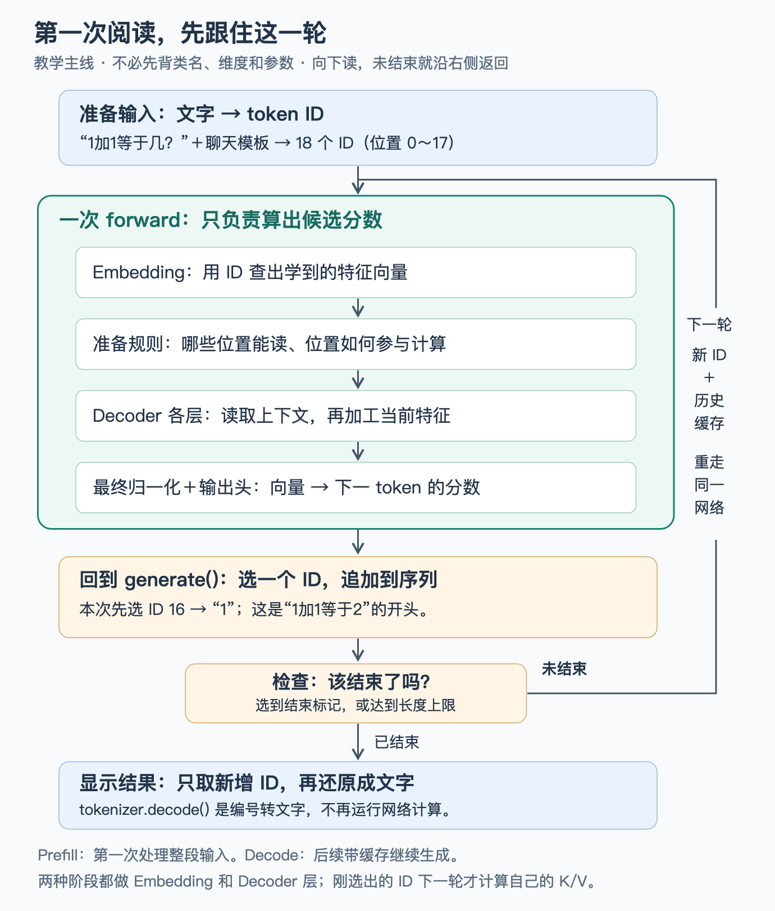
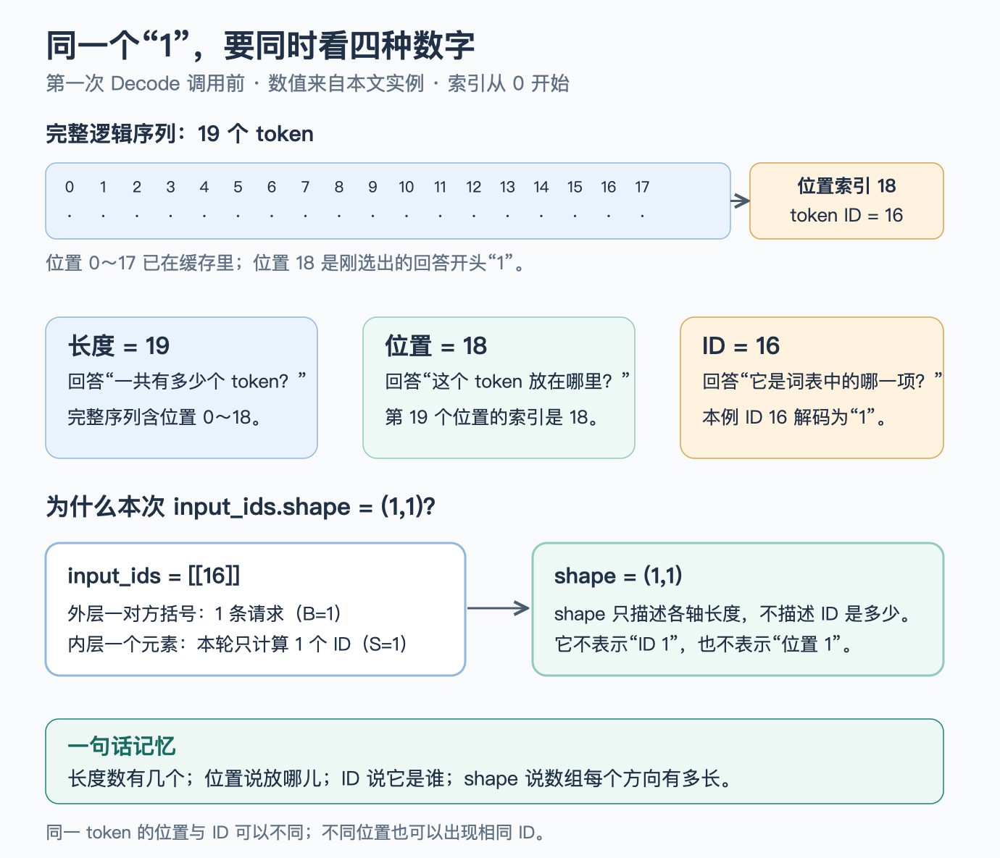
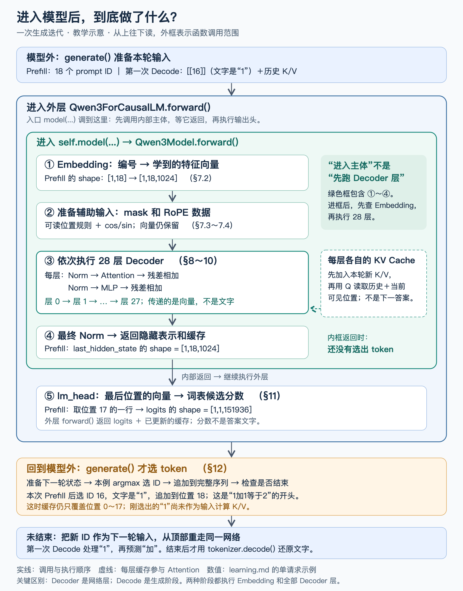

# 从一次请求读懂 Qwen3 推理：面向 AI Infra 学习者的代码教学

本文从项目入口 `debug_official.py` 出发，讲清 “一个问题如何变成逐 token 生成的回答”。默认你会读基础 Python，但还没有掌握深度学习术语。**先看一次完整旅程，再拆模型内部；不要求第一遍记住全部函数名和维度。**

**贯穿例子：** 用户问 `1加1等于几？`。本文原有运行记录中的回答以 “1 加 1 等于 2” 开头，后面继续解释，最终因新增 token 数达到上限而截断。下面先跟踪开头的 `"1"`、`"加"`、`"1"`；完整原始输出在第 13 节。




图 0 是**教学主线，不是完整调用栈**。蓝框负责文字与 ID 的转换，绿框负责一次网络计算，橙框负责从分数中选择 ID 并判断是否结束。

`generate()` 是模型对象的方法，但它管理循环；`forward()` 完成一轮网络计算。图中 “准备规则” 只产生辅助数据，不会把输入向量替换掉。

图中连接依据 [入口调用](file:///Users/bytedance/Documents/llm-learning/qwen3-inspector/debug_official.py#L53-L85)、[模型内部循环](file:///Users/bytedance/Documents/llm-learning/qwen3-inspector/.venv/lib/python3.11/site-packages/transformers/models/qwen3/modeling_qwen3.py#L404-L424)、[输出头](file:///Users/bytedance/Documents/llm-learning/qwen3-inspector/.venv/lib/python3.11/site-packages/transformers/models/qwen3/modeling_qwen3.py#L491-L506) 和 [生成循环](file:///Users/bytedance/Documents/llm-learning/qwen3-inspector/.venv/lib/python3.11/site-packages/transformers/generation/utils.py#L2858-L2927)。

**第一遍只跟住这段故事：**


1. **准备输入。** 聊天模板补上 “谁在说话” 等标记；Tokenizer（分词器）把文本分成小片段，并换成词表编号。小片段叫 **token**，编号叫 **token ID**。`1加1等于几？` 本身在本例中分成 6 个 token；加上模板后一共 18 个，位置索引是 `0～17`。

2. **第一次计算。** 把这 18 个 ID 送入模型的一次 `forward()`（前向计算）。模型先查 Embedding 得到特征向量，再经多层网络处理，最后给 “接下来可以接哪个 token” 打分。**这时返回的是分数，还不是文字。**

3. **选择开头。** `generate()`（生成循环）按本例的贪心策略选最高分 ID。本次选中 `16`；该 ID 解码为 `"1"`，所以回答从 `"1"` 开始。**18 是输入个数，16 是词表编号；并不是从输入中选 “第 16 个位置”。**

4. **继续生成。** 刚选出的 ID 追加到位置 `18`。如果还未结束，下一次只把这个新 ID 和历史缓存交给同一网络，得到下一个 token 的分数；本次接着选出 `"加"`，再下一轮选出 `"1"`。

5. **结束并显示。** 循环在选出结束标记或到达长度上限时停止。入口最后去掉输入那一段 ID，再用 `tokenizer.decode()` 把新 ID 序列还原为文字。

**用两个相邻调用固定时间顺序：**


| 网络调用       | 这次 `forward()` 的输入 | 调用前缓存 | `forward()` 返回后缓存 | 随后 `generate()` 选出 |
| ---------- | ------------------ | ----- | ----------------- | ------------------ |
| Prefill    | 18 个 prompt ID     | 0     | 18                | ID `16`，即 `"1"`    |
| 第一次 Decode | 刚选出的 ID `16`       | 18    | 19                | ID `20929`，即 `"加"` |

表中的缓存长度以 “每层已保存多少个位置的 K/V” 为口径。**选出的 ID 要到下一次网络调用中，才会获得自己的 K/V。**

第一次处理整段输入叫 **Prefill（预填充）**；后续用新 token 继续生成叫 **Decode（增量解码）**。两者跑的是同一套网络，主要区别是本轮输入长度，以及是否已有历史计算可复用。缓存保存什么，先看第 6 节的直观解释，再在第 9 节看 K/V 的实现。

## 怎么读：按理解层次展开，不把所有细节一次背完


* **先串主线：** 读第 0.0、0.2 节、第 1 节的概览、第 3～4.1 节、第 5～6 节展开区域外的说明、第 7.0 节，以及第 12 节的最小循环与第 13～14 节。目标是能解释 “输入、一次计算、选词、下一轮、停止”。

* **再拆模块：** 按第 7～11 节顺序看内部执行。第 9 节先用单头小例子讲 Attention 的作用，再进入 Q/K/V、多头、位置与缓存源码。此时再查第 2.4 节的完整尺寸。

* **最后查实现：** 展开 “源码进阶” 区域，核对配置、函数分派、内存布局；第 16 节保留完整手写循环，第 17～19 节用于性能、形状和断点回查，第 20 节用于综合自测。

折叠的是阅读层次，不是删除技术内容，也不代表真实运行会跳过这些步骤。若你的 Markdown 阅读器不支持折叠，仍按上述顺序阅读。全文保留原章节编号，方便沿用已有引用。

### 第一次出现就要分清的术语


| 术语               | 本例                             | 它回答什么问题                       |
| ---------------- | ------------------------------ | ----------------------------- |
| token            | `"等于"` 可以是一个 token             | 文本被分成了哪些片段？                   |
| token ID         | `"1"` 对应 ID `16`               | 这个片段在词表中的编号是什么？编号大小不表示语义大小。   |
| 位置               | 第一个回答 token 放在位置 `18`          | 它位于整条序列的哪里？位置从 0 开始。          |
| 长度               | prompt 长度为 `18`                | 序列里一共有多少个 token？              |
| shape            | `input_ids.shape = (1,18)`     | 张量各个轴有多长？这里是一条请求、18 个 ID。     |
| 张量               | 可以把它先理解为带 shape 的多维数字数组        | 程序如何成批保存和计算这些数字？              |
| 向量 /hidden state | 每个位置在层间对应 1024 个浮点数            | 网络当前如何表示这个位置的特征？它不是隐藏文字。      |
| logits           | 本例最后得到 151936 个候选分数            | 词表中的每个候选 ID 目前有多合适？它不是概率或 ID。 |
| 层                | Qwen3Model 中重复执行的处理模块，本例有 28 层 | 同一份表示还要经过几次不同参数的加工？           |

本文用两种方式写 shape：正文中的具体 shape 多写成 `(1,18)`；源码注释和公式中的轴模式保留 `[B,S,H]`。若等号左边是变量本身，例如 `input_ids = [[16]]`，右边展示的是**实际取值**，不是 shape。




图 0-A 用第一次 Decode 的实际状态区分四类数字：完整序列长度为 19，最后位置索引为 18，该位置的 token ID 是 16；本轮 `input_ids = [[16]]` 的 shape 为 `(1,1)`。

图中位置 `0～17` 用占位点表示，不是它们的真实 token ID。

## 0. 阅读边界与实验基准

**本节目的：** 固定本文的模型、环境和覆盖范围，避免把本例结论误套到其他版本或推理系统。

### 0.0 先用白话理解：模型在反复 “续写下一小段”

**本节目的：** 先建立 “模型每轮只预测一个 token” 的直觉，后文所有循环细节都围绕它展开。

你输入 “1 加 1 等于几？”，模型不是一次性返回一篇写好的答案。它反复做的是：


1. 把目前已经知道的内容送进模型，得到 “下一个 token 的候选分数”。

2. `generate()` 根据分数选一个 token；本例使用贪心选择（argmax，即取最高分所在的编号），第一个选出 ID `16`，对应 `"1"`。这是回答 “1 加 1 等于 2” 的开头，不是说结果为 1。

3. 把这个 token 追加到已有序列末尾，作为下一轮输入的一部分。

4. 重复上述过程，直到命中结束标记，或者达到生成长度上限。

这里的 “小段” 叫 **token**。它可能是一个字、一组字、标点，也可能是专门表示消息边界的标记。不要先把它理解成一个完整单词。

本例 `forward()` 接收 token ID，并返回下一 token 的候选分数（logits）；`generate()` 从分数中选出新 ID。Tokenizer 只负责文字与 ID 的转换，不替模型打分或选择答案。

**两个容易混淆的 “解码”：** 推理阶段的 Decode 是 “再算一轮，生成下一个 token”；`tokenizer.decode()` 是 “把已有编号翻译回文字”。它们不是同一件事。

第一遍阅读每一步都可以追问四件事：**输入是什么？这一步做了什么？输出是什么？输出由谁在下一步使用？** 公式和性能细节可以第二遍再看。

### 0.1 本文对应什么版本

这是一条固定模型、固定配置的教学路径，不是所有模型的通用结论。第一遍先知道：单条请求、贪心生成、使用缓存；要复现实验时再核对下面的环境与代码约定。

**本节目的：** 固定代码、依赖和模型基准，使源码行号、张量形状和运行结果可对应。

以下内容核对自本项目的实际环境，而不是笼统描述所有 Qwen 模型：


| 项目             | 本文基准                                       |
| -------------- | ------------------------------------------ |
| 入口             | `debug_official.py`                        |
| Python         | 本项目 `.venv` 中的 Python 3.11                 |
| PyTorch        | `2.8.0`                                    |
| Transformers   | `4.56.2`                                   |
| 模型             | `Qwen/Qwen3-0.6B`，稠密 Decoder-only 模型       |
| 本地模型快照         | `c1899de289a04d12100db370d81485cdf75e47ca` |
| 实际 Tokenizer 类 | `Qwen2TokenizerFast`，名称不代表加载错模型            |
| 注意力后端          | `eager`                                    |
| 生成方式           | `do_sample=False`，单序列贪心生成                  |
| 缓存             | `use_cache=True`，默认 `DynamicCache`         |
| 本次运行设备         | Apple MPS，参数与主要激活为 FP16                    |
| 用户输入           | `1加1等于几？`                                  |
| 新增 token 上限    | 16                                         |

模型目录中配置的 `transformers_version: "4.51.0"` 是保存配置时的版本信息；真正决定本文执行逻辑的是已安装的 **4.56.2**。

**代码片段的约定：**


* 标为 “入口代码” 的片段来自项目入口，补充了教学注释。

* 标为 “源码主干” 的片段保留当前路径的核心逻辑，省略文档字符串、装饰器或其他分支，不是上游文件的逐字完整拷贝。

* 标为 “教学等价代码” 的片段用于解释数学或状态变化，不声称就是库内部实现。

* 第 16 节给出完整可运行示例；其他片段按上下文阅读即可，不要求单独运行。

每段 Python/Jinja 代码附近都有 “代码定位”。其中的行号是**实际源文件行号**，不是本文的行号；可点击跳转。教学改写、演算示例与运行结果也会注明对应来源，但不冒充原样源码。

短文件名的含义：`modeling_qwen3.py` 在 `transformers/models/qwen3/` 下，`generation/utils.py` 在 `transformers/generation/` 下，其余库文件均以 `.venv/lib/python3.11/site-packages/` 为根。链接包含完整绝对路径，末尾第 19 节也保留索引。

这条路径没有 Web 服务、请求队列、连续批处理、分布式通信、PagedAttention 或投机解码。后文会解释它与生产推理引擎的对应关系，但不会把未启用的机制说成已经执行。

### 0.2 先记住四个对象

**本节目的：** 区分 Tokenizer、模型、`generate()` 和 KV Cache 的职责。先把 “缓存” 理解成留给后续轮次复用的计算结果；K/V 是其中用于 Attention 的两组向量，不是原始文字。它们为什么足够复用，在第 9 节展开。


| 对象                | 职责                           | 不负责什么                    |
| ----------------- | ---------------------------- | ------------------------ |
| `tokenizer`       | 字符串与 token ID 之间的转换          | 不执行 Transformer 的数学计算    |
| `model`           | 用权重把输入 token 转换为下一 token 的分数 | 单次 `forward()` 不负责生成完整回答 |
| `generate()`      | 调用模型、选 token、维护缓存和停止状态       | 不是某一层神经网络                |
| `past_key_values` | 保存各层已经计算出的 K、V               | 不是权重缓存，也不是历史文本本身         |

最重要的边界是：

> `forward()`
>
>  计算 “接下来各 token 有多合适”；
>
> `generate()`
>
>  决定 “选哪个 token，是否再算一轮”。

## 1. 全局地图：一次请求实际经过哪些函数

**本节目的：** 在进入细节前先看到完整调用链，知道每个后续章节位于哪一步。

**先看白话：** 请求可以分成四个阶段：加载模型、把对话整理并编码成 token、反复计算并选择新 token、把新增 token 解码成文字。模型加载只发生在启动阶段，不会每生成一个 token 就重新加载一次。


图 1：蓝色是准备工作，绿色是反复生成。第一轮读取整段提示词，后续轮次只补算新 token。图中 “选下一个 token” 对应 [generation/utils.py:2883-2927](file:///Users/bytedance/Documents/llm-learning/qwen3-inspector/.venv/lib/python3.11/site-packages/transformers/generation/utils.py#L2883-L2927)，整个入口见 [debug\_official.py:53-85](file:///Users/bytedance/Documents/llm-learning/qwen3-inspector/debug_official.py#L53-L85)。

第一次先用上面的概览确认 “准备输入 → forward → 选词 → 继续或停止”。完整调用栈用于后续对照调试，不必现在逐项记忆。

下面是本例执行主干，省略 PyTorch 的通用包装层。竖线左侧表示调用关系，`while` 下的内容会反复执行：


```
debug\_official.main()

|

\|-- AutoTokenizer.from\_pretrained(...)

\|-- AutoModelForCausalLM.from\_pretrained(...)

\|     \`-- Qwen3ForCausalLM

\|           |-- model: Qwen3Model

\|           |     |-- embed\_tokens

\|           |     |-- layers\[0..27]: Qwen3DecoderLayer

\|           |     |-- norm

\|           |     \`-- rotary\_emb

\|           \`-- lm\_head

|

\|-- tokenizer.apply\_chat\_template(messages, ...)

\|-- tokenizer(text, return\_tensors="pt")

|

\|-- model.generate(...)

\|     |-- 准备生成配置、停止条件、DynamicCache

\|     \`-- GenerationMixin.\_sample(...)  # 贪心也走这里

\|           \`-- while 未结束:

\|                 |-- prepare\_inputs\_for\_generation(...)

\|                 |-- Qwen3ForCausalLM.forward(...)

\|                 |     |-- Qwen3Model.forward(...)

\|                 |     |     |-- Embedding

\|                 |     |     |-- 创建 causal mask 和 RoPE cos/sin

\|                 |     |     |-- 28 层 Qwen3DecoderLayer.forward(...)

\|                 |     |     |     |-- RMSNorm

\|                 |     |     |     |-- Qwen3Attention.forward(...)

\|                 |     |     |     |     |-- Q/K/V 投影，Q/K Norm

\|                 |     |     |     |     |-- RoPE

\|                 |     |     |     |     |-- KV Cache 更新

\|                 |     |     |     |     \`-- QK^T -> mask -> softmax -> V -> O

\|                 |     |     |     |-- 残差相加

\|                 |     |     |     |-- RMSNorm -> SwiGLU MLP

\|                 |     |     |     \`-- 残差相加

\|                 |     |     \`-- 最终 RMSNorm

\|                 |     \`-- lm\_head -> logits

\|                 |-- 更新 cache、attention\_mask、cache\_position

\|                 |-- logits\_processor -> argmax

\|                 |-- 将新 token 追加到完整序列

\|                 \`-- 检查 EOS / 长度上限

|

\|-- 从 output\_ids 中切掉 prompt

\`-- tokenizer.decode(...) -> print(answer)
```

你在 Python 调试器里还会看到 `nn.Module.__call__`、`_call_impl` 等通用调用层。它们负责模块调用约定等工作，最终进入对应的 `forward()`。`model(...)` 不是重新加载模型。

## 2. 初始化：先把 “模型机器” 准备好

**本节目的：** 说明推理开始前如何定位文件、选择设备，并加载分词器和模型。

### 2.1 缓存目录在导入之前设置

这一步只定位磁盘中的模型文件。磁盘缓存保存文件，模型参数是加载后的权重，KV Cache 保存本请求运行中的历史中间结果；三者不是同一类缓存。

**本节目的：** 说明模型文件从哪里读取，并区分磁盘模型缓存和运行时 KV Cache。

**先看白话：** 先告诉库 “模型文件放在哪里”。这是找文件，不是让模型回答问题。

**代码定位：** [debug\_official.py:2-13](file:///Users/bytedance/Documents/llm-learning/qwen3-inspector/debug_official.py#L2-L13)，入口代码，补充注释：


```
import os

from pathlib import Path

ROOT = Path(\_\_file\_\_).resolve().parent  # 以脚本位置定位，不依赖 IDE 工作目录

os.environ.setdefault("HF\_HOME", str(ROOT / ".cache" / "huggingface"))

os.environ.setdefault("HF\_HUB\_DISABLE\_XET", "1")

import torch

from transformers import AutoModelForCausalLM, AutoTokenizer
```

`setdefault` 的意思是：外部没有设置这个环境变量时才使用这里的值。因此，外部已经设置 `HF_HOME` 时，实际缓存不一定在项目目录。

`HF_HUB_DISABLE_XET` 控制下载相关后端，不控制模型数学计算。本例 `local_files_only=True`，只使用本地已有文件，文件不全就报错，不会自动联网补齐。

这里的 **磁盘模型缓存** 与后面的 **设备内存 KV Cache** 完全不同：


| 名称                | 保存内容                 | 生命周期        |
| ----------------- | -------------------- | ----------- |
| Hugging Face 本地缓存 | 配置、分词器文件、训练好的权重文件    | 跨进程保留在磁盘    |
| 模型参数              | 已加载的权重张量             | 通常随模型实例长期驻留 |
| KV Cache          | 本请求每一层历史 token 的 K、V | 通常属于本次生成请求  |

### 2.2 设备选择与 dtype

`device` 指定在哪里算，`dtype` 指定数字如何存储。它们影响精度、内存与执行后端，不把 token ID 变成文字特征。具体设备分支见展开区域。

**本节目的：** 说明模型放在哪个设备、采用何种精度，以及这不会改变 token ID 的整数性质。

**代码定位：** [debug\_official.py:27-31](file:///Users/bytedance/Documents/llm-learning/qwen3-inspector/debug_official.py#L27-L31)，把一行设备选择展开成多行，行为不变：


```
device = DEVICE

if device == "auto":

&#x20;   if torch.cuda.is\_available():

&#x20;       device = "cuda"

&#x20;   elif torch.backends.mps.is\_available():

&#x20;       device = "mps"

&#x20;   else:

&#x20;       device = "cpu"

dtype = torch.float32 if device == "cpu" else torch.float16
```

设备和 dtype 是两个维度：


* `device` 决定张量存储位置与算子后端。

* `dtype` 决定数值表示、精度与每个元素的字节数。

* FP32 每元素 4 字节，FP16 每元素 2 字节。

* 输入 token ID 是整数索引，通常为 `torch.int64`，不会因为模型用了 FP16 就变成浮点数。

快照配置中的 `torch_dtype` 是 `bfloat16`，但入口显式传入 `dtype`，所以本次实际加载成 FP16。这是脚本策略，不代表 Qwen3 只能使用 FP16。

### 2.3 `from_pretrained` 到底做了什么

运行请求前，分别加载 Tokenizer 的词表规则和模型的训练好权重。两者不是同一个对象；模型通常只加载一次，不会每生成一个 token 都重新加载。

**本节目的：** 区分 Tokenizer 与模型的加载过程，理解配置如何决定实际模型类和权重。

**代码定位：** [debug\_official.py:35-42](file:///Users/bytedance/Documents/llm-learning/qwen3-inspector/debug_official.py#L35-L42)，入口代码：


```
tokenizer = AutoTokenizer.from\_pretrained(

&#x20;   MODEL\_ID,

&#x20;   local\_files\_only=LOCAL\_FILES\_ONLY,

)

model = AutoModelForCausalLM.from\_pretrained(

&#x20;   MODEL\_ID,

&#x20;   local\_files\_only=LOCAL\_FILES\_ONLY,

&#x20;   dtype=dtype,

&#x20;   attn\_implementation="eager",

).to(device).eval()
```

**代码定位：** [auto\_factory.py:469-604](file:///Users/bytedance/Documents/llm-learning/qwen3-inspector/.venv/lib/python3.11/site-packages/transformers/models/auto/auto_factory.py#L469-L604)、[debug\_official.py:35-42](file:///Users/bytedance/Documents/llm-learning/qwen3-inspector/debug_official.py#L35-L42)。下面是加载流程的教学伪代码，不是原样源码：


```
\# 教学流程，不是需要另行执行的加载实现。

config = 读取模型配置()                  # hidden\_size、层数、head\_dim 等

model\_class = 按配置查找对应模型类()      # Qwen3Config -> Qwen3ForCausalLM

model = 构建模块树并加载检查点权重()      # 实际库会进行内存与加载流程优化

model = model.to(device)                 # 参数与注册的 buffer 移到目标设备

model.eval()                            # 切换模块的 training 标志
```

这里有两个独立的加载动作：第一段加载 Tokenizer，第二段加载模型。Tokenizer 负责文字和 token ID；模型负责用参数执行神经网络。它们都使用同一个模型目录，但不是同一个对象。

`Auto` 是模型类型分发器，不是一个额外的神经网络。模型配置中的 `model_type="qwen3"` 让它选择 `Qwen3ForCausalLM`；Tokenizer 配置则让它加载兼容的 `Qwen2TokenizerFast`。Tokenizer 类名中的 `Qwen2` 是实现复用的名称，不表示当前加载成了 Qwen2 模型。

模型本地快照中的关键文件：


| 文件                        | 作用                          |
| ------------------------- | --------------------------- |
| `config.json`             | 神经网络结构配置                    |
| `model.safetensors`       | 训练好的参数张量                    |
| `generation_config.json`  | 默认生成策略，例如 EOS、采样参数          |
| `tokenizer.json`          | Fast Tokenizer 的词表与处理规则     |
| `tokenizer_config.json`   | Tokenizer 配置、特殊 token、聊天模板等 |
| `vocab.json`、`merges.txt` | BPE 词表及合并规则相关文件             |

`.eval()`**&#x20;不等于关闭梯度。**

**代码定位：** [debug\_official.py:37-42](file:///Users/bytedance/Documents/llm-learning/qwen3-inspector/debug_official.py#L35-L42) 与 [debug\_official.py:69-77](file:///Users/bytedance/Documents/llm-learning/qwen3-inspector/debug_official.py#L69-L77)；合并展示两个不同职责：


```
model.eval()                   # 例如让 Dropout 使用推理行为

with torch.inference\_mode():   # 关闭梯度记录及一些额外跟踪开销

&#x20;   output\_ids = model.generate(...)
```

本例没有标签、没有 loss 反向传播、没有优化器，不更新权重。`generate()` 自身也有关闭梯度的保护，入口再使用 `inference_mode()` 明确表示整段代码用于推理。

### 2.4 这台模型机器的尺寸

第一遍只先用到：模型有 28 层，每个 token 在层间用 1024 个特征数表示。`shape = (1,18,1024)` 是 “一条请求、18 个位置、每个位置 1024 个特征”，不是 1024 个新 token。头数、缓存宽度等在实际用到时再回查。

**本节目的：** 给后文张量形状、注意力头和 KV Cache 大小准备统一的配置数值与符号。


| 配置项                       | 数值      | 含义                            |
| ------------------------- | ------- | ----------------------------- |
| `vocab_size`              | 151936  | Embedding 和输出头的词表维度           |
| `hidden_size`             | 1024    | 每个 token 在层间传递的向量宽度           |
| `num_hidden_layers`       | 28      | Decoder 层数                    |
| `num_attention_heads`     | 16      | Query 头数                      |
| `num_key_value_heads`     | 8       | Key/Value 头数                  |
| `head_dim`                | 128     | 每个注意力头的维度                     |
| `intermediate_size`       | 3072    | MLP 中间维度                      |
| `hidden_act`              | `silu`  | MLP 门控激活函数                    |
| `rms_norm_eps`            | `1e-6`  | RMSNorm 数值稳定项                 |
| `rope_theta`              | 1000000 | RoPE 基频参数                     |
| `max_position_embeddings` | 40960   | 配置的位置长度基准，不是此次生成长度            |
| `tie_word_embeddings`     | `true`  | Embedding 和输出头共享权重            |
| `use_sliding_window`      | `false` | 本例所有层均为 full causal attention |

**特别注意：**`1024 / 16 = 64`**，但本模型的&#x20;**`head_dim`**&#x20;是 128，不是 64。**

这里 Q 投影输出宽度为 `16 * 128 = 2048`，因此拼接注意力头后的 2048 维需要由 `o_proj` 映射回 1024 维。

后文使用这些符号：


```
B  = batch size，本例为 1

S  = 本轮实际送进 forward 的 token 数

T  = 本轮合并后的 K/V 长度（每个 Q 能读其中哪些位置，还由 causal mask 限制）

H  = hidden\_size = 1024

Nq = Query 头数 = 16

Nk = KV 头数 = 8

D  = head\_dim = 128

I  = intermediate\_size = 3072

V  = 模型词表维度 = 151936（仅在形状/符号表中；Attention 的 V 表示 Value 张量）

P  = prompt 长度，本例为 18
```

Prefill 时 `S=T=P=18`。第一轮 Decode 时 `S=1, T=19`。不要把 `S` 和 `T` 始终当成相同的长度。

**张量形状到底怎么读？** 把 `[1,18,1024]` 想成一张 “18 行、每行 1024 个数字” 的表，最外层的 `1` 表示这里只有一条请求。18 行对应 18 个 token；每行的 1024 个数字是模型对这个 token 的内部表示，不是 1024 个新 token。

再看 `[1,16,18,128]`：一条请求，分成 16 个注意力头，每个头处理 18 个位置，每个位置使用 128 个数字。所谓 “拆头”，就是把一大组数字分成几组来算，不是在复制出 16 个完整模型。

## 3. 从用户请求到聊天模板：此时还没有张量计算

**本节目的：** 说明用户消息如何先变成 Qwen 对话格式字符串，尚未进入模型计算。

**先看白话：** 这一节只做字符串整理，不执行模型 forward。聊天模板把 Python 字典里的角色和内容，转换成模型约定的带边界标记的字符串；下一节才把这个字符串编码成 token ID。

**代码定位：** [debug\_official.py:53-57](file:///Users/bytedance/Documents/llm-learning/qwen3-inspector/debug_official.py#L53-L57)，入口代码：


```
messages = \[{"role": "user", "content": "1加1等于几？"}]

text = tokenizer.apply\_chat\_template(

&#x20;   messages,

&#x20;   tokenize=False,              # 先输出字符串，不直接输出 token ID

&#x20;   add\_generation\_prompt=True,  # 加 assistant 开头，引导模型续写回答

&#x20;   enable\_thinking=False,       # 模板中预先结束空的 thinking 段

)
```

本次实际得到的 `repr(text)`：


```
'<|im\_start|>user\n1加1等于几？<|im\_end|>\n<|im\_start|>assistant\n\<think>\n\n\</think>\n\n'
```

按行阅读：


```
<|im\_start|>user

1加1等于几？<|im\_end|>

<|im\_start|>assistant

\<think>

\</think>
```

角色名、边界标记、换行都属于模型接下来能看到的上下文。

到这里的结果仍然是 Python 字符串 `text`，还不是 `input_ids`。只有执行 `tokenizer(text, return_tensors="pt")` 后，才会得到模型可以接收的整数张量。

**代码定位：** [tokenizer\_config.json:230](file:///Users/bytedance/Documents/llm-learning/qwen3-inspector/.cache/huggingface/hub/models--Qwen--Qwen3-0.6B/snapshots/c1899de289a04d12100db370d81485cdf75e47ca/tokenizer_config.json#L230) 的 `chat_template` 字符串。下面将其中末尾一段转义的换行展开为可读 Jinja；不是另一个独立的 `.jinja` 文件：


```


&#x20;   {{- '<|im\_start|>assistant\n' }}

&#x20;   

&#x20;       {{- '\<think>\n\n\</think>\n\n' }}

&#x20;   


```

这里有三个值得区分的事实：


1. `enable_thinking=False` 是模板控制参数，不是在模型里关闭若干 Decoder 层。

2. 模型并不直接读取 Python 字典的 `role` 字段，而是读取模板转换出来的 token 序列。

3. `<think>` 和 `</think>` 在本例中已经属于输入，不能误认为它们是模型刚刚生成的回答。

没有 system 消息时，本次模板也没有凭空加入一条 system 提示词。

## 4. Tokenizer：把文字变成整数序列

**本节目的：** 说明聊天模板字符串如何变成模型可接收的 `input_ids` 和 `attention_mask`。

### 4.1 入口与实际结果

**本节目的：** 查看本次请求实际得到的 token ID、长度和各位置的可读含义。

**先看白话：** Tokenizer 把每段文字换成一个编号。ID 本身是整数，可以比较大小；但编号的大小不表示 token 的语义大小、重要性或相似程度。这里把整数用作词表索引，而不是拿编号数值当内容特征。

**代码定位：** [debug\_official.py:62-64](file:///Users/bytedance/Documents/llm-learning/qwen3-inspector/debug_official.py#L62-L64)，入口代码：


```
inputs = tokenizer(text, return\_tensors="pt").to(device)

prompt\_length = inputs.input\_ids.shape\[1]
```

`return_tensors="pt"` 让返回值里的序列成为 PyTorch 张量。返回容器是 `BatchEncoding`，可以按键访问，也可以用属性访问：

**代码定位：** [debug\_official.py:62-66](file:///Users/bytedance/Documents/llm-learning/qwen3-inspector/debug_official.py#L62-L66)；下面是对返回对象的教学访问示例：


```
inputs\["input\_ids"]       # 与 inputs.input\_ids 对应

inputs\["attention\_mask"]  # 1 表示有效位置，0 表示 padding
```

**数据定位：** [debug\_official.py:62-66](file:///Users/bytedance/Documents/llm-learning/qwen3-inspector/debug_official.py#L62-L66) 的运行结果，下面用 Python 列表展示，不是源文件里的硬编码常量：


```
input\_ids = \[\[

&#x20;   151644, 872, 198, 16, 20929, 16, 107106, 99195, 11319,

&#x20;   151645, 198, 151644, 77091, 198, 151667, 271, 151668, 271,

]]

\# shape = (1,18)，dtype = int64

attention\_mask = \[\[1] \* 18]

\# shape = (1,18)；本请求没有 padding
```

这里的 shape 按 `(batch_size, sequence_length)` 读取：`(1,18)` 表示一条请求、18 个 token。本文在正文中优先用圆括号写具体 shape；源码注释仍可能沿用常见的 `[B,S]` 形状记法。`input_ids = [[16]]` 则是在展示实际值，要结合等号左边判断。

`attention_mask` 与 `input_ids` 的位置一一对应。本例没有 padding，所以 18 个位置全是 1。

各位置的可读含义如下。这里直接展示解码后的文字；底层会把文本切成可复用片段（BPE 子词编码），第一遍不需要追踪内部字节形式：


| 位置 | ID     | 含义               |
| -- | ------ | ---------------- |
| 0  | 151644 | `<\|im_start\|>` |
| 1  | 872    | `user`           |
| 2  | 198    | `\n`             |
| 3  | 16     | `1`              |
| 4  | 20929  | `加`              |
| 5  | 16     | `1`              |
| 6  | 107106 | `等于`             |
| 7  | 99195  | `几`              |
| 8  | 11319  | `？`              |
| 9  | 151645 | `<\|im_end\|>`   |
| 10 | 198    | `\n`             |
| 11 | 151644 | `<\|im_start\|>` |
| 12 | 77091  | `assistant`      |
| 13 | 198    | `\n`             |
| 14 | 151667 | `<think>`        |
| 15 | 271    | `\n\n`           |
| 16 | 151668 | `</think>`       |
| 17 | 271    | `\n\n`           |

Markdown 表格里的 `\|` 只是转义竖线；实际特殊 token 中没有反斜杠。

**token 不等于汉字，也不等于单词。** 例如 “等于” 在本例中是一个 token，两个换行也可以是一个 token。

**停一下，检查是否跟上：** 输入只有 18 个 token，里面能出现 ID `151644` 吗？

能。18 是序列长度，151644 是词表编号；两个数字不在同一个计数维度。本例位置 0 的 ID 就是 151644。

### 4.2 Tokenizer 内部做什么

第一遍记住：Tokenizer 根据固定词表和分词规则把字符串变成 ID，不执行 Transformer。底层实现、不同词表计数和返回容器的细节保留如下；读主线可以直接进入第 5 节。

**本节目的：** 概括 Fast Tokenizer 如何编码字符串，并澄清词表大小相关数字的不同含义。

这一节回答的是 “字符串如何变成上面的整数列表”，不是 “token ID 如何进入 Transformer”。简化理解 Fast Tokenizer 路径：


```
Python tokenizer(...)

&#x20; -> 准备编码参数

&#x20; -> Rust tokenizers 后端 encode\_batch(...)

&#x20; -> 识别特殊 token，并按词表与 BPE 等规则编码普通文本

&#x20; -> 返回 ID、attention mask 等

&#x20; -> 封装为 BatchEncoding 和 PyTorch 张量
```

“Fast” 部分主要在 Rust 中执行；仅使用 Python 单步调试时，不会像查看 Qwen3 Python 层那样逐行展开底层编码算法。

本例 `.to(device)` 移动的是返回容器中的张量，不会把字符串处理或 Rust Tokenizer 变成 GPU 上的神经网络。

另外，本机实际检查得到：


```
tokenizer.vocab\_size = 151643

len(tokenizer)       = 151669

model.config.vocab\_size = 151936
```

它们分别表示：


* `tokenizer.vocab_size`：Tokenizer 声明的基础词表大小。

* `len(tokenizer)`：加入特殊 token 等扩展后，Tokenizer 可识别的条目数。

* `model.config.vocab_size`：Embedding 和输出头实际分配的词表维度。

这三个数字服务于不同对象，不能直接混用。模型输出 `logits` 的最后一维由 `model.config.vocab_size` 决定；其中的每个位置是一个候选 token ID，不等于一个汉字或一个可见字符。

## 5. `generate()`：建立生成过程的控制状态

**本节目的：** 说明 `generate()` 如何把一次模型 forward 组织成持续生成多个 token 的循环。

### 5.1 调用参数如何影响行为

本例最终生效的是：`do_sample=False`（选最高分，不随机抽取）、`use_cache=True`（复用历史计算）、`max_new_tokens=16`（最多新增 16 个 token）。结束标记 EOS 是词表里的特殊 ID，和长度上限一起决定何时停止。

**本节目的：** 找出本次生成最终生效的配置，并确定为何走贪心而不是随机采样。

**先看白话：** `generate()` 就是循环的组织者：让模型算一次、选一个 token、检查是否结束，再决定要不要继续。

本例需要先区分三层配置：


| 配置来源                         | 本例的值                                                       | 作用                                             |
| ---------------------------- | ---------------------------------------------------------- | ---------------------------------------------- |
| `generation_config.json` 默认值 | `do_sample=True`、`temperature=0.6`、`top_k=20`、`top_p=0.95` | 如果调用时没有覆盖，就作为生成默认行为                            |
| 入口运行时修改                      | `temperature=1.0`、`top_p=1.0`、`top_k=50`                   | `generate()` 调用前直接修改 `model.generation_config` |
| `model.generate(...)` 调用参数   | `do_sample=False`、`max_new_tokens=16`、`use_cache=True`     | 本次调用明确传入；同名参数优先于生成配置                           |

因此，本次运行的关键结论是：


```
do\_sample=False

&#x20;   -> 不进行随机采样

&#x20;   -> 生成模式是 GREEDY\_SEARCH

&#x20;   -> 每轮选择处理后 logits 最大的 token（argmax）
```

**代码定位：** [debug\_official.py:69-77](file:///Users/bytedance/Documents/llm-learning/qwen3-inspector/debug_official.py#L69-L77)，入口代码：


```
with torch.inference\_mode():

&#x20;   output\_ids = model.generate(

&#x20;       \*\*inputs,                       # 展开 input\_ids 和 attention\_mask

&#x20;       max\_new\_tokens=16,              # 最多新增 16 个 token

&#x20;       do\_sample=False,                # 不随机采样

&#x20;       use\_cache=True,                 # 保留历史 token 的每层 K/V

&#x20;   )
```

`**inputs` 只是 Python 的字典参数展开，等价于显式传入 `input_ids` 和 `attention_mask`：

**代码定位：** [debug\_official.py:72-77](file:///Users/bytedance/Documents/llm-learning/qwen3-inspector/debug_official.py#L69-L77)；下面是展开参数后的教学等价写法：


```
model.generate(

&#x20;   input\_ids=inputs.input\_ids,

&#x20;   attention\_mask=inputs.attention\_mask,

&#x20;   max\_new\_tokens=16,

&#x20;   do\_sample=False,

&#x20;   use\_cache=True,

)
```

**默认配置定位：** [generation\_config.json:2-11](file:///Users/bytedance/Documents/llm-learning/qwen3-inspector/.cache/huggingface/hub/models--Qwen--Qwen3-0.6B/snapshots/c1899de289a04d12100db370d81485cdf75e47ca/generation_config.json#L2-L11)。下面列出的是配置文件中的默认值，不一定是本次调用的最终值：


```
do\_sample = True

temperature = 0.6

top\_k = 20

top\_p = 0.95

eos\_token\_id = \[151645, 151643]

pad\_token\_id = 151643
```

入口代码没有改写磁盘上的 `generation_config.json`，但在加载后、调用 `generate()` 前，直接把内存中的 `model.generation_config` 改成了 `temperature/top_p/top_k = 1.0/1.0/50`。调用参数 `do_sample=False` 又覆盖了默认的 `do_sample=True`。由于本次走贪心分支，不会执行随机采样所需的 temperature、top-k、top-p 处理；这些值不会改变本次选出的 token。

**停止条件也要看最终配置：** 模型结构配置中的 `eos_token_id` 是 `151645`，但本次生成配置中的 EOS 是 `[151645, 151643]`。因此生成出的 token 只要命中 `151645` 或 `151643` 任意一个，就可能触发停止；不能只根据模型结构配置中的单个值判断。

### 5.2 进入循环前准备了什么

循环开始前先保留完整输入序列，建立空缓存，并准备停止规则。此时没有生成新 token。所谓 logits processors，是选词前修改候选分数的规则；本例没有启用额外惩罚或强制选词规则。

**本节目的：** 列出循环启动前创建的长度限制、停止条件、缓存和 logits 处理状态。

**代码定位：** [generation/utils.py:2362-2406](file:///Users/bytedance/Documents/llm-learning/qwen3-inspector/.venv/lib/python3.11/site-packages/transformers/generation/utils.py#L2362-L2406) 与 [generation/utils.py:1999-2008](file:///Users/bytedance/Documents/llm-learning/qwen3-inspector/.venv/lib/python3.11/site-packages/transformers/generation/utils.py#L1999-L2008)；下面是本次路径的教学概括：

这一阶段还没有逐个生成新 token。它先把 “生成循环需要的状态” 准备好：


```
input\_ids = inputs.input\_ids               # 完整逻辑序列；初始 shape = (1,18)，不是取值 \[1,18]

max\_length = input\_ids.shape\[1] + 16        # 18 + 16 = 34

past\_key\_values = DynamicCache(config=model.config)

logits\_to\_keep = 1                         # 只需要最后位置的词表输出

use\_cache = True
```

除此之外，还会创建 logits processors、EOS / 最大长度停止条件，准备特殊 token 张量，并验证参数。可以把这一步理解为 “搭好生成循环的运行环境”，而不是已经完成一次生成。

本次配置没有启用重复惩罚、强制 token 等额外 logits 处理，所以选 token 时可以简化理解为：对最后位置的 logits 做 `argmax`。如果以后改变生成配置，logits 可能会先经过 processors，再进行选择，不能再假设处理器总是空的。

`DynamicCache(config=...)` 会根据模型的 28 层 Transformer 准备 28 个缓存层对象。此时主要是准备存放位置；每层真正的 K/V 张量会在第一次 forward 更新缓存时，按照实际输入长度初始化。它是动态增长的，因此不会因为 `max_length=34` 就提前为每层分配一整块长度为 34 的 Static Cache。

### 5.3 为什么贪心会进入 `_sample`

函数名 `_sample` 不代表本次一定随机采样。这个版本的框架让贪心与随机采样共用一个循环；本例在循环内部走贪心分支。具体分派可以第二遍再读。

**本节目的：** 消除函数名带来的误解，说明贪心与随机采样如何复用同一个循环实现。

**这段代码要解决什么问题？** 前面已经根据配置判定了生成模式；这里选择具体的循环函数。当前 Transformers 版本让 “随机采样” 和 “贪心” 复用同一个 `_sample()` 循环，区别留到循环内部的 `do_sample` 分支处理。


```
elif generation\_mode in (GenerationMode.SAMPLE, GenerationMode.GREEDY\_SEARCH):

&#x20;   result = self.\_sample(

&#x20;       input\_ids,                                       # 当前完整序列

&#x20;       logits\_processor=prepared\_logits\_processor,      # 选 token 前修改分数的规则

&#x20;       stopping\_criteria=prepared\_stopping\_criteria,    # EOS、最大长度等停止规则

&#x20;       generation\_config=generation\_config,             # 本次最终生效的配置

&#x20;       synced\_gpus=synced\_gpus,

&#x20;       streamer=streamer,

&#x20;       \*\*model\_kwargs,                                  # cache、mask、位置等循环状态

&#x20;   )
```

**代码定位：** [generation/utils.py:2537-2549](file:///Users/bytedance/Documents/llm-learning/qwen3-inspector/.venv/lib/python3.11/site-packages/transformers/generation/utils.py#L2537-L2549)；上面是模式分派主干，并补充了参数职责。

这里最容易误解的是函数名：`_sample` 不等于 “本次一定随机采样”。它是当前 Transformers 版本中，贪心和随机采样共用的生成循环。

本次实际路径可以写成：


```
do\_sample=False

&#x20;   -> generation\_mode = GREEDY\_SEARCH

&#x20;   -> GREEDY\_SEARCH 也被分派到 \_sample

&#x20;   -> 循环内部走 do\_sample=False 分支

&#x20;   -> 对最后位置 logits 做 argmax
```

只有当 `do_sample=True` 时，`_sample` 内部才会按概率随机抽取 token。因此，判断生成方式要看 `do_sample` 和循环内部的分支，不能只看 `_sample` 这个函数名。

## 6. Prefill 与 Decode 的分界：准备本轮输入

**本节目的：** 说明同一条序列在首次处理和后续生成时，为何送进模型的 token 数量不同。

### 6.1 生成循环保留完整序列，模型只接收未缓存部分

**本节目的：** 通过 KV Cache 解释完整序列、本轮输入和缓存长度为何是三个不同状态。

**先理解为什么要缓存：** 第二次生成时，题目那 18 个 token 没变；如果每次都从头加工它们，会重复做很多工作。KV Cache 保留可复用的中间结果，使后续计算只加工刚追加的 token，同时仍能读取历史。

**Q/K/V 先记用途，不必先记公式：** Q（Query）是本轮发起匹配的特征；K（Key）是各位置用来接受匹配的特征；V（Value）是匹配后被汇总的内容特征。每层分别计算并保存自己的历史 K/V；新的 Q 由当前输入产生。第 9.0 节用一个小例子解释匹配与汇总。

下一轮生成时，历史 token 不必重新经过 Embedding、28 层 Decoder、Q/K/V 投影和 MLP。模型会把本轮新 token 算出的 Q，与 Cache 中历史 token 的 K/V 一起做 Attention，因此仍然能读取完整上下文。


```
上一轮处理完 token 0..17：

&#x20;   每层 KV Cache 已保存位置 0..17 的 K/V

下一轮处理位置 18：

&#x20;   只计算位置 18 的新 Q/K/V

&#x20;   新 Q 读取 Cache 中位置 0..17 的 K/V，以及本轮位置 18 的 K/V
```

**再看本节问题：** “已经输出多少内容” 和 “这一轮还要重新算多少内容” 不是一回事。有 KV Cache 后，历史内容的计算结果仍可读取，所以这一轮只需把最新的一小段送进模型。

这一节要区分三个状态。它们都在描述同一条序列，但用途不同：


```
完整序列 input\_ids：

&#x20;   prompt + 已经生成的 token

&#x20;   用于保存最终输出，也用于下一轮追加 token

本轮 model\_inputs\["input\_ids"]：

&#x20;   本轮真正重新送入模型的 token

KV Cache 的长度：

&#x20;   已经完成各层 K/V 计算并保存的 token 数量
```

在本例中，三者随时间变化如下：


| 时刻         | 完整序列长度 | 本轮送入模型                     | forward 前缓存长度 |
| ---------- | ------ | -------------------------- | ------------- |
| Prefill    | 18     | 18 个 prompt token          | 0             |
| 第一次 Decode | 19     | Prefill 后刚选出的 1 个 token    | 18            |
| 第二次 Decode | 20     | 第一次 Decode 后刚选出的 1 个 token | 19            |

这张表统一记录**当前这次 forward 调用前**的状态。例如 “第一次 Decode” 这一行：完整序列包含上一次 Prefill 之后选出的 `"1"`；它现在就作为本次 Decode 的输入，不需要再等一轮。调用前缓存长度为 18，本次处理它以后缓存长度变为 19。

**主线到这里：** 完整序列保存所有输入与已生成 ID；缓存保存已经算过的 K/V；本次 forward 只加工尚未缓存的输入。下面的切片代码负责把这三个状态接起来。

**这段代码要解决什么问题？** `generate()` 手里拿的是完整序列，但 `forward()` 只应接收本轮尚未写入缓存的 token。下面的代码就是把 “完整生成状态” 整理成 “本轮 `forward()` 参数”：


```
model\_inputs\["cache\_position"] = cache\_position

\# 告诉模型：本轮输入 token 对应序列中的哪些位置。

\# Prefill 时是 \[0, 1, ..., 17]；第一次 Decode 时是 \[18]。

if past\_key\_values is not None:

&#x20;   model\_inputs\["past\_key\_values"] = past\_key\_values

&#x20;   \# 把已经计算好的历史 K/V 一并传给 forward，供本轮 Attention 读取。

&#x20;   inputs\_embeds, input\_ids = self.\_cache\_dependant\_input\_preparation(

&#x20;       input\_ids, inputs\_embeds, cache\_position

&#x20;   )

&#x20;   \# 关键步骤：依据 cache\_position 裁剪完整 input\_ids，

&#x20;   \# 只保留“还没有计算过 K/V”的 token。

&#x20;   \# 本例第一次 Decode：完整长度 19 -> 本轮 input\_ids 长度 1。

model\_inputs\["input\_ids"] = input\_ids.clone(

&#x20;   memory\_format=torch.contiguous\_format

)

\# 将裁剪后的本轮 token 写入返回字典；下一步实际调用 model(\*\*model\_inputs)。
```

**代码定位：** [generation/utils.py:545-583](file:///Users/bytedance/Documents/llm-learning/qwen3-inspector/.venv/lib/python3.11/site-packages/transformers/generation/utils.py#L545-L583)；上面是保留本例主线后的源码，并补充了教学注释。

这段函数本身不计算 Attention，不选择下一个 token，也不写入新的 K/V；它只负责准备参数。可把它理解为：


```
完整 input\_ids + 历史 KV Cache

&#x20;       -> 按 cache\_position 裁剪

&#x20;       -> 返回本轮 model\_inputs

&#x20;       -> model(\*\*model\_inputs) 才开始 forward
```

普通缓存路径下，输入切片可以理解为：

**代码定位：** [generation/utils.py:448-480](file:///Users/bytedance/Documents/llm-learning/qwen3-inspector/.venv/lib/python3.11/site-packages/transformers/generation/utils.py#L448-L480)；仅展示本例适用的切片思想：


```
input\_ids = input\_ids\[:, cache\_position]  # 教学解释，源码还有长度相等等分支
```

Prefill（第一次 forward）：

**代码定位：** [generation/utils.py:1788-1814](file:///Users/bytedance/Documents/llm-learning/qwen3-inspector/.venv/lib/python3.11/site-packages/transformers/generation/utils.py#L1788-L1814)；以下为初始位置的教学等价写法：


```
cache\_position = torch.arange(18, device=device)  # \[0,1,...,17]

\# 缓存为空，因此模型收到所有 18 个 token。
```

Prefill 的 forward 返回 logits、生成循环选出第一个新 token 后，准备第一次 Decode：

**代码定位：** [generation/utils.py:993-994](file:///Users/bytedance/Documents/llm-learning/qwen3-inspector/.venv/lib/python3.11/site-packages/transformers/generation/utils.py#L993-L994)；以下为下一轮位置的具体数值示意：


```
\# 完整序列长度已经变成 19，但前 18 个位置已有 K/V。

cache\_position = torch.tensor(\[18], device=device)

\# 下一轮模型只收到位置 18 的这一个 token。
```

因此，`use_cache=True` 不是让模型 “跳过所有旧上下文”。旧上下文仍然通过 K/V 参加注意力，只是不重复计算它们的各层表示。

### 6.2 `position_ids` 与 `cache_position`

本例没有 padding（为批量凑齐长度而补的空位），所以两种位置编号的值一致。第一遍只需知道它们告诉模型 “本次输入在序列哪里”；职责上的区别和计算代码在下面。

**本节目的：** 区分 “用于位置编码的有效 token 序号” 和 “本轮 token 对应的缓存位置”。`position_ids` 是忽略 padding 后的有效位置序号，不表示词义；`cache_position` 是写入或对应的缓存槽位。无 padding 时，两者在本例中的数值相同。

**代码定位：** [generation/utils.py:588-616](file:///Users/bytedance/Documents/llm-learning/qwen3-inspector/.venv/lib/python3.11/site-packages/transformers/generation/utils.py#L588-L616)，生成准备阶段的位置计算主干：


```
position\_ids = attention\_mask.long().cumsum(-1) - 1

position\_ids.masked\_fill\_(attention\_mask == 0, 1)

\# 存在缓存时，只保留本轮输入对应的位置。

position\_ids = position\_ids\[:, -current\_input\_length:]
```

本例无 padding：


| 阶段         | `position_ids`   | `cache_position` |
| ---------- | ---------------- | ---------------- |
| Prefill    | `[[0,1,...,17]]` | `[0,1,...,17]`   |
| 第一次 Decode | `[[18]]`         | `[18]`           |
| 第二次 Decode | `[[19]]`         | `[19]`           |

含义不同：


* `position_ids` 给 RoPE 提供每条序列中有效 token 的位置序号，不表示词义。

* `cache_position` 描述本轮处理的缓存位置，也参与 mask 构造。

无 padding 时数值一致，不代表概念相同。批量左 padding 时，每条序列的有效位置编号与统一张量中的缓存槽位可能不同。

## 7. 进入模型：先看完整链路，再拆开内部步骤

**本节目的：** 先回答 “进入模型后依次做什么、每一步交出什么”，再展开 Embedding、因果掩码与位置编码。第 8～10 节放大其中的 Decoder 层，第 11 节解释输出头，第 12 节回到生成循环。

**先记住结论：** 调用 `Qwen3Model(...)` 是进入一个包含多个步骤的函数；**进入后先执行 Embedding，再执行 28 层 Decoder，最后执行 Norm**。所以，“先调用模型主体” 和 “先做 Embedding” 不矛盾：前者是进门，后者是进门后的第一步特征计算。

### 7.0 一张图看清：进入谁、做什么、从哪里返回




图 7-A：一次生成迭代的教学示意。外框表示调用范围，向下箭头表示执行顺序；绿色内框属于 `Qwen3Model`，它包含 Embedding 和 28 层 Decoder，而不是仅指 28 层。图中以文档记录的 Prefill 为例；本例后续 Decode 仍走同一套网络。源码对应 [内部主体](file:///Users/bytedance/Documents/llm-learning/qwen3-inspector/.venv/lib/python3.11/site-packages/transformers/models/qwen3/modeling_qwen3.py#L404-L424)、[外层输出头](file:///Users/bytedance/Documents/llm-learning/qwen3-inspector/.venv/lib/python3.11/site-packages/transformers/models/qwen3/modeling_qwen3.py#L491-L506) 和 [生成循环](file:///Users/bytedance/Documents/llm-learning/qwen3-inspector/.venv/lib/python3.11/site-packages/transformers/generation/utils.py#L2858-L2927)。可缩放的图源位于 `docs/learning/08-model-forward-flow.svg`。

**三个名字先分开：**


* **外层模型&#x20;**`Qwen3ForCausalLM`：入口变量 `model` 指向它。一次 `model(...)` 会调用内部 `Qwen3Model`，再调用 `lm_head` 产生词表分数。

* **内部主体&#x20;**`Qwen3Model`：即外层模型的 `self.model`。负责 Embedding、准备 mask 与 RoPE 数据、依次执行 28 层 Decoder、最终 Norm；返回隐藏表示和缓存。

* **单层&#x20;**`Qwen3DecoderLayer`：只是内部主体中的一层，主要做 Attention 和 MLP，各带归一化与残差连接；不是整个 `Qwen3Model`。

**另一个同名陷阱：** `Decoder` 是网络模块名称；`Decode` 是 Prefill 之后逐 token 生成的阶段名称。**Prefill 也会执行全部 Decoder 层；Decode 也仍然要做 Embedding。** 不是 “Prefill 跑 Embedding、Decode 才跑 Decoder”。

沿图读一遍：


1. `generate()`**&#x20;准备本轮输入。** Prefill 给出整段 prompt 的 ID；后续 Decode 给出上轮刚选出的 ID，并带上历史缓存。

2. **进入外层&#x20;**`forward()`**，再进入内部&#x20;**`Qwen3Model.forward()`**。** 这是两层函数调用关系，不是已经执行完两次网络计算。

3. **Embedding 查表。** 把 “是什么 token” 的整数编号换成学到的特征向量；此时还没有选答案。

4. **准备 mask 与 RoPE 的&#x20;**`cos/sin`**。** 前者规定 “哪些位置能读”，后者为各层 Q/K 的位置旋转提供数据。不是把向量先变成 mask、再变成 `cos/sin`；它们是随向量一起传给各层的辅助输入。

5. **依次经过 28 层 Decoder。** 每层 Attention 从允许访问的上下文汇总信息，MLP 加工每个位置的特征；每层还更新自己的 K/V 缓存。层与层之间传递的仍是向量，不是新文字。

6. **内部主体在最终 Norm 后返回外层，再执行&#x20;**`lm_head`**。** 本例只取最后一个输入位置的向量，给各候选 token ID 打分；外层 `forward()` 返回 `logits` 和缓存。

7. **回到&#x20;**`generate()`**&#x20;才选 token。** 本例用 `argmax` 选最高分 ID，追加到完整序列并检查停止条件。没有结束时，该 ID 在下一轮重新从 Embedding 开始计算。

这里是主线概括；源码在外层 `forward()` 返回后，会先准备下一轮的 mask、位置等状态，再选 token，详见第 12.3 节。`forward()`**&#x20;返回分数，**`generate()`**&#x20;选择编号；**`tokenizer.decode()`**&#x20;最后才把编号转成文字。**

### 7.1 两层调用边界：外层 model (...) 进入内部 self.model (...)

**本节目的：** 读懂代码里的两个 “model”，不把 “进入函数” 误解成 “跳过 Embedding，直接开始 Decoder 层”。

**下面的代码位于外层&#x20;**`Qwen3ForCausalLM.forward()`**&#x20;内部。** 执行到 `self.model(...)` 时，程序进入 `Qwen3Model.forward()`，把第 7.2～10 节的内部计算全部做完，才返回并继续执行 `outputs.last_hidden_state`。不是只传一下参数便立刻返回。


```
\# 当前位于 Qwen3ForCausalLM.forward() 内部。

outputs = self.model(  # 进入 Qwen3Model.forward()；Embedding 就在这个调用内部执行

&#x20;   input\_ids=input\_ids,                # 本轮 token ID：Prefill 为 18 个，Decode 为 1 个

&#x20;   attention\_mask=attention\_mask,      # 整段序列的有效位置；内部还会构造因果 mask

&#x20;   position\_ids=position\_ids,          # 本轮位置编号，用来计算 RoPE 数据

&#x20;   past\_key\_values=past\_key\_values,    # 之前已经计算好的各层 K/V

&#x20;   use\_cache=use\_cache,                # 本例开启缓存

&#x20;   cache\_position=cache\_position,      # 本轮输入对应的缓存位置

)

\# 到这一行时，Embedding、辅助数据准备、28 层 Decoder、最终 Norm 都已经执行完。

hidden\_states = outputs.last\_hidden\_state  # 仍是浮点向量，不是 token ID，也不是文字

\# 接着由外层的 lm\_head 转成 logits，见第 11 节；这里尚未选择新 token。
```

**代码定位：** [modeling\_qwen3.py:480-491](file:///Users/bytedance/Documents/llm-learning/qwen3-inspector/.venv/lib/python3.11/site-packages/transformers/models/qwen3/modeling_qwen3.py#L480-L491)；上面是源码主干，并补充调用边界。`self.model` 不会再次加载权重或再次分词。

**用本例对齐第一次和第二次调用：** 以下只看单条请求；列表中的 `[[...]]` 展示实际值，`shape = (...)` 单独说明各轴长度。

**第一次调用（Prefill）**


* 输入：聊天模板编码后的 18 个 token ID，`input_ids.shape = (1,18)`；位置值是 `[[0,1,...,17]]`，调用前缓存长度为 0。

* 网络输出：`Qwen3Model` 返回 shape 为 `(1,18,1024)` 的隐藏表示；外层 `lm_head` 返回 shape 为 `(1,1,151936)` 的候选分数；调用后缓存长度为 18。

* 选词：回到 `generate()` 后选出 ID `16`（`"1"`），追加到位置 `18`。这个 ID 尚未经过下一次 `forward()`，因此缓存仍只覆盖位置 `0～17`。

**第二次调用（第一次 Decode）**


* 输入：刚选出的 ID `16`，以及位置 `0～17` 的缓存；调用前缓存长度为 18。

* 网络内部：ID `16` 仍先经过 Embedding，再经过 28 层 Decoder；本次处理位置 `18`，调用后缓存长度为 19。

* 选词：返回的分数预测位置 `19`，随后 `generate()` 选出 ID `20929`（`"加"`）。


```
\# 第一次 Decode 调用前：下面是数值示意，不是字符串输入。

input\_ids        = \[\[16]]             # 值为 ID 16，shape = (1,1)；解码为 "1"

position\_ids     = \[\[18]]             # 值为位置索引 18，shape = (1,1)；即整段序列第 19 个位置

cache\_position   = \[18]               # 值为 18，shape = (1,)；本轮处理的位置

past\_key\_values  = 位置 0..17 的各层 K/V  # 调用前缓存长度 18

attention\_mask   = \[\[1, 1, ..., 1]]    # 19 个 1，shape = (1,19)；只表示没有 padding
```

**再次区分三个数：** `18 个`是 prompt 的长度，`位置 18` 是新 token 追加的位置索引，`ID 16` 是 `"1"` 在词表中的编号。ID 不是序列位置，也不是从输入的 18 个 token 中挑选的序号。

**为什么先生成&#x20;**`"1"`**&#x20;而不是&#x20;**`"2"`**？** 文档记录的输出以 “1 加 1 等于 2” 开头，所以第一个 `"1"` 只是回答的开头，不是说计算结果为 1。后面还会逐步生成 `"加"`、`"1"`、`"等于"`、`"2"`；这是本次运行的输出，不是所有回答必须先复述算式。完整运行记录见第 13 节。

接下来不再往下一轮生成跳，而是**回到图中的第一个内部步骤**：`Qwen3Model` 收到这些整数 ID 后，先怎样把它们变成向量？这就是第 7.2 节要讲 Embedding 的原因。

### 7.2 Embedding 是查表，不是对 ID 做数值运算

**本节目的：** 解释整数 token ID 如何通过查表变成 1024 维浮点向量。

**你现在在图中的哪里？** 已经进入 `Qwen3Model.forward()`，还没有进入第 0 层 Decoder。接下来先做 Embedding：为每个 token ID 查出一行训练好的浮点向量。输入编号 `16` 时，读取 `embedding_weight[16]`（索引从 0 开始），不是把整数 16 当成内容特征使用。

**为什么要这一步？** token ID 只是词表中的标签，编号大小不表示语义大小；把 `16` 转成浮点数 `16.0` 也不会得到内容特征。Embedding 用训练好的参数把这个标签映射成 1024 维向量，让后面的网络加工这些特征。**不是整数不能做矩阵运算，而是这套网络需要特征向量，而非任意分配的编号数值。**

**分清 “创建表” 和 “使用表”：** 下面的 `nn.Embedding(...)` 属于模型初始化，训练好的表在加载模型时准备好；每次 `forward()` 只执行后面的查表操作，不会重新创建或训练这张表。


```
self.embed\_tokens = nn.Embedding(

&#x20;   config.vocab\_size,   # 151936：可索引的 token ID 行数

&#x20;   config.hidden\_size,  # 1024：每个 token ID 对应一行 1024 维向量

&#x20;   self.padding\_idx,    # 若存在 padding，指定其对应的特殊行

)

\# 上面是 \_\_init\_\_ 中的模块创建；下面才是每轮 forward 中执行的查表。

inputs\_embeds = self.embed\_tokens(input\_ids)  # \[B,S] 的整数 ID -> \[B,S,1024] 的浮点向量
```

**代码定位：** [modeling\_qwen3.py:342](file:///Users/bytedance/Documents/llm-learning/qwen3-inspector/.venv/lib/python3.11/site-packages/transformers/models/qwen3/modeling_qwen3.py#L342)、[modeling\_qwen3.py:370-371](file:///Users/bytedance/Documents/llm-learning/qwen3-inspector/.venv/lib/python3.11/site-packages/transformers/models/qwen3/modeling_qwen3.py#L370-L371)；上面是 Embedding 初始化与查表主干。

**代码定位：** [modeling\_qwen3.py:370-371](file:///Users/bytedance/Documents/llm-learning/qwen3-inspector/.venv/lib/python3.11/site-packages/transformers/models/qwen3/modeling_qwen3.py#L370-L371)；下面用数组索引解释查表，不是该行源码的原样拷贝：


```
inputs\_embeds = embedding\_weight\[input\_ids]

\# input\_ids:      \[B,S]，整数

\# embedding表:    \[V,H] = \[151936,1024]，浮点数

\# inputs\_embeds:  \[B,S,H]
```

Prefill 的输入是 18 个 token，所以得到 `[1,18,1024]`；Decode 的输入只有 1 个 token，所以得到 `[1,1,1024]`。这里的 `S` 变化了，隐藏宽度 `H=1024` 没变。

**放到本例中看：** Prefill 时，位置 3 的 ID `16`（问题中的第一个 `"1"`）读取 `embedding_weight[16]`。位置 5 的另一个 `"1"` 也读取这一行，所以两处刚查出的向量相同。位置 17 的 ID `271`（模板末尾的两个换行）则读取 `embedding_weight[271]`。

得到的 shape `(1,18,1024)` 表示 “一条请求、18 个输入位置、每个位置 1024 个特征”，不是新生成了 18 个 token。

**本步结束时：** 只有输入的初始内容向量，还没有在这里加入 RoPE，也没有通过 Attention 汇总上下文。下一步准备读取规则与位置数据；随后各层才结合位置和上下文更新这些向量。

ID 16 和 17 的数字接近，不代表它们的语义距离接近；语义表示来自训练好的向量。

**停一下，检查是否跟上：** 位置 3 和位置 5 都是 ID `16`，刚查出的 Embedding 向量是否相同？

相同，两次读取同一行训练好的权重。之后它们所在的位置和可见上下文不同，经过各层加工后的表示可以不同。Embedding 本身没有生成新 token。

### 7.3 二维 padding mask 如何变成四维 causal mask

**本节目的：** 解释 “有效位置” 信息如何变成 Attention 中禁止读取未来 token 的具体掩码。

**你现在在图中的哪里？** Embedding 已得到向量，28 层 Decoder 尚未开始。现在为后续 Attention 准备 “谁能读谁” 的规则；不是把向量转换成 mask，向量和 mask 会一起交给各层。

**先看白话：** 有两种不同的 “遮挡”：padding mask 遮住为了凑齐长度而填的空位；causal mask 遮住当前 token 后面的内容，避免它提前偷看未来。


图 2：把方格的行当作 “谁在读取”，列当作 “读谁”。绿色可读，灰色不可读。下方单独一行演示位置 18 的 Decode：位置 0 至 18 已经存在，所以都可读；位置 18 是本轮输入，不是本轮尚未选出的答案 token。对应 [masking\_utils.py:475-522](file:///Users/bytedance/Documents/llm-learning/qwen3-inspector/.venv/lib/python3.11/site-packages/transformers/masking_utils.py#L475-L522)。

入口传入的 `[1,18]` 全 1 mask 只表示 “没有 padding”，**本身没有表达不许看未来**。

**这段代码要解决什么问题？** 入口传入的二维 `attention_mask` 只标记 padding；这里根据当前位置和缓存长度构造真正限制 “谁能看谁” 的因果 mask，并按 Attention 层类型保存。

**代码定位：** [modeling\_qwen3.py:385-399](file:///Users/bytedance/Documents/llm-learning/qwen3-inspector/.venv/lib/python3.11/site-packages/transformers/models/qwen3/modeling_qwen3.py#L385-L399)；下面将参数字典展开，并补充各参数的作用：


```
causal\_mask\_mapping = {

&#x20;   "full\_attention": create\_causal\_mask(  # 本例所有 28 层都使用这一种 mask

&#x20;       config=self.config,                # 模型的 attention 类型等配置

&#x20;       input\_embeds=inputs\_embeds,        # 用于确定本轮 query 长度与 dtype

&#x20;       attention\_mask=attention\_mask,     # 二维有效位置信息

&#x20;       cache\_position=cache\_position,     # 本轮 query 对应的绝对位置

&#x20;       past\_key\_values=past\_key\_values,   # 用于得知历史 K/V 长度

&#x20;       position\_ids=position\_ids,         # padding 等情况下辅助确定位置

&#x20;   ),

}
```

本例 eager 后端使用浮点加法 mask：

**代码定位：** [masking\_utils.py:74-82](file:///Users/bytedance/Documents/llm-learning/qwen3-inspector/.venv/lib/python3.11/site-packages/transformers/masking_utils.py#L74-L82) 与 [masking\_utils.py:475-522](file:///Users/bytedance/Documents/llm-learning/qwen3-inspector/.venv/lib/python3.11/site-packages/transformers/masking_utils.py#L475-L522)；下面是无 padding 情况的教学等价计算：


```
\# 教学等价代码：展示本例没有 padding 时的核心关系。

query\_positions = cache\_position\[:, None]         # \[S,1]

key\_positions = torch.arange(T, device=device)\[None, :]  # \[1,T]

allowed = key\_positions <= query\_positions        # \[S,T]

mask = torch.where(allowed, 0.0, torch.finfo(dtype).min)

mask = mask\[None, None, :, :]                     # \[1,1,S,T]
```

源码实际还合并 padding 等约束，不是只处理上述最简单情况。

Prefill 时，忽略 batch/head 广播维，mask 像这样：


```
&#x20;        key0  key1  key2  key3 ...

query0     0     m     m     m

query1     0     0     m     m

query2     0     0     0     m

query3     0     0     0     0

m = 当前 dtype 可表示的最小有限值
```

FP16 的 `m=-65504`；不要把源码中的这个值严格说成浮点 `-inf`。它在 softmax 前把被屏蔽位置的分数压到极低。

第一轮 Decode 的新 token 位置为 18，可以看位置 `0～18`，因此本例 mask 为 `[1,1,1,19]`，值全为 0。

**单 token 解码的因果条件仍然存在，只是此次所有已存位置都满足条件。**

**放到本例中看：** 第一次 Decode 的输入是位置 18 的 `"1"`。它能读取用户问题中的位置 3、5 的两个 `"1"`，也能读取位置 17 的模板结尾，还能读取自己位置 18；位置 19 的 `"加"` 尚未由模型选出，所以既不在 KV Cache 中，也不可能被读取。

**停一下，检查是否跟上：** Prefill 已经知道整段 prompt，为什么还要遮住每个位置后面的 token？

模型按 “当前位置预测下一个 token” 的因果规则工作。例如位置 3 的表示不能提前读取位置 4，否则训练时就可能直接偷看预测目标。Prefill 虽然一次收到全部位置，也用相同的读取规则；最后位置仍可读取整个 prompt。

### 7.4 RoPE 的 cos/sin 每次 forward 计算一次，供各层共用

**本节目的：** 说明位置编号如何生成 RoPE 所需的 `cos/sin`，以及为什么 28 层可以共享这份数据。

**你现在在图中的哪里？** 向量和 mask 已准备好，现在再准备位置旋转所需的 `cos/sin`，随后才进入第 0 层 Decoder。**本节先计算角度数据；第 9.3 节才在每层内部用它旋转 Q/K。**

**这段代码要解决什么问题？** 下面连续展示三段不同职责：先准备 RoPE 数据，再把向量连同 mask、RoPE 数据和缓存交给 28 层，最后做总的 RMSNorm。`hidden_states` 是每个位置当前的特征向量：一开始来自 Embedding，之后由上一层输出更新；不是隐藏的回答文本。


```
hidden\_states = inputs\_embeds

position\_embeddings = self.rotary\_emb(hidden\_states, position\_ids)

\# position\_embeddings 是二元组 (cos, sin)，每个张量的形状都是 \[B,S,128]；此时尚未旋转 Q/K。

for decoder\_layer in self.layers:

&#x20;   hidden\_states = decoder\_layer(

&#x20;       hidden\_states,  # 上一层输出；第 0 层时就是 Embedding 结果

&#x20;       attention\_mask=causal\_mask\_mapping\[decoder\_layer.attention\_type],

&#x20;       position\_ids=position\_ids,

&#x20;       past\_key\_values=past\_key\_values,

&#x20;       use\_cache=use\_cache,

&#x20;       cache\_position=cache\_position,

&#x20;       position\_embeddings=position\_embeddings,  # 各层共享，不必重复计算 cos/sin

&#x20;   )

hidden\_states = self.norm(hidden\_states)  # 所有 Decoder 层之后的最终 RMSNorm
```

**代码定位：** [modeling\_qwen3.py:404-424](file:///Users/bytedance/Documents/llm-learning/qwen3-inspector/.venv/lib/python3.11/site-packages/transformers/models/qwen3/modeling_qwen3.py#L404-L424)；上面是源码主干，并补充了数据流注释。

`position_embeddings` 是 `(cos, sin)`，不是把一个位置向量加到 Embedding 上。真正的旋转在每一层的 Q/K 上执行。

**代码定位：** [modeling\_rope\_utils.py:110-119](file:///Users/bytedance/Documents/llm-learning/qwen3-inspector/.venv/lib/python3.11/site-packages/transformers/modeling_rope_utils.py#L110-L119) 与 [modeling\_qwen3.py:321-332](file:///Users/bytedance/Documents/llm-learning/qwen3-inspector/.venv/lib/python3.11/site-packages/transformers/models/qwen3/modeling_qwen3.py#L321-L332)；下面是默认 RoPE 的教学等价代码：


```
head\_dim = 128

theta = 1\_000\_000

inv\_freq = 1.0 / (

&#x20;   theta \*\* (torch.arange(0, head\_dim, 2, device=device).float() / head\_dim)

)  # \[64]，为不同维度配不同旋转频率

freqs = position\_ids.float()\[..., None] \* inv\_freq\[None, None, :]

\# \[B,S,64]：位置编号乘以每个维度的频率

emb = torch.cat((freqs, freqs), dim=-1)  # \[B,S,128]

cos = emb.cos().to(dtype)

sin = emb.sin().to(dtype)
```

源码通过矩阵乘法完成位置与频率组合，并显式使用 FP32 计算频率及三角函数，最后转回激活 dtype。`inv_freq` 是注册的 buffer，不是通过本次请求学习的参数。

**放到本例中看：** Prefill 一次计算位置 `0～17` 的 `cos/sin`。第一次 Decode 只计算位置 `18` 的一行 `cos/sin`，随后第 0 到第 27 层都拿这同一行数据旋转本层的 Q/K。它不把位置 `18` 的信息加到词 ID `16` 上，而是改变该 token 在 Attention 匹配中的 Q/K 表示。

默认配置没有启用动态 RoPE 缩放。源码的 autocast 控制在 MPS 情况下使用 `"cpu"` 作为上下文类型，不能据此推断三角函数张量被搬到了 CPU；张量运算设备仍需看实际张量的 `device`。

## 8. 一层 Decoder 的完整骨架

**本节目的：** 先把单层 Decoder 中 Attention、MLP 和两次残差连接的顺序串起来。

**你现在在图中的哪里？** 已经完成 Embedding、mask 和 RoPE 数据准备，现在放大图中 “28 层 Decoder” 的其中一层。第 0 层接收 Embedding 向量；后续层接收上一层输出。**每轮共做一次 Embedding，然后依次过 28 层，不是每进一层就重新查一次 Embedding。**

**先看白话：** 一层主要做两次加工。Attention 负责 “从允许访问的位置（包括自身）取有用信息”，MLP 负责 “整理当前位置的特征”。每次加工后，都把结果加回原来的表示，不把原内容直接丢掉。


图 3：左侧绕行箭头是保留下来的原表示；圆圈中的加号是逐元素相加。整套结构重复 28 次，但每层权重不同。对应 [modeling\_qwen3.py:257-277](file:///Users/bytedance/Documents/llm-learning/qwen3-inspector/.venv/lib/python3.11/site-packages/transformers/models/qwen3/modeling_qwen3.py#L257-L277)。

28 层的代码结构相同，但每层参数不同，缓存也各自独立。

**这段代码要解决什么问题？** 一个 Decoder 层接收 `[B,S,1024]` 的表示，依次经过 Attention 和 MLP；每个子模块的结果都加回输入，因此输出形状保持 `[B,S,1024]`，可继续交给下一层。


```
residual = hidden\_states                        # 保留层输入 \[B,S,1024]

hidden\_states = self.input\_layernorm(hidden\_states)  # 先归一化，再进入 Attention

hidden\_states, \_ = self.self\_attn(

&#x20;   hidden\_states=hidden\_states,                # 归一化后的本层输入

&#x20;   attention\_mask=attention\_mask,              # 不能读取未来的位置

&#x20;   position\_ids=position\_ids,

&#x20;   past\_key\_values=past\_key\_values,            # 历史 K/V

&#x20;   use\_cache=use\_cache,

&#x20;   cache\_position=cache\_position,

&#x20;   position\_embeddings=position\_embeddings,    # 本轮的 RoPE cos/sin

)

hidden\_states = residual + hidden\_states        # 第一次残差相加

residual = hidden\_states                        # 保存 Attention 后的表示

hidden\_states = self.post\_attention\_layernorm(hidden\_states)  # MLP 前的归一化

hidden\_states = self.mlp(hidden\_states)         # 逐 token 的非线性变换

hidden\_states = residual + hidden\_states        # 第二次残差相加

return hidden\_states                           # 仍然是 \[B,S,1024]
```

**代码定位：** [modeling\_qwen3.py:257-277](file:///Users/bytedance/Documents/llm-learning/qwen3-inspector/.venv/lib/python3.11/site-packages/transformers/models/qwen3/modeling_qwen3.py#L257-L277)；上面是源码主干，并补充了每一步的输入输出职责。

数学结构：


```
u = x + Attention(RMSNorm(x))

y = u + MLP(RMSNorm(u))
```

这是 Pre-Norm：先归一化，再进入子层。残差连接保留已有表示，子层学习对它的增量修正。

**放到本例中看：** Prefill 时，这套步骤同时处理位置 `0～17` 的 18 行表示；第 0 层处理完后，仍是 18 行 1024 维数据，再交给第 1 层，直到第 27 层。第一次 Decode 时只处理位置 18 的一行，但 Attention 会通过 Cache 读取位置 `0～18`，所以 “只算一行” 不等于 “只知道一个 token”。

这里的 `post_attention_layernorm` 虽然名字里有 post，但它位于 MLP 之前，不要据此误判整个网络是 Post-Norm 架构。

### 8.1 RMSNorm 做了什么

**本节目的：** 说明 RMSNorm 如何稳定每个 token 向量的数值尺度而不改变张量形状。

**为什么需要它？** 向量经过多次线性变换和残差相加，数值尺度可能变化。归一化给下一步计算提供更稳定的输入尺度；它不是把内容解释成文字，也不是删掉 token。

**先用两个数看 “稳定尺度”：** 这是教学演算，不是模型中的真实向量。先忽略很小的 `eps`，并把可学习缩放权重设为 `[1,1]`。


* 输入 `[3,4]` 的均方根是 `sqrt((3²+4²)/2) ≈ 3.5355`。

* 逐项除以它，得到约 `[0.8485,1.1314]`；这个结果的均方根为 1。

* 如果输入整体放大成 `[30,40]`，在上述简化条件下归一化后仍得到同一结果。

真实实现最后还会逐维乘训练好的 `weight`，因此最终输出的均方根不保证总为 1。

这里的 “归一化” 不同于 softmax：RMSNorm 调整一行特征的尺度，不要求这行数的总和为 1。

**这段代码要解决什么问题？** 对每个 token 的 1024 维向量，先计算均方根大小，再按该大小缩放，使数值尺度更稳定；最后乘上可学习的逐维权重。输入和输出形状不变。


```
input\_dtype = hidden\_states.dtype                 # 记住原 dtype，例如 FP16

hidden\_states = hidden\_states.to(torch.float32)   # 归一化统计先用 FP32 计算

variance = hidden\_states.pow(2).mean(-1, keepdim=True)  # 每个 token 沿最后一维求均方值

hidden\_states = hidden\_states \* torch.rsqrt(

&#x20;   variance + self.variance\_epsilon               # 1 / sqrt(variance + eps)

)

return self.weight \* hidden\_states.to(input\_dtype)  # 转回原 dtype，并逐维缩放
```

**代码定位：** [modeling\_qwen3.py:59-64](file:///Users/bytedance/Documents/llm-learning/qwen3-inspector/.venv/lib/python3.11/site-packages/transformers/models/qwen3/modeling_qwen3.py#L59-L64)；上面是 RMSNorm 主干，并补充了数值含义。

对每个 token 向量，公式是：


```
RMSNorm(x) = weight \* x / sqrt(mean(x^2) + eps)
```


* 沿最后的特征维归一化，不跨 token 求平均。

* 不像标准 LayerNorm 那样先减均值。

* `weight` 是可学习的缩放向量。

* 平方与均值使用 FP32，提高数值稳定性。

* 输入输出形状相同，不会把 `[B,S,H]` 压成一个标量。

Decoder 中两处 RMSNorm 的特征宽度是 1024。注意力内部还有 Q/K 的 RMSNorm，宽度是 128，它们是不同模块。

**停一下，检查是否跟上：** 一层 Decoder 的输出还是同样多行、每行 1024 个数，是不是说明这一层什么也没做？

不是。形状没变，不代表数值没变。Attention 汇入上下文特征，MLP 再加工特征，残差连接把增量加回原表示。输出仍是向量，并没有在每一层都选一次 token。

## 9. Attention：从当前表示读取整个可见上下文

**本节目的：** 解释当前 token 如何利用 Q、K、V 和因果约束从历史上下文提取信息。

**先看白话：** 对当前 token 来说，前面的每个位置都可能有帮助。Attention 先算 “各位置有多相关”，再按相关程度汇总它们的信息。


图 4：Q 用来发起匹配，K 用来接受匹配，V 是实际汇总的内容。绿色分支来自缓存及本轮新增 K/V；蓝色分支是本轮 Q 的计算。对应 [modeling\_qwen3.py:197-230](file:///Users/bytedance/Documents/llm-learning/qwen3-inspector/.venv/lib/python3.11/site-packages/transformers/models/qwen3/modeling_qwen3.py#L197-L230)、[modeling\_qwen3.py:142-155](file:///Users/bytedance/Documents/llm-learning/qwen3-inspector/.venv/lib/python3.11/site-packages/transformers/models/qwen3/modeling_qwen3.py#L142-L155)。

### 9.0 先只看一个头：谁来匹配，最后拿到什么？

**上一环节留下的问题：** 每个位置已经有自己的特征向量，但要预测后续内容，不能只看当前 token 本身。Attention 让当前位置从允许读取的位置汇总相关信息。


* **Q：拿什么去匹配。** 当前输入经过一组训练好的权重，得到用于查询的特征。

* **K：拿什么接受匹配。** 每个可见位置也有一组匹配特征，和 Q 做内积，得到相关性分数。

* **V：匹配后汇总什么。** 用相关性权重加权汇总各位置的内容特征；不是直接取出一段文字。

举一个纯教学例子：三个可读位置的分数分别为 `2、1、0`。softmax 把它们转换成约 `0.665、0.245、0.090` 的权重，权重总和为 1。

如果三个位置的 V 分别是 `[10,0]`、`[0,10]`、`[10,10]`，加权结果约为 `[7.55,3.35]`。这不是从三个位置中硬选一个，而是让它们贡献不同比例。实际模型每个 V 头有 128 个特征数，并对多个头分别执行。

例如汇总结果的第一项约为 `0.665×10 + 0.245×0 + 0.090×10 = 7.55`。这仍是两个特征数，不是某个 token ID。softmax 在这里把上下文分数变成总和为 1 的权重；真正从词表选下一 token，还要等所有层与输出头算完。

**为什么需要多个头？** 一组 Q/K 只形成一组匹配权重。多头使用不同的可学习投影，并行形成多组匹配与内容汇总，再通过输出投影结合结果，因此可以学习不同的匹配方式。

这里不是人为规定 “某头负责语法、某头负责数字”，也不保证每个头都有固定、可读的功能。本例有 16 个 Q 头，并共享 8 组 K/V；对应关系放在第 9.6 节。

**这里与后面是什么关系？** 这一节先解释 Attention 想完成什么，不是另加一次计算。后续按源码顺序展开：投影并拆头 → Q/K 归一化 → 本层 RoPE → 加入当前 K/V → 匹配与汇总 → 输出投影。

**停一下，检查是否跟上：** Attention 已算出一组权重，是不是已经选出答案 token？

不是。这里的权重分配给上下文位置，用来加权汇总 V。答案 token 的分数由最后的 lm\_head 给出，编号由生成循环选择。

### 9.1 投影：同一个输入产生 Q、K、V

**本节目的：** 说明一份隐藏表示如何经过不同线性层得到用于匹配和汇总的 Q/K/V。

**代码定位：** [modeling\_qwen3.py:171-184](file:///Users/bytedance/Documents/llm-learning/qwen3-inspector/.venv/lib/python3.11/site-packages/transformers/models/qwen3/modeling_qwen3.py#L171-L184)；把配置值代入后的初始化主干：


```
self.q\_proj = nn.Linear(1024, 16 \* 128, bias=False)

self.k\_proj = nn.Linear(1024,  8 \* 128, bias=False)

self.v\_proj = nn.Linear(1024,  8 \* 128, bias=False)

self.o\_proj = nn.Linear(16 \* 128, 1024, bias=False)

self.q\_norm = Qwen3RMSNorm(128, eps=1e-6)

self.k\_norm = Qwen3RMSNorm(128, eps=1e-6)
```

注意 PyTorch 线性层的权重存储形状是 `[out_features, in_features]`：

**代码定位：** [torch/nn/modules/linear.py:124-125](file:///Users/bytedance/Documents/llm-learning/qwen3-inspector/.venv/lib/python3.11/site-packages/torch/nn/modules/linear.py#L124-L125)；下面是 `bias=False` 时的数学等价表达：


```
\# nn.Linear 的教学等价公式

y = x @ weight.T  # 本例没有 bias
```

因此：


| 权重              | 形状            | 输入 -> 输出                   |
| --------------- | ------------- | -------------------------- |
| `q_proj.weight` | `[2048,1024]` | `[B,S,1024] -> [B,S,2048]` |
| `k_proj.weight` | `[1024,1024]` | `[B,S,1024] -> [B,S,1024]` |
| `v_proj.weight` | `[1024,1024]` | `[B,S,1024] -> [B,S,1024]` |
| `o_proj.weight` | `[1024,2048]` | `[B,S,2048] -> [B,S,1024]` |

可把三者理解成：


* Q：当前 token 用什么特征去查询上下文。

* K：每个可见 token 用什么特征接受匹配。

* V：匹配后真正汇总的内容向量。

这些只是帮助理解的说法；Q/K/V 本质都是训练得到的线性变换结果，不是人工可读的问句、索引字符串和答案。

**放到本例中看：** 第一次 Decode 处理位置 18 的 `"1"`。每层完成投影、拆头及 Q/K Norm 后，Q 的 shape 为 `(1,16,1,128)`，本轮 K/V 的 shape 各为 `(1,8,1,128)`。第一维的 `1` 是请求条数，第三维的 `1` 是本轮输入长度。

随后 Q/K 做 RoPE。新 K/V 与旧缓存合并后，K/V 的序列长度变成 19；Q 仍只有本轮的一行。

### 9.2 拆头、Q/K Norm 与转置

**本节目的：** 将第 9.0 节的多个查询视角对应到张量。先投影得到一长行特征，再把这行按头分组；转置只是调换轴的排列。本节的详细形状可第二遍跟代码核对。

**这段代码要解决什么问题？** Attention 需要把当前层的 `[B,S,1024]` 表示投影为 Q/K/V，并把末维拆成多个头。Q 有 16 个头，K/V 只有 8 个头，原因会在 GQA 一节解释。


```
input\_shape = hidden\_states.shape\[:-1]  # (B,S)

hidden\_shape = (\*input\_shape, -1, self.head\_dim)  # -1 自动推导头数

query\_states = self.q\_norm(

&#x20;   self.q\_proj(hidden\_states).view(hidden\_shape)  # \[B,S,2048] -> \[B,S,16,128]

).transpose(1, 2)                                 # -> \[B,16,S,128]

key\_states = self.k\_norm(

&#x20;   self.k\_proj(hidden\_states).view(hidden\_shape)  # \[B,S,1024] -> \[B,S,8,128]

).transpose(1, 2)                                 # -> \[B,8,S,128]

value\_states = (

&#x20;   self.v\_proj(hidden\_states)                     # \[B,S,1024]

&#x20;   .view(hidden\_shape)                            # \[B,S,8,128]

&#x20;   .transpose(1, 2)                               # \[B,8,S,128]

)
```

**代码定位：** [modeling\_qwen3.py:197-202](file:///Users/bytedance/Documents/llm-learning/qwen3-inspector/.venv/lib/python3.11/site-packages/transformers/models/qwen3/modeling_qwen3.py#L197-L202)；上面是源码主干，并补充了形状变化。

把 Q 分支逐步写开：

**代码定位：** [modeling\_qwen3.py:200](file:///Users/bytedance/Documents/llm-learning/qwen3-inspector/.venv/lib/python3.11/site-packages/transformers/models/qwen3/modeling_qwen3.py#L200)；下面把同一行拆成四步，便于对照形状：


```
q = self.q\_proj(hidden\_states)  # \[B,S,2048]

q = q.view(B, S, 16, 128)      # 2048 拆成 16 个 128 维的头

q = self.q\_norm(q)             # 每个头沿最后 128 维归一化

q = q.transpose(1, 2)          # \[B,16,S,128]
```

最终：


```
Q: \[B,16,S,128]

K: \[B, 8,S,128]

V: \[B, 8,S,128]
```

`view`/`transpose` 主要改变张量各轴如何解释和访问；stride 是描述各轴在内存中如何跨步读取的元数据，它们不是新的学习层。后续的 `reshape`/`contiguous` 在布局需要时可能产生真实复制，因此不能认为所有形状变换都没有成本。

Qwen3 在这里对 Q/K 做了每头 RMSNorm，V 没有对应的 `v_norm`。

### 9.3 对 Q 和 K 施加 RoPE

**本节目的：** 说明第 7 节算出的 `cos/sin` 如何真正写入 Q/K 的位置关系。

**先看白话：** 相同的词出现在不同位置，模型需要区分。RoPE 根据位置，把 Q/K 中成对的数字 “转一个角度”；之后做匹配时，位置关系就会影响分数。它不改变 token 顺序，也不把文字真的旋转。


图 5：箭头只是某一对维度的几何示意，不是本次运行的真实向量。实际有多组频率，代码一次处理全部维度。对应 [modeling\_qwen3.py:86-117](file:///Users/bytedance/Documents/llm-learning/qwen3-inspector/.venv/lib/python3.11/site-packages/transformers/models/qwen3/modeling_qwen3.py#L86-L117)、[modeling\_qwen3.py:204-210](file:///Users/bytedance/Documents/llm-learning/qwen3-inspector/.venv/lib/python3.11/site-packages/transformers/models/qwen3/modeling_qwen3.py#L204-L210)。

**这段代码要解决什么问题？** 本层刚投影出的 Q/K 尚未施加本层的 RoPE 旋转；下面利用本轮位置对应的 `cos/sin` 旋转 Q 和 K，V 不做这一步旋转。后续层的输入已经经过前面层的位置相关计算，因此不能笼统说此时的 Q/K “完全没有位置信息”。


```
def rotate\_half(x):

&#x20;   x1 = x\[..., : x.shape\[-1] // 2]  # 前 64 维

&#x20;   x2 = x\[..., x.shape\[-1] // 2 :]  # 后 64 维

&#x20;   return torch.cat((-x2, x1), dim=-1)  # 将 (x1, x2) 变为 (-x2, x1)

cos = cos.unsqueeze(1)  # \[B,1,S,128]，广播到所有头

sin = sin.unsqueeze(1)  # \[B,1,S,128]

q\_embed = q \* cos + rotate\_half(q) \* sin  # 带位置信息的 Q

k\_embed = k \* cos + rotate\_half(k) \* sin  # 带位置信息的 K，随后写入 Cache
```

**代码定位：** [modeling\_qwen3.py:86-117](file:///Users/bytedance/Documents/llm-learning/qwen3-inspector/.venv/lib/python3.11/site-packages/transformers/models/qwen3/modeling_qwen3.py#L86-L117)；上面是 RoPE 应用主干，并补充了输入输出含义。

对一对对应维度 `(a,b)`，旋转相当于：


```
a' = a\*cos(angle) - b\*sin(angle)

b' = b\*cos(angle) + a\*sin(angle)
```

位置不同，旋转角度不同。旋转后的 Q/K 做内积时，会携带相对位置关系。

**放到本例中看：** 位置 3 的用户输入 `"1"` 与位置 18 的回答 `"1"` 的 token ID 都是 `16`，但二者的 RoPE 角度不同。即使某层投影前的内容特征存在相似性，旋转后的 Q/K 匹配也能利用 “相隔 15 个位置” 这一信息。

本实现按前后两半配对维度，不能把别的实现中 “相邻两维配对” 的代码不加转换地套进来。

执行顺序必须记准：


```
Q/K/V 线性投影

&#x20; -> Q/K 每头 RMSNorm

&#x20; -> Q/K RoPE

&#x20; -> 写入 KV Cache

&#x20; -> 注意力计算
```

V 不做 RoPE。缓存里的 K 已经经过 Q/K Norm 中的 K Norm 和 RoPE；历史 K 下一轮直接使用，不需要用新位置再旋转一遍。

### 9.4 KV Cache：先加入当前 token，再参与注意力

**本节目的：** 说明每层新 K/V 如何追加到历史缓存，并为何本轮 token 可以读取自己。

**先看白话：** Cache 存的是 “已经送入各层并算好的历史 K/V”。每次 forward 先为本轮输入计算 K/V，再把它们追加到旧缓存；随后，本轮的 Q 读取 “旧 K/V + 本轮新 K/V”，而不是只读取最新位置。


图 6：每行是一轮 “先执行一次 forward，再由生成循环选词”。中间的缓存长度是该次 forward 返回后的长度；右侧 ID 是随后才选出的，因此还没有自己的 K/V。对应 [cache\_utils.py:95-118](file:///Users/bytedance/Documents/llm-learning/qwen3-inspector/.venv/lib/python3.11/site-packages/transformers/cache_utils.py#L95-L118) 和 [generation/utils.py:2858-2927](file:///Users/bytedance/Documents/llm-learning/qwen3-inspector/.venv/lib/python3.11/site-packages/transformers/generation/utils.py#L2858-L2927)。

**这段代码要解决什么问题？** `key_states/value_states` 此时只包含本轮新输入的 K/V。调用 `update()` 后，它们会被替换为 “历史 K/V + 本轮 K/V”，供后面的 Attention 一次性读取。


```
if past\_key\_values is not None:

&#x20;   cache\_kwargs = {

&#x20;       "sin": sin,                          # 某些 Cache 实现可能需要 RoPE 数据

&#x20;       "cos": cos,

&#x20;       "cache\_position": cache\_position,    # 本轮 token 的位置

&#x20;   }

&#x20;   key\_states, value\_states = past\_key\_values.update(

&#x20;       key\_states,       # 本轮新 K：Prefill 为 \[1,8,18,128]，Decode 为 \[1,8,1,128]

&#x20;       value\_states,     # 本轮新 V

&#x20;       self.layer\_idx,   # 更新当前 Decoder 层自己的缓存

&#x20;       cache\_kwargs,

&#x20;   )

&#x20;   \# 返回完整 K/V：例如第一次 Decode 后均为 \[1,8,19,128]。
```

**代码定位：** [modeling\_qwen3.py:207-210](file:///Users/bytedance/Documents/llm-learning/qwen3-inspector/.venv/lib/python3.11/site-packages/transformers/models/qwen3/modeling_qwen3.py#L207-L210)；上面是缓存更新主干，并补充了更新前后的区别。

`self.layer_idx` 区分第 0 层到第 27 层。第 0 层的 K/V 不能供第 1 层直接复用，因为每层输入与投影权重都不同。

`past_key_values` 先依据 `layer_idx` 找到当前层容器，再把更新委托给该层：


```
keys, values = self.layers\[layer\_idx].update(

&#x20;   key\_states, value\_states, cache\_kwargs  # 输入本轮新 K/V，返回完整 K/V

)

return keys, values
```

**代码定位：** [cache\_utils.py:794-832](file:///Users/bytedance/Documents/llm-learning/qwen3-inspector/.venv/lib/python3.11/site-packages/transformers/cache_utils.py#L794-L832)；上面是按层分派缓存更新的主干。

本例使用 `DynamicLayer`，其核心动作就是沿序列维追加：


```
if self.keys is None:

&#x20;   self.lazy\_initialization(key\_states)  # 第一次更新时创建空的 K/V 张量

self.keys = torch.cat(\[self.keys, key\_states], dim=-2)      # 旧 K + 本轮新 K

self.values = torch.cat(\[self.values, value\_states], dim=-2)  # 旧 V + 本轮新 V

return self.keys, self.values  # 返回供本轮 Attention 读取的完整历史
```

**代码定位：** [cache\_utils.py:95-118](file:///Users/bytedance/Documents/llm-learning/qwen3-inspector/.venv/lib/python3.11/site-packages/transformers/cache_utils.py#L95-L118)；上面是本例 `DynamicLayer.update()` 的核心。

`dim=-2` 是序列维，缓存形状为 `[B,Nk,T,D]`。

以任意一层为例：


```
Prefill:

&#x20; 原缓存长度 0

&#x20; 新 K/V: \[1,8,18,128]

&#x20; 更新后: \[1,8,18,128]

第一次 Decode:

&#x20; 原缓存: \[1,8,18,128]

&#x20; 新 K/V: \[1,8, 1,128]

&#x20; 更新后: \[1,8,19,128]
```

更新先于本轮注意力计算，所以本轮输入中的 token 也能关注自己。第一次 Decode 输入的是 Prefill 刚刚选出的 token；它不是在同一轮被选出来的下一个 token。

虽然接口传入了 `cache_position/cos/sin`，本例的普通动态层核心是沿序列维 `cat`，不是按 `cache_position` 原地写固定槽位。Static Cache 等实现的更新策略不同。

### 9.5 为什么只缓存 K/V，不缓存 Q

**本节目的：** 从未来生成时真正需要的数据出发，解释缓存 K/V 而不缓存历史 Q 的原因。

当前 token 的输出需要：


```
当前 Q 与所有可见 K 比较 -> 权重 -> 加权汇总所有可见 V
```

未来 token 会产生自己的 Q，不需要重新使用历史 Q。

因果模型中，历史位置只能看它之前和自身，追加未来 token 不会改变历史位置本来应得到的表示。因此可以保留它们每一层的 K/V，避免反复计算。这是缓存成立的关键，而不是简单因为 “之前算过所以随便复用”。

这也解释了为什么训练和推理不同：训练通常一次输入完整序列、在多个位置算损失；本例生成只需要每次求出下一 token。

### 9.6 GQA（Grouped Query Attention，分组查询注意力）：16 个 Q 头共享 8 组 K/V

**本节目的：** 解释 Q 头数和 KV 头数不一致时，如何减少持久 KV Cache 占用。

**先看白话：** 16 个头各自发起查询，但不各自保存一套不同的 K/V。每两个 Q 头共用一组 K/V，因此历史缓存少存了一半的头。

本模型：

**代码定位：** [modeling\_qwen3.py:166](file:///Users/bytedance/Documents/llm-learning/qwen3-inspector/.venv/lib/python3.11/site-packages/transformers/models/qwen3/modeling_qwen3.py#L166)；代入本模型配置后的算式：


```
num\_key\_value\_groups = 16 // 8  # 2
```

**这段代码要解决什么问题？** Cache 中只存 8 个 K/V 头以节省内存，但 Q 有 16 个头。做矩阵乘法前，需要逻辑上让每组 K/V 头对应两个 Q 头；下面是 eager 实现中的展开方式。


```
batch, num\_kv\_heads, slen, head\_dim = hidden\_states.shape

hidden\_states = hidden\_states\[:, :, None, :, :].expand(

&#x20;   batch, num\_kv\_heads, 2, slen, head\_dim  # 每个 KV 头逻辑上复制 2 份

)

hidden\_states = hidden\_states.reshape(

&#x20;   batch, num\_kv\_heads \* 2, slen, head\_dim  # \[B,8,2,T,128] -> \[B,16,T,128]

)
```

**代码定位：** [modeling\_qwen3.py:120-129](file:///Users/bytedance/Documents/llm-learning/qwen3-inspector/.venv/lib/python3.11/site-packages/transformers/models/qwen3/modeling_qwen3.py#L120-L129)；上面是代入 `n_rep=2` 的源码主干。

效果是：


```
缓存中的 K/V: \[B, 8,T,128]

注意力用 K/V: \[B,16,T,128]

Q head 0、1 使用 KV head 0

Q head 2、3 使用 KV head 1

...

Q head 14、15 使用 KV head 7
```

缓存始终只存 8 个头，不存重复后的 16 个头。与其他条件相同、K/V 也各有 16 头的标准多头注意力（MHA）相比，持久 KV Cache 大小减半。

`expand` 本身可以是视图，但后续 reshape 不保证零复制。融合注意力内核可以直接处理分组共享关系，不一定需要按 eager 路径显式展开 K/V。

### 9.7 核心数学：`QK^T -> mask -> softmax -> V`

**本节目的：** 按顺序展开 Attention 的打分、屏蔽、归一化和加权汇总四步。

**先看白话：** 这串公式只有四步：给各位置打分、遮住不能看的位置、把分数转成权重、按权重汇总内容。`K^T` 中的上标 `T` 表示转置，即交换 K 的最后两个维度；它与形状 `[B,16,S,T]` 中表示上下文长度的 `T` 含义不同。

第 9.0 节已经用三个位置演算过 “分数 → 权重 → 汇总 V”。下面把同一动作换成真实张量操作：每个头分别执行，分数对应的是上下文位置，不是词表候选。

**这段代码要解决什么问题？** 前面已经有带位置的 Q，以及缓存合并后的 K/V。现在依次完成：让 K/V 头数对齐 Q、计算相关性分数、加入因果限制、把分数变成权重、按权重汇总 V。


```
key\_states = repeat\_kv(key, module.num\_key\_value\_groups)      # \[B,8,T,128] -> \[B,16,T,128]

value\_states = repeat\_kv(value, module.num\_key\_value\_groups)  # 让每个 Q 头都有对应 K/V

\# 此时 Q: \[B,16,S,128]；K/V: \[B,16,T,128]

attn\_weights = torch.matmul(

&#x20;   query,

&#x20;   key\_states.transpose(2, 3),  # \[B,16,128,T]

) \* scaling                         # 每个 query 对每个可见 key 的分数：\[B,16,S,T]

if attention\_mask is not None:

&#x20;   causal\_mask = attention\_mask\[:, :, :, : key\_states.shape\[-2]]  # 取与当前 K 长度匹配的 mask

&#x20;   attn\_weights = attn\_weights + causal\_mask  # 未来位置加极小值，softmax 后接近 0

attn\_weights = nn.functional.softmax(

&#x20;   attn\_weights,

&#x20;   dim=-1,                     # 对每个 query 的所有 key 位置归一化，得到权重

&#x20;   dtype=torch.float32,

).to(query.dtype)

attn\_weights = nn.functional.dropout(

&#x20;   attn\_weights,

&#x20;   p=dropout,

&#x20;   training=module.training,   # 本例 eval，且 dropout=0，因此数值不变

)

attn\_output = torch.matmul(attn\_weights, value\_states)  # 按权重汇总 V：\[B,16,S,128]

attn\_output = attn\_output.transpose(1, 2).contiguous()

\# 调整为 \[B,S,16,128]，供下一节合并所有头
```

**代码定位：** [modeling\_qwen3.py:142-155](file:///Users/bytedance/Documents/llm-learning/qwen3-inspector/.venv/lib/python3.11/site-packages/transformers/models/qwen3/modeling_qwen3.py#L142-L155)；上面是 eager Attention 主干，并标出了每一步输入输出。

数学公式：


```
Attention(Q,K,V) = softmax(QK^T / sqrt(128) + causal\_mask) V
```

**为什么除以&#x20;**`sqrt(128)`**？** 内积会累加多个维度的贡献，维度增大时分数尺度容易变大，缩放有助于让 softmax 处于更合适的数值范围。

**softmax 沿哪一维？** 沿 K 的位置维 `T`，即 “当前这个 Query 如何分配对上下文各位置的权重”。它不沿词表维，也不在这里选输出 token。

**Prefill：**


```
Q:             \[1,16,18,128]

K^T:           \[1,16,128,18]

scores:        \[1,16,18,18]

causal mask:   \[1, 1,18,18]

attn output:   \[1,18,16,128]
```

**第一次 Decode：**


```
Q:             \[1,16,1,128]

K^T:           \[1,16,128,19]

scores:        \[1,16,1,19]

causal mask:   \[1, 1,1,19]

attn output:   \[1,1,16,128]
```

可见，Decode 虽然只输入一个新 token，注意力的 K/V 长度仍随着上下文增长，并不是恒定大小的工作。

### 9.8 合并头并返回残差流

**本节目的：** 说明多个 Attention 头的输出如何回到 Decoder 统一使用的 1024 维表示。

回到 `Qwen3Attention.forward()`：

**这段代码要解决什么问题？** Attention 此时仍按头保留数据，形状是 `[B,S,16,128]`。先把 16 个头拼回 2048 维，再经过输出投影映射回 Decoder 统一使用的 1024 维。


```
attn\_output = attn\_output.reshape(\*input\_shape, -1).contiguous()

\# \[B,S,16,128] -> \[B,S,2048]；\`contiguous()\` 保证后续线性层所需的连续布局

attn\_output = self.o\_proj(attn\_output)

\# \[B,S,2048] -> \[B,S,1024]；可以与残差流相加

return attn\_output, attn\_weights  # 返回 Attention 输出与内部权重
```

**代码定位：** [modeling\_qwen3.py:228-230](file:///Users/bytedance/Documents/llm-learning/qwen3-inspector/.venv/lib/python3.11/site-packages/transformers/models/qwen3/modeling_qwen3.py#L228-L230)；上面是合并头与输出投影主干。

输出投影混合不同头的信息，并恢复 1024 维，这样 Decoder 才能执行：

**代码定位：** [modeling\_qwen3.py:270](file:///Users/bytedance/Documents/llm-learning/qwen3-inspector/.venv/lib/python3.11/site-packages/transformers/models/qwen3/modeling_qwen3.py#L270)；把注意力输出变量重命名为 `attn_output` 的教学写法：


```
hidden\_states = residual + attn\_output  # 两者形状都是 \[B,S,1024]
```

`attn_weights` 在 eager 算法中作为中间结果确实算出来了，但本次没有请求保留全部注意力输出供用户查看。默认 `generate()` 最终也不会返回这些矩阵。

## 10. MLP：逐 token 的非线性特征变换

**本节目的：** 说明 Attention 混合上下文后，MLP 如何独立加工每个 token 的特征向量。

**为什么 Attention 后面还需要 MLP？** Attention 负责跨位置汇总信息；MLP 则对汇入后的特征做进一步组合与非线性变换。前者偏向 “从哪里读”，后者偏向 “把已经读到的特征如何加工”。这只是职责上的帮助理解，不是说二者能对应到人工可读的推理步骤。

**本例怎么加工？** 同一个输入走两条投影分支：一条生成待加工特征，另一条经 SiLU 产生调节量；两条分支逐元素相乘，再投影回原来的 1024 维。非线性意味着这一步不只是反复乘固定矩阵，否则多个纯线性变换可以合并成一次线性变换。

**只看相乘这一步的教学例子：** 假设 `up` 分支给出 `[4,2]`，SiLU 后的 `gate` 给出 `[0.5,2]`，逐元素相乘得到 `[2,4]`。第一项被减弱，第二项被放大。

这些是假设的中间值，不是本次模型的实测激活。真实中间向量有 3072 个特征数，之后还要经过 `down_proj`。gate 不是 0/1 开关，数值也不限定在 0～1。


图 7：`×` 是对应位置相乘，不是矩阵乘法；`gate_proj` 不是 MoE（混合专家）中的专家路由。MLP 的输出随后加回原表示。对应 [modeling\_qwen3.py:76-83](file:///Users/bytedance/Documents/llm-learning/qwen3-inspector/.venv/lib/python3.11/site-packages/transformers/models/qwen3/modeling_qwen3.py#L76-L83)。

**这段代码要解决什么问题？** Attention 已混入上下文信息，但仍保持 `[B,S,1024]`。下面的 MLP 对每个位置分别进行非线性变换，再用残差连接保留 Attention 的结果：


```
residual = hidden\_states                                   # 保存 Attention 后的 \[B,S,1024]

hidden\_states = self.post\_attention\_layernorm(hidden\_states)  # MLP 前归一化

hidden\_states = self.mlp(hidden\_states)                   # MLP 输出仍为 \[B,S,1024]

hidden\_states = residual + hidden\_states                   # 加回 Attention 后的表示
```

**代码定位：** [modeling\_qwen3.py:273-277](file:///Users/bytedance/Documents/llm-learning/qwen3-inspector/.venv/lib/python3.11/site-packages/transformers/models/qwen3/modeling_qwen3.py#L273-L277)；上面是 MLP 外层残差路径。

**代码定位：** [modeling\_qwen3.py:76-79](file:///Users/bytedance/Documents/llm-learning/qwen3-inspector/.venv/lib/python3.11/site-packages/transformers/models/qwen3/modeling_qwen3.py#L76-L79)；把配置值代入后的 `Qwen3MLP` 初始化：


```
self.gate\_proj = nn.Linear(1024, 3072, bias=False)

self.up\_proj = nn.Linear(1024, 3072, bias=False)

self.down\_proj = nn.Linear(3072, 1024, bias=False)

self.act\_fn = ACT2FN\["silu"]
```

**代码定位：** [modeling\_qwen3.py:81-83](file:///Users/bytedance/Documents/llm-learning/qwen3-inspector/.venv/lib/python3.11/site-packages/transformers/models/qwen3/modeling_qwen3.py#L81-L83)；实际 forward 的核心表达式：


```
down\_proj = self.down\_proj(

&#x20;   self.act\_fn(self.gate\_proj(x)) \* self.up\_proj(x)

)

return down\_proj
```

**代码定位：** [modeling\_qwen3.py:81-83](file:///Users/bytedance/Documents/llm-learning/qwen3-inspector/.venv/lib/python3.11/site-packages/transformers/models/qwen3/modeling_qwen3.py#L81-L83)；下面将同一表达式拆成五步：


```
gate = self.gate\_proj(x)   # \[B,S,1024] -> \[B,S,3072]

up = self.up\_proj(x)       # \[B,S,1024] -> \[B,S,3072]

gate = torch.nn.functional.silu(gate)  # SiLU(z) = z \* sigmoid(z)

mixed = gate \* up          # 逐元素乘，不是矩阵乘法

out = self.down\_proj(mixed)  # \[B,S,3072] -> \[B,S,1024]
```

这是 SwiGLU 风格门控前馈网络：


```
MLP(x) = down\_proj(SiLU(gate\_proj(x)) \* up\_proj(x))
```

区别要记住：


* Attention 沿序列维混合不同 token 的信息。

* MLP 对每个位置的特征向量做非线性变换，本身不在不同位置之间交换信息。

* MLP 使用同一层的相同权重处理所有位置，但不同 Decoder 层的 MLP 权重不同。

* 这是稠密 MLP，没有 MoE router、专家选择或 all-to-all 通信。

一层结束后 `[B,S,1024]` 交给下一层。重复 28 次后，`Qwen3Model` 再做一次最终 RMSNorm，返回 `last_hidden_state` 和缓存。

**放到本例中看：** 第一次 Decode 时，位置 18 的 `"1"` 经过某一层 MLP 后仍是一行 1024 维数据；MLP 不会直接从位置 3 的用户 `"1"` 取信息。跨位置的信息已在该层前面的 Attention 中通过 K/V 汇入这行表示，MLP 只继续加工汇入后的结果。

## 11. `lm_head`：从隐藏表示到整个词表的分数

**本节目的：** 说明最后的隐藏表示如何变成每个候选 token 的 logits。

**你现在在图中的哪里？** 28 层 Decoder 和最终 Norm 已经执行完，内部 `self.model(...)` 已返回；现在继续执行外层 `Qwen3ForCausalLM.forward()` 的 `lm_head`。

**先看白话：** 前面得到的是每个输入位置的特征向量，还不是文字。`lm_head` 把本例最后一个输入位置的向量变成候选打分表。外层 `forward()` 返回这些分数后，`generate()` 才从中选出编号；输出头自己不执行 `argmax`。

**这段代码要解决什么问题？** 28 层网络输出的是每个位置的 1024 维隐藏表示；这里先决定保留哪些位置，再用 `lm_head` 把它们映射为词表中 151936 个候选 token 的分数。


```
hidden\_states = outputs.last\_hidden\_state  # \[B,S,1024]

slice\_indices = (

&#x20;   slice(-logits\_to\_keep, None)  # logits\_to\_keep=1 时，只保留最后一个位置

&#x20;   if isinstance(logits\_to\_keep, int)

&#x20;   else logits\_to\_keep

)

logits = self.lm\_head(hidden\_states\[:, slice\_indices, :])

\# Prefill 时：\[1,18,1024] -> 取最后位置 \[1,1,1024] -> \[1,1,151936]

return CausalLMOutputWithPast(

&#x20;   loss=None,                                  # 本例只生成，没有训练标签

&#x20;   logits=logits,                              # 下一步用于选择下一个 token

&#x20;   past\_key\_values=outputs.past\_key\_values,    # 同时把本轮更新后的缓存交还 generate()

)
```

**代码定位：** [modeling\_qwen3.py:491-506](file:///Users/bytedance/Documents/llm-learning/qwen3-inspector/.venv/lib/python3.11/site-packages/transformers/models/qwen3/modeling_qwen3.py#L491-L506)；上面是词表投影与返回结果的主干。

**放到本例中看：**


* Prefill 后，`hidden_states` 对应位置 `0～17`，共有 18 行；这里仅把位置 17 的最后一行投影成 151936 个候选分数。

* 按本文运行记录，候选 ID `16` 的分数最高。返回生成循环后，`generate()` 用 `argmax` 选出它，把 `"1"` 追加到位置 18。

* 第一次 Decode 处理位置 18 后，用该位置的输出分数预测位置 19；本次随后选出 `"加"`。

### 11.1 为什么 Prefill 只输出一个位置的 logits

**本节目的：** 解释 `logits_to_keep=1` 如何节省无用的词表投影，而不跳过 prompt 的 Decoder 计算。

`generate()` 检查模型支持 `logits_to_keep` 后，为本例设置 `logits_to_keep=1`。

因此：

**代码定位：** [modeling\_qwen3.py:493-494](file:///Users/bytedance/Documents/llm-learning/qwen3-inspector/.venv/lib/python3.11/site-packages/transformers/models/qwen3/modeling_qwen3.py#L493-L494) 与 [generation/utils.py:2380-2384](file:///Users/bytedance/Documents/llm-learning/qwen3-inspector/.venv/lib/python3.11/site-packages/transformers/generation/utils.py#L2380-L2384)；下面代入 `logits_to_keep=1` 展开：


```
last\_hidden = hidden\_states\[:, -1:, :]  # Prefill: \[1,18,1024] -> \[1,1,1024]

logits = self.lm\_head(last\_hidden)      # \[1,1,151936]
```

**这里只省去位置 0～16 的词表投影，不会跳过它们的 Decoder 计算。** 18 个 prompt token 都经过 Embedding 和 28 层 Decoder，并建立各层 KV Cache。

位置 `t` 的输出用于预测 `t+1`。因此，要预测 prompt 后面的位置 18，只需把位置 17 的 hidden state 投影到词表。更早位置也能得到预测分数，但它们预测的是 prompt 内已经给出的后继 token，不是当前需要生成的第一个回答 token。

直接调用 `model(...)` 而不指定 `logits_to_keep` 时，其默认值是 0：

**代码定位：** [modeling\_qwen3.py:455](file:///Users/bytedance/Documents/llm-learning/qwen3-inspector/.venv/lib/python3.11/site-packages/transformers/models/qwen3/modeling_qwen3.py#L455)、[modeling\_qwen3.py:493-494](file:///Users/bytedance/Documents/llm-learning/qwen3-inspector/.venv/lib/python3.11/site-packages/transformers/models/qwen3/modeling_qwen3.py#L493-L494)；下面是 Python 切片规则的演示：


```
slice(-0, None) == slice(0, None)  # 保留所有位置

\# 直接 forward 的 logits 因而可能是 \[1,18,151936]。
```

看到不同形状时，要先检查调用的是 `generate()` 还是直接 `forward()`，不要立即认为模型实现不一致。

### 11.2 为什么最后一个输入位置能预测第一个答案 token

**本节目的：** 连接因果语言模型的训练目标与本例 “最后 prompt 位置预测第一个新 token” 的行为。

因果语言模型训练时，让位置 `t` 的输出预测 `t+1` 的 token。

所以本例：


```
输入最后一个位置 17：模板末尾的双换行 token

位置 17 的最终 hidden state：已经聚合整个合法前缀

对应 logits：预测位置 18 应该出现哪个 token
```

它不是在 “复述输入最后一个双换行”，而是在预测它后面的 token。

### 11.3 权重共享与 logits 的含义

**本节目的：** 区分 Embedding 查表和 `lm_head` 投影，并澄清 logits 不是概率或 token ID。

**代码定位：** [modeling\_qwen3.py:429-441](file:///Users/bytedance/Documents/llm-learning/qwen3-inspector/.venv/lib/python3.11/site-packages/transformers/models/qwen3/modeling_qwen3.py#L429-L441) 与 [config.json:24](file:///Users/bytedance/Documents/llm-learning/qwen3-inspector/.cache/huggingface/hub/models--Qwen--Qwen3-0.6B/snapshots/c1899de289a04d12100db370d81485cdf75e47ca/config.json#L24)；以下将输出头配置代入并说明权重共享：


```
self.lm\_head = nn.Linear(1024, 151936, bias=False)

\# 本模型 tie\_word\_embeddings=True，加载后的输出头与 Embedding 共享权重。
```

同一个 `[151936,1024]` 权重矩阵被两种方式使用：

**代码定位：** [modeling\_qwen3.py:370-371](file:///Users/bytedance/Documents/llm-learning/qwen3-inspector/.venv/lib/python3.11/site-packages/transformers/models/qwen3/modeling_qwen3.py#L370-L371)、[modeling\_qwen3.py:493-494](file:///Users/bytedance/Documents/llm-learning/qwen3-inspector/.venv/lib/python3.11/site-packages/transformers/models/qwen3/modeling_qwen3.py#L493-L494)；下面是两种操作的数学等价写法：


```
x = embedding\_weight\[input\_ids]  # 查行：ID -> 隐藏向量

logits = hidden @ embedding\_weight.T  # 投影：隐藏向量 -> 词表分数
```

logits 是未归一化的分数，不是概率，也不是 token ID。其最后一维的索引才对应候选 token ID。

训练好的模型通过这些数值变换生成 “1 加 1 等于 2”，本次代码没有调用 Python 的 `1 + 1`，也没有调用外部计算器。因此一般语言模型回答数学题并不等于获得算术正确性保证。

## 12. 回到生成循环：选 token、更新状态、检查停止

**本节目的：** 把模型输出的 logits 接回控制循环，完成 token 选择、状态推进与停止判断。

### 12.1 每轮生成的源码骨架

**本节目的：** 从源码时序看清一轮生成中输入准备、forward、选 token 和停止检查的先后关系。

**先看白话：** 每一轮先处理本轮输入，再从最后一个位置得到候选分数；然后选出一个 token，追加到完整序列，最后检查是否停止。若继续，刚选出的 token 会在下一轮成为模型输入。

**先读这个主线伪代码（用于理解，不可直接执行）：**


```
重复，直到满足停止条件：

&#x20;   从完整序列取出本次需要计算的 ID，带上缓存

&#x20;   调用 forward，得到 logits 和已更新的 K/V

&#x20;   准备下一次使用的位置和 mask 等状态

&#x20;   用 argmax 从 logits 中选出一个新 ID

&#x20;   将新 ID 追加到完整序列，检查结束标记和长度上限
```

这里已经包含一轮生成的关键关系。下方展开区域只是把这些动作对应到框架里的具体变量和分支，不会再执行第二套独立循环。

先确认能复述前面的主线伪代码，再展开框架实现。多序列状态、缓存元数据与张量复制用于实现同一流程。

**这段代码要解决什么问题？** 它把单次 `forward()` 重复执行，直到所有序列停止。阅读时可按四段看：准备本轮输入和 forward、更新下一轮状态、选择并追加 token、检查停止。


```
unfinished\_sequences = torch.ones(

&#x20;   batch\_size, dtype=torch.long, device=input\_ids.device  # 1 表示该序列尚未结束

)

model\_kwargs = self.\_get\_initial\_cache\_position(

&#x20;   cur\_len, input\_ids.device, model\_kwargs  # 首轮 cache\_position = \[0, ..., 17]

)

is\_prefill = True  # 首轮处理整段 prompt；后续轮处理 1 个新 token

while self.\_has\_unfinished\_sequences(

&#x20;   this\_peer\_finished, synced\_gpus, device=input\_ids.device

):

&#x20;   model\_inputs = self.prepare\_inputs\_for\_generation(input\_ids, \*\*model\_kwargs)

&#x20;   \# 完整序列与 Cache -> 本轮真正送给 forward 的输入

&#x20;   if is\_prefill:

&#x20;       outputs = self(\*\*model\_inputs, return\_dict=True)  # 第一轮：18 个 prompt token

&#x20;       is\_prefill = False

&#x20;   else:

&#x20;       outputs = model\_forward(\*\*model\_inputs, return\_dict=True)  # 后续：通常 1 个 token

&#x20;   \# forward 已经更新了本轮的 KV；这里准备下一轮要使用的状态。

&#x20;   model\_kwargs = self.\_update\_model\_kwargs\_for\_generation(

&#x20;       outputs, model\_kwargs, is\_encoder\_decoder=False

&#x20;   )

&#x20;   next\_token\_logits = outputs.logits\[:, -1, :].to(

&#x20;       copy=True,

&#x20;       dtype=torch.float32,

&#x20;       device=input\_ids.device,

&#x20;   )  # 取最后位置的词表分数：\[B,V]

&#x20;   next\_token\_scores = logits\_processor(input\_ids, next\_token\_logits)

&#x20;   \# 本例没有额外处理器，因此分数实质上不变

&#x20;   if do\_sample:

&#x20;       probs = nn.functional.softmax(next\_token\_scores, dim=-1)  # 分数转概率

&#x20;       next\_tokens = torch.multinomial(probs, num\_samples=1).squeeze(1)  # 按概率随机抽取

&#x20;   else:

&#x20;       next\_tokens = torch.argmax(next\_token\_scores, dim=-1)  # 本例：选择最高分 ID，\[B]

&#x20;   if has\_eos\_stopping\_criteria:

&#x20;       next\_tokens = (

&#x20;           next\_tokens \* unfinished\_sequences

&#x20;           \+ pad\_token\_id \* (1 - unfinished\_sequences)

&#x20;       )

&#x20;   input\_ids = torch.cat(\[input\_ids, next\_tokens\[:, None]], dim=-1)

&#x20;   \# 把刚选出的 ID 追加到完整序列；它会在下一轮成为模型输入

&#x20;   unfinished\_sequences = (

&#x20;       unfinished\_sequences & \~stopping\_criteria(input\_ids, scores)  # EOS 或长度上限则标记结束

&#x20;   )

&#x20;   this\_peer\_finished = unfinished\_sequences.max() == 0

&#x20;   cur\_len += 1

&#x20;   del outputs

return input\_ids  # 本例 return\_dict\_in\_generate=False
```

**代码定位：** [generation/utils.py:2831-2960](file:///Users/bytedance/Documents/llm-learning/qwen3-inspector/.venv/lib/python3.11/site-packages/transformers/generation/utils.py#L2831-L2960)；上面是 `_sample()` 的本例主干，并补充了循环时序注释。

省略了流式输出、可选结果保存和多卡同步分支。本例没有启用编译缓存，`model_forward` 是普通模块调用，不要把这个变量名理解为一定执行了编译图。

### 12.2 贪心为何不需要词表 softmax

**本节目的：** 解释为何贪心只需 `argmax`，并与 Attention 内部的 softmax 区分开。

本例执行：

**代码定位：** [generation/utils.py:2910-2914](file:///Users/bytedance/Documents/llm-learning/qwen3-inspector/.venv/lib/python3.11/site-packages/transformers/generation/utils.py#L2910-L2914)；展示贪心分支：


```
next\_tokens = torch.argmax(next\_token\_scores, dim=-1)
```

对有限 logits 而言，softmax 不改变分数的大小顺序，因此先算概率再取最大值没有必要。

要区分两处 softmax：


| 位置           | 沿哪个维度          | 本例是否执行          |
| ------------ | -------------- | --------------- |
| Attention 内部 | 上下文 K 的位置维 `T` | 是               |
| 随机选 token 前  | 词表维 `V`        | 否，贪心分支直接 argmax |

因此，“贪心不做 softmax” 只能指选 token 的那一处，不能理解为整个模型没有 softmax。

**放到本例中看：** Prefill 的最后位置 17 对词表中所有候选 ID 都有一个分数。ID `16` 得分最高，所以 `argmax` 直接返回 `16`；不需要先将 151936 个分数全部转换成概率，才能知道最大者是谁。

### 12.3 下一轮的 mask 和位置怎样增长

**本节目的：** 说明每轮生成后缓存、`attention_mask` 和 `cache_position` 如何为下一轮推进一格。

**这段代码要解决什么问题？** `forward()` 已经处理完本轮输入并返回更新后的缓存。此处不产生 token，而是把下一轮会用到的缓存、mask 和位置先推进一格。


```
model\_kwargs\["past\_key\_values"] = outputs.past\_key\_values  # 接住本轮更新后的各层 K/V

attention\_mask = model\_kwargs\["attention\_mask"]            # 例如 Prefill 后仍是 \[1,18]

model\_kwargs\["attention\_mask"] = torch.cat(

&#x20;   \[

&#x20;       attention\_mask,

&#x20;       attention\_mask.new\_ones((attention\_mask.shape\[0], 1)),  # 为即将追加的位置标为有效

&#x20;   ],

&#x20;   dim=-1,

)  # Prefill 后：\[1,18] -> \[1,19]

model\_kwargs\["cache\_position"] = model\_kwargs\["cache\_position"]\[-1:] + 1

\# Prefill 的 \[0,...,17] -> 下一轮的 \[18]
```

**代码定位：** [generation/utils.py:961-994](file:///Users/bytedance/Documents/llm-learning/qwen3-inspector/.venv/lib/python3.11/site-packages/transformers/generation/utils.py#L961-L994)；上面是下一轮状态更新主干。

Prefill 后：


```
缓存长度：18

下一轮 attention\_mask 的 shape：(1,19)，值全为 1

下一轮 cache\_position 的值：\[18]，shape 为 (1,)
```

这段源码先更新缓存引用、`attention_mask` 和 `cache_position`，再选择 token、拼接完整 `input_ids`。这里更新的是 “下一轮状态”，不是把尚未选出的 token 提前写进 KV Cache：新位置已确定为有效位置，但具体 token ID 要等本轮 `argmax` 或采样完成后才知道。

历史缓存对象通常是同一个可变对象；传递 `outputs.past_key_values` 并不是把整个缓存搬回 CPU，再复制进下一轮 GPU。

**放到本例中看，按源码时序分开三个时刻：**


1. **Prefill 的 forward 返回后：** 已得到位置 17 的 logits，缓存覆盖位置 `0～17`，长度 18；此刻还没有执行本轮选词。

2. **准备下次输入状态：** 本段把 `attention_mask` 扩为 19 个有效位置，把下一次 `cache_position` 设为 `[18]`；只是准备元数据，没有提前计算位置 18 的 K/V。

3. **本轮选词并追加后：** `generate()` 选出 ID `16`（`"1"`），追加到位置 18。完整序列长 19，缓存仍长 18；到第一次 Decode 处理这个 ID 时，才把位置 18 的 K/V 加入每层缓存。

### 12.4 停止不是由 `forward()` 决定的

**本节目的：** 说明模型只返回分数，EOS 和长度上限等停止决定由生成循环统一处理。

本例主要有两种停止条件：

**代码定位：** [generation/stopping\_criteria.py:59-85](file:///Users/bytedance/Documents/llm-learning/qwen3-inspector/.venv/lib/python3.11/site-packages/transformers/generation/stopping_criteria.py#L59-L85)、[generation/stopping\_criteria.py:452-473](file:///Users/bytedance/Documents/llm-learning/qwen3-inspector/.venv/lib/python3.11/site-packages/transformers/generation/stopping_criteria.py#L452-L473)；下面代入本例长度和 EOS，写成单序列教学判断：


```
\# 教学等价判断，适用于这里的单序列请求。

hit\_length = input\_ids.shape\[1] >= 34

hit\_eos = input\_ids\[0, -1].item() in {151645, 151643}

finished = hit\_length or hit\_eos
```

EOS 检查的是新序列的最后一个 token。Prompt 中位置 9 的 `<|im_end|>` 是用户消息边界，不会因为它出现在输入里就让生成直接结束。

生成 EOS 后，EOS 本身已经追加进 `output_ids`，只是最后文字解码时可以过滤掉。

批量生成时，已结束的序列可能继续被填入 pad token，直到其他序列也结束；本例 `B=1` 没有这个等待场景。

**停一下，检查是否跟上：** Prefill 后刚选出 `"1"` 时，它已经有自己的 K/V 了吗？

还没有。这时完整序列长度是 19，缓存长度是 18。第一次 Decode 把这个 ID 作为输入计算以后，才得到它的各层 K/V。

## 13. 用本次真实输出走完时间线

**本节目的：** 用本机真实生成的 16 个 token 把 Prefill、Decode、缓存长度和停止时刻对应起来。

入口在本机 MPS/FP16 下实际输出：


```
输入形状: (1, 18)

新生成的 token ID:

\[16, 20929, 16, 107106, 17, 1773, 105464, 99797,

&#x20;9370, 104552, 118274, 3837, 102119, 18493, 101254, 102438]

回答: 1加1等于2。这是一个基本的数学运算，通常在日常生活中
```

这 16 个新 token 没有 EOS，所以这次是**达到长度上限而停止**，不是模型认为回答已经完整结束。

不同设备、dtype、算子后端或模型快照可能改变具体 logits，进而改变贪心输出。下表是本次运行路径，不把具体回答当成跨平台保证。


| 第几次 forward | 阶段      | 这次网络实际输入                    | 调用前缓存长度 | forward 返回后缓存长度 | 随后由 `generate()` 选出的 token |
| ----------- | ------- | --------------------------- | ------- | --------------- | -------------------------- |
| 1           | Prefill | 18 个 prompt token           | 0       | 18              | `16`，即 `1`                 |
| 2           | Decode  | Prefill 后选出的 `16`           | 18      | 19              | `20929`，即 `加`              |
| 3           | Decode  | 第 2 次 forward 后选出的 `20929`  | 19      | 20              | `16`，即 `1`                 |
| 4           | Decode  | 第 3 次 forward 后选出的 `16`     | 20      | 21              | `107106`，即 `等于`            |
| 5           | Decode  | 第 4 次 forward 后选出的 `107106` | 21      | 22              | `17`，即 `2`                 |
| ...         | Decode  | 上一轮产生的 token                | ...     | ...             | ...                        |
| 16          | Decode  | 第 15 个生成 token              | 32      | 33              | 第 16 个生成 token             |

### 13.1 第一个 token 只需一次 Prefill forward

**本节目的：** 说明为什么生成 16 个 token 只需要 1 次 Prefill 加 15 次 Decode。

本例生成 16 个新 token，一共需要：


```
1 次 Prefill + 15 次 Decode = 16 次模型 forward
```

原因是：Prefill 的 forward 已给出预测第 1 个新 token 所需的 logits；它返回后，生成循环就能选出第 1 个新 token，不需要再调用一次网络。剩下的 15 个新 token 各需一次 Decode 的 forward，再由生成循环选出。这里说 “Prefill 的产物” 包含其后紧接着的选词步骤，不是 logits 自己会选择。

### 13.2 为什么最终输出长度 34，缓存长度却是 33

**本节目的：** 解释最后一个刚选出的 token 为什么尚未进入下一次 forward，也就还没有 K/V。

最后一次 forward：


```
forward 前完整序列：18 个 prompt token + 前 15 个生成 token = 33 个 token

forward 前缓存长度：32

本轮实际输入：其中尚未进入缓存的最后 1 个 token

forward 后缓存长度：33

forward 返回最后位置的 logits；随后 \`generate()\` 选出第 16 个生成 token

随后达到 max\_new\_tokens=16，循环停止
```

最后一个新 token 没有再被送入模型，因此还没有它的 K/V。

本例默认不返回 cache 给调用者；这是循环结束时内部缓存的状态。若将来要继续生成，必须分清 “已经输出的序列” 和 “缓存已经覆盖的前缀”，不能跳过尚未入缓存的最后 token。

## 14. 解码与返回：ID 重新变成文字

**本节目的：** 说明如何从包含 prompt 的完整 ID 序列中取出新增 token，并解码为用户看到的文本。

**这段代码要解决什么问题？** `generate()` 返回的是 “prompt + 新生成 token” 的完整 ID 序列；用户只需要新增部分。因此先按 prompt 长度切片，再把这些 ID 转回字符串。


```
new\_ids = output\_ids\[0, prompt\_length:]  # 取第 0 条请求，并去掉前 18 个 prompt ID

\# output\_ids.shape = (1,34)：一条完整序列，包含 34 个 ID

\# new\_ids.shape = (16,)：一维张量，包含 16 个新增 ID

\# new\_ids 的值以 \[16,20929,16,107106,17,...] 开头；并不是只有一个值 16

answer = tokenizer.decode(new\_ids, skip\_special\_tokens=True)  # ID 序列 -> 用户可见字符串

print("新生成的 token ID:", new\_ids.tolist())                # 仅用于观察真实 ID

print("回答:", answer)                                       # 打印最终文本
```

**代码定位：** [debug\_official.py:81-85](file:///Users/bytedance/Documents/llm-learning/qwen3-inspector/debug_official.py#L81-L85)；上面是输出截取和解码主干。

完整逻辑：


```
output\_ids

&#x20; \= prompt IDs + answer IDs

output\_ids\[0,18:]

&#x20; \= answer IDs

tokenizer.decode(...)

&#x20; \= answer string
```

`skip_special_tokens=True` 负责过滤 Tokenizer 登记的特殊 token，并不负责切掉 prompt。切片这一步仍然必须做。

本例的 Fast Tokenizer 最终调用底层 decoder，把 ID 对应的编码片段拼接为 Unicode 文本。它不是运行第二个语言模型，也没有在这里重新判断数学题答案。

`decode` 与 `.tolist()` 将设备张量转换成 CPU 可处理的数据时可能触发同步。入口没有 `streamer`，因此等整段生成结束后才打印答案，不会逐 token 向用户输出。

在常驻推理服务中，模型通常继续驻留，单请求中间张量与缓存按生命周期释放或回收。设备分配器可能保留已申请内存以供复用，所以请求结束后 “仍有设备内存占用” 并不自动意味着泄漏。

## 15. 关闭 KV Cache 后，究竟多算了什么

**本节目的：** 对比开关缓存时每轮输入长度和重复计算内容，理解 Cache 节省的究竟是什么。

这一节只比较 “每次送入 Decoder 的 token 数量” 和 “哪些历史表示被重复计算”，不把 token 数量直接当成总浮点运算量（FLOPs）。

入口把 `USE_CACHE=False` 后：


```
forward 1 输入长度：18

forward 2 输入长度：19

forward 3 输入长度：20

...

forward 16 输入长度：33
```

每次都把完整前缀重新送进模型，重复执行旧 token 的 Embedding、各层 Q/K/V、注意力与 MLP。

开缓存时：


```
forward 1 输入长度：18

forward 2 输入长度：1

forward 3 输入长度：1

...

forward 16 输入长度：1
```

只统计送入 Decoder 的 token-position 数量：


```
有缓存：18 + 15 = 33

无缓存：18 + 19 + ... + 33 = 408
```

**这不是总浮点运算量（FLOPs）直接减少到&#x20;**`33/408`**&#x20;的精确结论。** 注意力的历史 K/V 读取、不同形状的矩阵运算效率、词表投影等不能用这一项完全代表。

**放到本例中看：** 为生成 `"1加1等于2..."` 的前两个 token，开 Cache 时是 “Prefill 输入 18 个 token，然后 Decode 输入 1 个 token”；关 Cache 时则是 “先输入 18 个 token，再把这 18 个 token 加上新生成的 `"1"` 一起输入，共 19 个 token”。后者会重新计算 prompt 的 18 个位置，前者则直接读取它们已保存的 K/V。

因此，缓存主要省掉了历史 token 的重复表示计算；它没有省掉：


* 新 token 在所有 28 层的 Q/K/V 投影、Norm、RoPE、MLP 等。

* 当前 Q 对历史 K 的打分，以及对历史 V 的加权汇总。

* 当前 token 的词表投影与选 token。

* 动态缓存增长与内存管理开销。

在相同数值计算条件下，两条路径意图实现同一个自回归条件分布。实际浮点归约和算子形状可能不同，因此不要无条件要求所有平台的 logits 逐位相等。

## 16. 完整实验：不调用 `generate()`，自己管理生成循环

**本节目的：** 用可运行代码手动复现本例贪心循环，验证输入裁剪、缓存、位置和停止逻辑。

前面把一个请求拆开解释，现在重新拼成一个可运行程序。代码中的 `manual_generate()` 负责控制循环，但每一轮的神经网络计算仍然调用官方 `model(...)`。

下面代码在项目目录、使用本项目 `.venv` 的 Python 中运行。它导入入口中的常量与库，但不会触发 `entry.main()`，因为入口有 `if __name__ == "__main__"` 保护。

这个版本限定为**本例的单序列、无 padding、无额外 logits processor 的贪心生成**，不是可以替代 Transformers 全部生成模式的通用框架。它没有实现 beam search、随机采样、批量序列或复杂的停止条件。

**代码定位：** 这是本文编写的独立教学实验，不存在一份同名的官方脚本。模型加载和前处理对应 [debug\_official.py:27-64](file:///Users/bytedance/Documents/llm-learning/qwen3-inspector/debug_official.py#L27-L64)，手写循环对应 [generation/utils.py:2831-2960](file:///Users/bytedance/Documents/llm-learning/qwen3-inspector/.venv/lib/python3.11/site-packages/transformers/generation/utils.py#L2831-L2960)。它复用官方网络，不调用官方生成循环来产生 `manual_ids`。


```
import debug\_official as entry

from transformers.cache\_utils import DynamicCache

torch = entry.torch

device = entry.DEVICE

if device == "auto":

&#x20;   device = (

&#x20;       "cuda" if torch.cuda.is\_available()

&#x20;       else "mps" if torch.backends.mps.is\_available()

&#x20;       else "cpu"

&#x20;   )

dtype = torch.float32 if device == "cpu" else torch.float16

tokenizer = entry.AutoTokenizer.from\_pretrained(

&#x20;   entry.MODEL\_ID, local\_files\_only=entry.LOCAL\_FILES\_ONLY

)

model = entry.AutoModelForCausalLM.from\_pretrained(

&#x20;   entry.MODEL\_ID,

&#x20;   local\_files\_only=entry.LOCAL\_FILES\_ONLY,

&#x20;   dtype=dtype,

&#x20;   attn\_implementation="eager",

).to(device).eval()

model.generation\_config.temperature = 1.0

model.generation\_config.top\_p = 1.0

model.generation\_config.top\_k = 50

text = tokenizer.apply\_chat\_template(

&#x20;   \[{"role": "user", "content": entry.PROMPT}],

&#x20;   tokenize=False,

&#x20;   add\_generation\_prompt=True,

&#x20;   enable\_thinking=False,

)

inputs = tokenizer(text, return\_tensors="pt").to(device)

prompt\_length = inputs.input\_ids.shape\[1]

eos\_ids = model.generation\_config.eos\_token\_id

eos\_ids = set(eos\_ids if isinstance(eos\_ids, list) else \[eos\_ids])

@torch.inference\_mode()

def manual\_generate(use\_cache):

&#x20;   all\_ids = inputs.input\_ids.clone()       # 完整输出序列，保留 prompt

&#x20;   attention\_mask = inputs.attention\_mask.clone()

&#x20;   cache = DynamicCache(config=model.config) if use\_cache else None

&#x20;   records = \[]

&#x20;   for step in range(entry.MAX\_NEW\_TOKENS):

&#x20;       if use\_cache and step > 0:

&#x20;           current\_ids = all\_ids\[:, -1:]    # 只消费上一轮新产生的 token

&#x20;       else:

&#x20;           current\_ids = all\_ids            # Prefill 或无缓存时消费完整前缀

&#x20;       past\_length = cache.get\_seq\_length() if cache is not None else 0

&#x20;       cache\_position = torch.arange(

&#x20;           past\_length,

&#x20;           past\_length + current\_ids.shape\[1],

&#x20;           device=device,

&#x20;       )

&#x20;       outputs = model(

&#x20;           input\_ids=current\_ids,

&#x20;           attention\_mask=attention\_mask,   # 仍覆盖整个可见序列

&#x20;           position\_ids=cache\_position.unsqueeze(0),  # 本例无 padding

&#x20;           cache\_position=cache\_position,

&#x20;           past\_key\_values=cache,

&#x20;           use\_cache=use\_cache,

&#x20;           logits\_to\_keep=1,

&#x20;           return\_dict=True,

&#x20;       )

&#x20;       assert tuple(outputs.logits.shape) == (1, 1, model.config.vocab\_size)

&#x20;       cache = outputs.past\_key\_values

&#x20;       if use\_cache:

&#x20;           expected = (

&#x20;               1,

&#x20;               model.config.num\_key\_value\_heads,

&#x20;               all\_ids.shape\[1],

&#x20;               model.config.head\_dim,

&#x20;           )

&#x20;           assert len(cache.layers) == model.config.num\_hidden\_layers

&#x20;           for layer in cache.layers:

&#x20;               assert tuple(layer.keys.shape) == expected

&#x20;               assert tuple(layer.values.shape) == expected

&#x20;       else:

&#x20;           assert cache is None

&#x20;       next\_id = outputs.logits\[:, -1, :].float().argmax(dim=-1)

&#x20;       records.append((

&#x20;           step + 1,

&#x20;           current\_ids.shape\[1],

&#x20;           cache.get\_seq\_length() if cache is not None else 0,

&#x20;           next\_id.item(),

&#x20;       ))

&#x20;       all\_ids = torch.cat(\[all\_ids, next\_id\[:, None]], dim=-1)

&#x20;       attention\_mask = torch.cat(

&#x20;           \[attention\_mask, attention\_mask.new\_ones((1, 1))],

&#x20;           dim=-1,

&#x20;       )

&#x20;       if next\_id.item() in eos\_ids:

&#x20;           break                            # EOS 已经追加进 all\_ids

&#x20;   return all\_ids, records

manual\_ids, records = manual\_generate(use\_cache=True)

with torch.inference\_mode():

&#x20;   official\_ids = model.generate(

&#x20;       \*\*inputs,

&#x20;       max\_new\_tokens=entry.MAX\_NEW\_TOKENS,

&#x20;       do\_sample=False,

&#x20;       use\_cache=True,

&#x20;   )

assert torch.equal(manual\_ids, official\_ids), "手写循环与官方生成结果不同"

no\_cache\_ids, no\_cache\_records = manual\_generate(use\_cache=False)

print("device/dtype:", device, dtype)

print("参数量:", sum(p.numel() for p in model.parameters()))

print("Embedding 与输出头共享参数:",

&#x20;     model.lm\_head.weight is model.model.embed\_tokens.weight)

print("记录格式: (forward序号, 本轮输入长度, 更新后缓存长度, 新token ID)")

print("有缓存:", records)

print("无缓存输入长度:", \[row\[1] for row in no\_cache\_records])

print("缓存开关的结果是否一致:", torch.equal(manual\_ids, no\_cache\_ids))

print("输出 IDs:", manual\_ids\[0, prompt\_length:].tolist())

print("回答:", tokenizer.decode(

&#x20;   manual\_ids\[0, prompt\_length:], skip\_special\_tokens=True

))
```

代码中 `.item()`、断言和打印是为了教学观测，会引入同步或额外开销，不应直接作为高性能 token loop 的实现模板。

你应该观察的不是只有最后答案，还包括：


```
有缓存的前三轮：

(1, 18, 18, 16)

(2,  1, 19, 20929)

(3,  1, 20, 16)

生成到第 16 轮时：

本轮输入长度 = 1

更新后缓存长度 = 33

输出完整序列长度 = 34

无缓存的输入长度：

\[18,19,20,21,22,23,24,25,26,27,28,29,30,31,32,33]
```

这段实验把框架职责显式化：网络仍然使用官方 Qwen3，而循环控制由你亲自维护。具体包括输入裁剪、位置、缓存、token 选择、序列追加和停止状态。

**实验验证记录：**


* 本轮已在 MPS/FP16 上重新执行官方 `generate()`：输出 shape 为 `(1,34)`，16 个新增 ID 与第 13 节一致；共发生 16 次 `forward()`，前两次缓存长度为 `0→18`、`18→19`，最后一次为 `32→33`。

* 本轮也从本文重新提取并执行了完整手写实验：手写循环与官方 `generate()` 的 token 序列一致；有缓存与无缓存的生成结果一致，输入长度变化与上文相符。

* 每轮的 logits shape，以及全部 28 层 K/V shape 断言通过。

* 另用 CPU/FP32 的随机输入独立检查一层 Attention，确认 Prefill/Decode 的 mask、注意力权重与输出 shape，并确认 Prefill 不读取未来位置。这项检查验证结构与因果约束，不用于证明随机权重具有问答能力。

## 17. 从 AI Infra 视角理解这条路径

**本节目的：** 把本例的单请求实现映射到推理服务中的内存管理、性能瓶颈和调度概念。

### 17.1 参数、激活、KV Cache 是三类不同内存

**本节目的：** 区分模型共享参数、单次 forward 临时激活和单请求 KV Cache 的生命周期与占用。

先区分三个对象：参数属于模型、激活属于当前计算、KV Cache 属于当前请求。它们都可能出现在设备内存中，但生命周期和复用范围不同。

**模型参数：** 所有请求共享的训练结果。当前模型实测参数量为 `596,049,920`，约为 0.6B；这个数字已经考虑了 Embedding 与输出头共享权重，不会把同一个矩阵按两份重复计数。

**激活与临时张量：** 当前 forward 中的 hidden states、Q、注意力分数、MLP 中间结果等。`inference_mode` 避免为反向传播保留计算图，但算子仍需要临时存储。

**KV Cache：** 对每条请求保留、随着上下文增长的状态。

本例完整 28 层的持久 KV 数据量：


```
KV 字节数 = 2 \* L \* B \* T \* Nk \* D \* bytes\_per\_element

&#x20;            ^

&#x20;            K 和 V 各一份

FP16、B=1：

每增加一个缓存 token：

2 \* 28 \* 8 \* 128 \* 2 = 114688 bytes = 112 KiB

Prefill 后 T=18：

112 KiB \* 18 = 2016 KiB = 1.96875 MiB

本例结束时 T=33：

112 KiB \* 33 = 3696 KiB = 3.609375 MiB

若同样布局下 T=4096：

112 KiB \* 4096 = 448 MiB
```

这是 K/V 张量本身的数据量，不包括动态拼接时旧新张量同时存活的峰值、分配器预留、注意力临时张量或模型权重。

**放到本例中看：** 第一次 Decode 后，28 层都已缓存位置 `0～18` 的 K/V，因此约占 `112 KiB * 19 = 2.078125 MiB`；模型每多生成一个、并在下一轮实际消费它的 token，就再多约 112 KiB。最后刚选出的第 16 个 token 没有进入下一轮 `forward()`，所以结束时缓存是 33 个位置而不是 34 个。

CPU FP32 缓存按元素大小计算会翻倍。真实服务中的并发、不同请求长度、KV 量化、TP 切分、分页与共享前缀也会改变实际占用。

### 17.2 Prefill 和 Decode 为什么表现不同

**本节目的：** 从计算形状解释 Prefill 和 Decode 常见的吞吐与延迟差异。

这里的 “表现不同” 指计算形状和常见性能倾向，不是说两者执行了两套不同的模型。

Prefill 一次处理多个 token：


```
线性层可看成：

\[B\*S,H] @ \[H,out]

S 较大时，多行输入共享一组权重参与矩阵乘法。
```

Decode 在本例中 `B*S=1`：


```
新 token 的投影与 MLP 工作量较小；

但仍需要读取大量模型参数，并访问越来越长的 K/V。
```

常见趋势是较长 Prefill 更容易利用矩阵计算吞吐，而小 batch Decode 更容易受到权重 / KV 读取内存带宽和设备计算核（kernel）启动开销制约。不是所有设备、长度与 batch 下都能用 “Prefill 一定算力瓶颈、Decode 一定带宽瓶颈” 概括，最终需要测量。

仅对 Attention 两次主要矩阵乘法做量级分析：


```
Prefill: O(B \* Nq \* P^2 \* D)   # 每个头有 P 行 Q、P 行 K：本例 eager 先形成 P×P 分数矩阵，再屏蔽未来位置

单轮 Decode: O(B \* Nq \* T \* D) # 每个头只有 1 行新 Q，匹配 T 行 K，再按权重汇总对应 V；T 包含当前输入
```

整个网络还包含投影、MLP、输出头等成本，这不是全模型的 FLOPs 公式。

**放到本例中看：** Prefill 的 Attention 同时计算位置 `0～17` 的相互可见关系，分数矩阵每头是 `18 x 18`；第一次 Decode 只产生位置 18 的一行查询，但这行仍要对 19 个 K 打分，分数矩阵每头是 `1 x 19`。因此 Decode 的输入虽短，读取历史 Cache 的长度仍会随回答继续增长。

### 17.3 为什么 eager 很适合学习，却不是性能最优实现

**本节目的：** 说明 eager 代码为何易于观察数学过程，以及融合 Attention 内核优化了什么。

源码明确创建：

**代码定位：** [modeling\_qwen3.py:145-152](file:///Users/bytedance/Documents/llm-learning/qwen3-inspector/.venv/lib/python3.11/site-packages/transformers/models/qwen3/modeling_qwen3.py#L145-L152)；以下使用简短变量名概括，省略 dtype 等细节：


```
scores = Q @ K.transpose(-2, -1)  # \[B,Nq,S,T]

probs = softmax(scores + mask)

out = probs @ V
```

Prefill 的中间注意力矩阵随 `P^2` 增长，长上下文时成本明显。

FlashAttention 一类实现以分块与融合方式计算同样的注意力语义，避免将完整注意力矩阵作为大型中间张量写入全局内存。它不是通过删掉一半上下文来获得加速，也不等价于 KV Cache。

本脚本指定 `attn_implementation="eager"`，因此不会因为模型声称 “支持 Flash Attention” 就自动执行它。生产部署是否支持具体融合内核，还受设备、dtype、依赖、head\_dim 等条件约束。

### 17.4 Dynamic Cache、Static Cache 与 Paged KV

**本节目的：** 在已经理解缓存内容后，再比较不同存储实现如何分配、增长和定位 K/V。本节是进阶内容，不是前面单请求模型执行之外又多跑的一组步骤。

三者保存的仍然是每层的 K/V，主要区别在于内存如何分配、增长和定位：


| 方式               | 基本思路                   | 需要关注的问题               |
| ---------------- | ---------------------- | --------------------- |
| 本例 Dynamic Cache | 每层沿序列维拼接 K/V           | `cat` 分配和复制、增长中的地址与形状 |
| Static Cache     | 预留容量，按位置写入             | 预留内存、有效长度 mask、容量上限   |
| Paged KV         | 将请求 K/V 放进固定大小块，通过映射定位 | 块分配回收、页表、内核配合与共享      |

本例的 `torch.cat` 不等于固定内存中的常数成本追加；旧数据通常需要参与新张量构造。规模更大的推理引擎会专门优化这里。

分页主要改变缓存存储和访问方式，不改变 “当前 Q 读取可见历史 K/V” 这一基本数学关系。

### 17.5 从 `while` 循环到生产推理引擎

**本节目的：** 将本例脚本中的对象对应到生产系统的调度、执行和缓存管理组件。


| 当前脚本中的部分                        | 在生产系统中常见的对应部分         |
| ------------------------------- | --------------------- |
| `messages` 与模板处理                | 请求协议、模板选择、输入验证        |
| `tokenizer(...)`                | Tokenizer worker 或前处理 |
| 加载一次 `model`                    | 模型 worker、设备资源初始化     |
| `generate()` 的循环                | 调度器与执行器共同管理请求进展       |
| `prepare_inputs_for_generation` | 准备活跃 token、位置和执行元数据   |
| `past_key_values`               | KV 管理器、块表、缓存生命周期      |
| `model.forward`                 | 模型执行、融合内核、图执行等        |
| `argmax` / 采样                   | 采样器与 logits 处理        |
| 停止条件                            | 请求完成、EOS、长度、取消等状态管理   |
| `tokenizer.decode`              | Detokenizer 与流式响应     |

连续批处理会在迭代间移除已完成请求、加入新请求，使设备持续服务一组活跃序列；这不是简单把本脚本的 `B` 改大就完整实现了。

Prefix Cache 是跨请求复用兼容前缀的 K/V。本例的 KV Cache 只是当前请求内部复用，不会自动在两个独立的 `generate()` 调用之间命中相同 prompt。

Tensor Parallel、Pipeline Parallel、CUDA Graph、Chunked Prefill、投机解码都属于进一步的执行或调度机制，本次脚本没有启用。理解它们时，可以反过来问：它们在上表中改变了哪一部分，哪些模型数学不变？

### 17.6 延迟指标怎样对应代码

**本节目的：** 说明首 token 延迟、token 间延迟和端到端延迟分别覆盖哪段代码路径。

这些指标描述的是一次请求中不同时间段的耗时；本脚本没有队列和流式输出，现有入口也没有逐 token 计时；给整个 `generate()` 加计时可得到该调用的耗时。若要测内部首 token 或每轮耗时，还需在生成循环的相应位置单独计时。


```
冷启动：

模型加载 + 设备初始化等

请求首 token 延迟：

排队（本脚本没有）+ 前处理 + Prefill + 选第一个 token + 返回处理

后续 token 间延迟：

一轮 Decode + 选 token + 调度/输出开销

端到端延迟：

请求开始到最终结果完成
```

本脚本只在生成结束后打印，所以用户实际看到的是整段输出延迟；内部能算出第一个 token 的时间不等于终端已经显示了第一个 token。

测量设备执行时间时，CUDA/MPS 的异步执行尤其重要：

**代码定位：** 下面是本文的教学计时代码，不是入口已有实现。推理调用对应 [debug\_official.py:69-77](file:///Users/bytedance/Documents/llm-learning/qwen3-inspector/debug_official.py#L69-L77)；同步 API 分别见 [torch/cuda/](file:///Users/bytedance/Documents/llm-learning/qwen3-inspector/.venv/lib/python3.11/site-packages/torch/cuda/__init__.py#L1075-L1089)[init](file:///Users/bytedance/Documents/llm-learning/qwen3-inspector/.venv/lib/python3.11/site-packages/torch/cuda/__init__.py#L1075-L1089)[.py:1075-1089](file:///Users/bytedance/Documents/llm-learning/qwen3-inspector/.venv/lib/python3.11/site-packages/torch/cuda/__init__.py#L1075-L1089)、[torch/mps/](file:///Users/bytedance/Documents/llm-learning/qwen3-inspector/.venv/lib/python3.11/site-packages/torch/mps/__init__.py#L32-L35)[init](file:///Users/bytedance/Documents/llm-learning/qwen3-inspector/.venv/lib/python3.11/site-packages/torch/mps/__init__.py#L32-L35)[.py:32-35](file:///Users/bytedance/Documents/llm-learning/qwen3-inspector/.venv/lib/python3.11/site-packages/torch/mps/__init__.py#L32-L35)。


```
import time

def synchronize(device):

&#x20;   if str(device).startswith("cuda"):

&#x20;       torch.cuda.synchronize()

&#x20;   elif str(device).startswith("mps"):

&#x20;       torch.mps.synchronize()

synchronize(device)

t0 = time.perf\_counter()

with torch.inference\_mode():

&#x20;   result = model.generate(

&#x20;       \*\*inputs, max\_new\_tokens=16, do\_sample=False, use\_cache=True

&#x20;   )

synchronize(device)

elapsed = time.perf\_counter() - t0
```

先完成预热、把加载时间与稳定推理时间分开，并明确是否包含分词、解码、同步和打印。带断点、逐层打印或 `.item()` 的教学运行不能直接代表生产吞吐。

## 18. 张量速查表

**本节目的：** 将 Prefill 和第一次 Decode 的关键张量形状并排汇总，便于回查。

以下比较 Prefill 与第一次 Decode。表格单元中的方括号都表示 **shape**，不是张量实际取值；例如 `[1,19]` 表示两条轴的长度分别为 1 和 19。表中 `T` 指本轮 K/V 已加入后的总长度；“本轮新增 K/V” 只指本轮输入刚算出来的那一段。


| 张量或步骤                            | Prefill          | 第一次 Decode      |
| -------------------------------- | ---------------- | --------------- |
| `generate` 持有的完整 ID 序列，forward 前 | `[1,18]`         | `[1,19]`        |
| 实际 `model_inputs.input_ids`      | `[1,18]`         | `[1,1]`         |
| 二维 `attention_mask`              | `[1,18]`         | `[1,19]`        |
| `position_ids`                   | `[1,18]`，值 0..17 | `[1,1]`，值 18    |
| Embedding / 残差流                  | `[1,18,1024]`    | `[1,1,1024]`    |
| Q 投影，拆头之前                        | `[1,18,2048]`    | `[1,1,2048]`    |
| Q，拆头之后                           | `[1,16,18,128]`  | `[1,16,1,128]`  |
| 本轮新增 K/V，每个各一份                   | `[1,8,18,128]`   | `[1,8,1,128]`   |
| 更新后每层缓存 K/V                      | `[1,8,18,128]`   | `[1,8,19,128]`  |
| GQA 展开后的 K/V                     | `[1,16,18,128]`  | `[1,16,19,128]` |
| RoPE cos 或 sin                   | `[1,18,128]`     | `[1,1,128]`     |
| eager causal mask                | `[1,1,18,18]`    | `[1,1,1,19]`    |
| attention scores/probabilities   | `[1,16,18,18]`   | `[1,16,1,19]`   |
| Attention 合并头后、O 投影前             | `[1,18,2048]`    | `[1,1,2048]`    |
| O 投影后                            | `[1,18,1024]`    | `[1,1,1024]`    |
| MLP gate/up                      | `[1,18,3072]`    | `[1,1,3072]`    |
| MLP down / 最终 Norm               | `[1,18,1024]`    | `[1,1,1024]`    |
| `logits_to_keep=1` 后的 logits     | `[1,1,151936]`   | `[1,1,151936]`  |
| `next_token_scores`              | `[1,151936]`     | `[1,151936]`    |
| `next_tokens`                    | `[1]`            | `[1]`           |
| 追加后完整 ID 序列                      | `[1,19]`         | `[1,20]`        |

## 19. 源码与断点索引

**本节目的：** 提供可点击的源码入口和最小断点集合，方便把文档解释与真实运行对应起来。

这些链接对应当前机器的实际文件和 Transformers 4.56.2。升级依赖后行号可能变化，优先按函数名定位。入口注释提到的 `DEBUG_GUIDE.md` 当前工作目录未发现，本文直接给出完整索引，不依赖它。


| 主题                | 源码位置                                                                                                                                                                                 | 重点观察                      |
| ----------------- | ------------------------------------------------------------------------------------------------------------------------------------------------------------------------------------ | ------------------------- |
| 用户入口              | [debug\_official.py:25](file:///Users/bytedance/Documents/llm-learning/qwen3-inspector/debug_official.py#L25)                                                                        | 加载与请求处理的边界                |
| 模型类自动映射           | [modeling\_auto.py:714](file:///Users/bytedance/Documents/llm-learning/qwen3-inspector/.venv/lib/python3.11/site-packages/transformers/models/auto/modeling_auto.py#L714)            | Qwen3 -> Qwen3ForCausalLM |
| 通用权重加载入口          | [modeling\_utils.py:4503](file:///Users/bytedance/Documents/llm-learning/qwen3-inspector/.venv/lib/python3.11/site-packages/transformers/modeling_utils.py#L4503)                    | `from_pretrained`         |
| 聊天模板              | [tokenization\_utils\_base.py:1518](file:///Users/bytedance/Documents/llm-learning/qwen3-inspector/.venv/lib/python3.11/site-packages/transformers/tokenization_utils_base.py#L1518) | 模板参数与返回字符串                |
| Fast Tokenizer 编码 | [tokenization\_utils\_fast.py:553](file:///Users/bytedance/Documents/llm-learning/qwen3-inspector/.venv/lib/python3.11/site-packages/transformers/tokenization_utils_fast.py#L553)   | Rust `encode_batch` 边界    |
| 生成入口              | [generation/utils.py:2141](file:///Users/bytedance/Documents/llm-learning/qwen3-inspector/.venv/lib/python3.11/site-packages/transformers/generation/utils.py#L2141)                 | 配置、输入与分支选择                |
| 只保留必要 logits      | [generation/utils.py:2380](file:///Users/bytedance/Documents/llm-learning/qwen3-inspector/.venv/lib/python3.11/site-packages/transformers/generation/utils.py#L2380)                 | `logits_to_keep=1`        |
| 创建生成缓存            | [generation/utils.py:1882](file:///Users/bytedance/Documents/llm-learning/qwen3-inspector/.venv/lib/python3.11/site-packages/transformers/generation/utils.py#L1882)                 | 默认 DynamicCache           |
| 本轮输入准备            | [generation/utils.py:545](file:///Users/bytedance/Documents/llm-learning/qwen3-inspector/.venv/lib/python3.11/site-packages/transformers/generation/utils.py#L545)                   | 完整序列与实际输入的差别              |
| 缓存相关输入裁剪          | [generation/utils.py:448](file:///Users/bytedance/Documents/llm-learning/qwen3-inspector/.venv/lib/python3.11/site-packages/transformers/generation/utils.py#L448)                   | `cache_position`          |
| 生成循环              | [generation/utils.py:2765](file:///Users/bytedance/Documents/llm-learning/qwen3-inspector/.venv/lib/python3.11/site-packages/transformers/generation/utils.py#L2765)                 | Prefill 和 Decode          |
| 更新下一轮状态           | [generation/utils.py:954](file:///Users/bytedance/Documents/llm-learning/qwen3-inspector/.venv/lib/python3.11/site-packages/transformers/generation/utils.py#L954)                   | cache、mask、位置的增长          |
| Decoder 模型主体      | [modeling\_qwen3.py:356](file:///Users/bytedance/Documents/llm-learning/qwen3-inspector/.venv/lib/python3.11/site-packages/transformers/models/qwen3/modeling_qwen3.py#L356)         | Embedding、mask、28 层循环     |
| RMSNorm           | [modeling\_qwen3.py:59](file:///Users/bytedance/Documents/llm-learning/qwen3-inspector/.venv/lib/python3.11/site-packages/transformers/models/qwen3/modeling_qwen3.py#L59)           | 最后一维、FP32 计算              |
| Decoder 层         | [modeling\_qwen3.py:246](file:///Users/bytedance/Documents/llm-learning/qwen3-inspector/.venv/lib/python3.11/site-packages/transformers/models/qwen3/modeling_qwen3.py#L246)         | 两条残差路径                    |
| Attention         | [modeling\_qwen3.py:188](file:///Users/bytedance/Documents/llm-learning/qwen3-inspector/.venv/lib/python3.11/site-packages/transformers/models/qwen3/modeling_qwen3.py#L188)         | QKV、RoPE、cache、输出投影       |
| RoPE 频率初始化        | [modeling\_rope\_utils.py:92](file:///Users/bytedance/Documents/llm-learning/qwen3-inspector/.venv/lib/python3.11/site-packages/transformers/modeling_rope_utils.py#L92)             | `theta` 和 `head_dim`      |
| RoPE cos/sin      | [modeling\_qwen3.py:321](file:///Users/bytedance/Documents/llm-learning/qwen3-inspector/.venv/lib/python3.11/site-packages/transformers/models/qwen3/modeling_qwen3.py#L321)         | 当前位置的三角函数                 |
| RoPE 应用到 Q/K      | [modeling\_qwen3.py:93](file:///Users/bytedance/Documents/llm-learning/qwen3-inspector/.venv/lib/python3.11/site-packages/transformers/models/qwen3/modeling_qwen3.py#L93)           | 旋转发生在缓存写入前                |
| 动态缓存更新            | [cache\_utils.py:95](file:///Users/bytedance/Documents/llm-learning/qwen3-inspector/.venv/lib/python3.11/site-packages/transformers/cache_utils.py#L95)                              | `cat(..., dim=-2)`        |
| GQA 展开            | [modeling\_qwen3.py:120](file:///Users/bytedance/Documents/llm-learning/qwen3-inspector/.venv/lib/python3.11/site-packages/transformers/models/qwen3/modeling_qwen3.py#L120)         | 8 个 KV 头对应 16 个 Q 头       |
| eager 注意力         | [modeling\_qwen3.py:132](file:///Users/bytedance/Documents/llm-learning/qwen3-inspector/.venv/lib/python3.11/site-packages/transformers/models/qwen3/modeling_qwen3.py#L132)         | scores 与 probability 的区别  |
| eager mask        | [masking\_utils.py:475](file:///Users/bytedance/Documents/llm-learning/qwen3-inspector/.venv/lib/python3.11/site-packages/transformers/masking_utils.py#L475)                        | 0 与 dtype 最小有限值           |
| SwiGLU MLP        | [modeling\_qwen3.py:81](file:///Users/bytedance/Documents/llm-learning/qwen3-inspector/.venv/lib/python3.11/site-packages/transformers/models/qwen3/modeling_qwen3.py#L81)           | gate/up/down              |
| 输出头与 logits       | [modeling\_qwen3.py:445](file:///Users/bytedance/Documents/llm-learning/qwen3-inspector/.venv/lib/python3.11/site-packages/transformers/models/qwen3/modeling_qwen3.py#L445)         | 最后位置的词表投影                 |
| 贪心选 token         | [generation/utils.py:2914](file:///Users/bytedance/Documents/llm-learning/qwen3-inspector/.venv/lib/python3.11/site-packages/transformers/generation/utils.py#L2914)                 | logits 变为整数 ID            |
| EOS 判断            | [stopping\_criteria.py:452](file:///Users/bytedance/Documents/llm-learning/qwen3-inspector/.venv/lib/python3.11/site-packages/transformers/generation/stopping_criteria.py#L452)     | 判断最后一个 ID                 |
| Fast Tokenizer 解码 | [tokenization\_utils\_fast.py:671](file:///Users/bytedance/Documents/llm-learning/qwen3-inspector/.venv/lib/python3.11/site-packages/transformers/tokenization_utils_fast.py#L671)   | ID -> 字符串                 |

### 19.1 第一遍调试，只设这些断点

**本节目的：** 用最少的断点观察主控制流和关键形状，避免一开始陷入通用框架代码。


1. 入口的 `model.generate(...)`：确认 prompt 长度为 18。

2. `Qwen3Model.forward()` 的 `embed_tokens` 后：观察 `[1,18,1024]`。

3. `Qwen3Attention.forward()`：条件设为 `self.layer_idx == 0`，避免 28 层反复停下。

4. `past_key_values.update(...)` 前后：对比新增 K/V 与完整缓存长度。

5. `eager_attention_forward()`：看 Prefill 的 `[1,16,18,18]` 分数矩阵。

6. `torch.argmax(...)`：看到第一个新 token ID 16。

7. 第一次 Decode 刚进入 `Qwen3Model.forward()` 时：输入 shape 为 `(1,1)`，每层缓存长度仍为 18；再跟到当前层的 `past_key_values.update(...)` 后，该层缓存长度才变成 19。全部层处理完后，各层缓存长度都是 19。

要进入第三方库源码，Python 调试配置需要 `"justMyCode": false`。这仅影响调试器跟踪范围，不会改变推理算法。

不要一开始逐语句跟进所有加载和通用包装代码；先通过上述断点建立张量与控制流的对应关系，再按兴趣深入加载器和底层算子。

## 20. 自测：能回答这些问题，就串起了主干

**本节目的：** 用问题检查是否已经将输入处理、模型计算、缓存与生成控制串成完整流程。

**1. 为什么一句 7 个字符的题目，输入有 18 个 token？**

因为加入了角色与边界标记、assistant 前缀和 thinking 模板；字符与 token 也不是一一对应。

**2. 本例为什么没有 Encoder？**

Qwen3-0.6B 是 Decoder-only 模型，整个前缀直接进入因果 Decoder，不存在单独的编码器输出或 cross-attention。

**3. Prefill 为什么能并行处理 prompt，而答案还要逐 token 生成？**

Prompt token 已知，可在一层内用因果 mask 并行计算各位置；未来答案 token 未知，需要先选出上一个 token 才能确定下一轮输入。28 个 Decoder 层之间仍有依赖。

**4. 开了缓存后，模型是否不再看历史？**

仍然看，通过每层历史 K/V 读取；只是历史 token 不再重复走整个 Decoder。

**5. 为什么 Q 是 16 个头，K/V 只有 8 个头？**

这是 GQA，每两个 Q 头共享一组 K/V，减少持久 KV 存储。

**6. 为什么 Q 的总维度是 2048，而 hidden size 是 1024？**

配置独立指定了 `head_dim=128`，`16*128=2048`；输出由 O 投影回 1024。

**7.&#x20;**`attention_mask`**&#x20;全 1 为什么仍看不到未来？**

二维 mask 表示有效位置，模型另外构造了因果约束。

**8.&#x20;**`enable_thinking=False`**&#x20;是否省去了某些层？**

不是，只改变本例的聊天模板内容，28 层仍然全部执行。

**9. 为什么缓存的 K 已经带位置，而 V 没带 RoPE？**

源码只旋转 Q/K，以内积表达位置关系，随后缓存旋转后的 K 和原投影 V。

**10. 为什么 logits 是&#x20;**`[1,1,151936]`**，而不是&#x20;**`[1,18,151936]`**？**

本版本 `generate()` 为该模型设置 `logits_to_keep=1`，只做最后位置的输出投影。

**11. 为什么贪心不做词表 softmax，却仍有 attention softmax？**

两个 softmax 的作用和归一化维度不同；只有选最大 token 时的概率归一化可以省去。

**12. 为什么回答已经出现 “2”，却还继续生成？**

停止条件不理解 “题目已经答对”，只根据 EOS、长度等规则判断。

**13. 为什么最后输出 token 没有对应 KV？**

它刚被选出来就触发停止，没有再作为输入跑下一次 forward。

**14. 把&#x20;**`max_new_tokens`**&#x20;调大是否就能保证完整且正确？**

不能，只是放宽生成预算；仍受 EOS、上下文限制与模型自身能力约束。

**15. 下一步学推理框架，该盯住哪些边界？**

请求调度、输入打包、KV 分配与寻址、算子执行、采样、停止与输出。先辨认框架改变了哪个边界，再讨论它的性能收益与正确性约束。

最后用一句话回顾：

> 一次 Qwen3 生成，就是把带聊天结构的文本变成 ID，先用整个前缀建立各层 K/V 并预测第一个新 token，再循环用新 token 的 Q 读取历史 K/V、产生词表分数、选出下一个 ID，直到控制循环停止，最后把新增 ID 解码成文字。