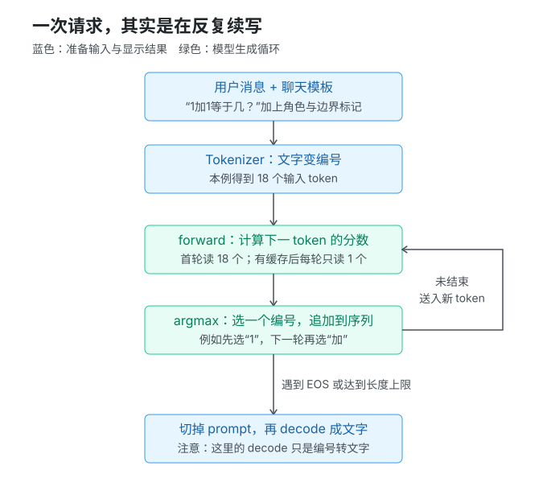
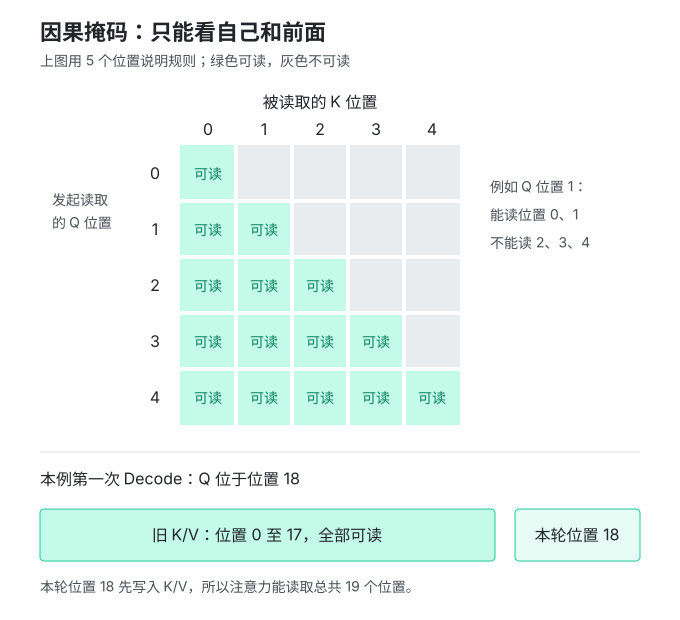
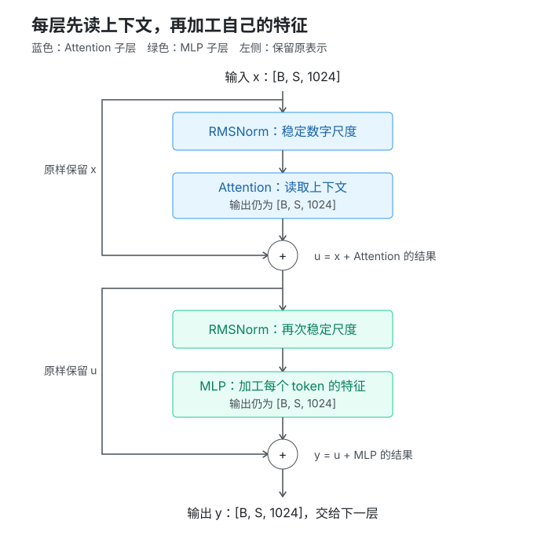
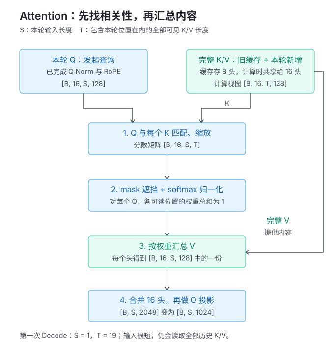
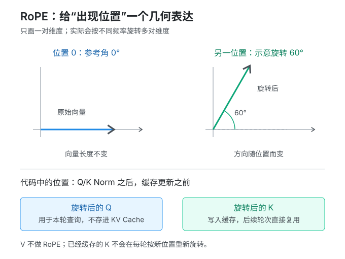
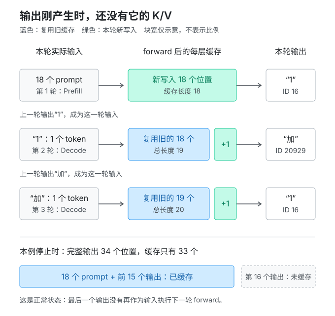
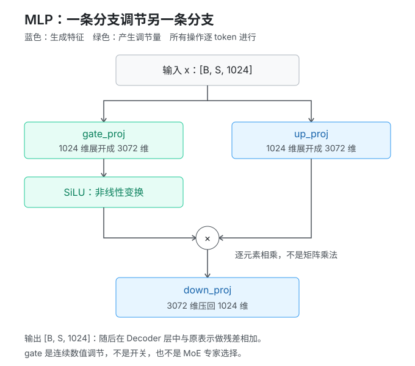

# 从一次请求读懂 Qwen3 推理：面向 AI Infra 学习者的代码教学

本文从 `debug_official.py` 出发，完整追踪：

```text
Python 中的用户请求
  -> 聊天模板
  -> Tokenizer
  -> generate() 生成控制循环
  -> Prefill：处理整段提示词，产生第一个新 token
  -> Decode：复用 KV Cache，每轮产生一个新 token
  -> EOS 或长度条件触发停止
  -> token ID 解码成最终文字
```

全文始终围绕同一个具体请求：用户输入 `1加1等于几？`，prompt 最终被编码为 18 个 token，最多生成 16 个新 token。后文出现的形状、长度和 token ID，默认都指这个请求。

目标不是让你在一堆源码链接之间跳转，而是把理解这条路径需要的代码和解释放在本文里。链接只是方便你日后打断点。

**阅读导航：**

| 想解决的问题 | 对应章节 |
|---|---|
| 一个请求经过哪些模块，输入如何进入模型 | 第 0 至 6 节 |
| 一次 forward 内部到底算了什么 | 第 7 至 11 节 |
| 怎样从一次 forward 变成完整回答 | 第 12 至 15 节 |
| 亲自管理 Prefill、Decode 与缓存 | 第 16 节，可运行实验 |
| 如何对应推理框架的内存与性能设计 | 第 17 节 |
| 查形状、打断点、检查理解 | 第 18 至 20 节 |

## 0. 阅读边界与实验基准

**本节目的：** 固定本文的模型、环境和覆盖范围，避免把本例结论误套到其他版本或推理系统。

### 0.0 先用白话理解：模型在反复“续写下一小段”

**本节目的：** 先建立“模型每轮只预测一个 token”的直觉，后文所有循环细节都围绕它展开。

你输入“1加1等于几？”，模型不是一次性返回一篇写好的答案。它反复做的是：

1. 把目前已经知道的内容送进模型，得到“下一个 token 的候选分数”。
2. 根据生成策略选出一个 token；本例是选分数最大的 token，例如 `1`。
3. 把这个 token 追加到已有序列末尾，作为下一轮输入的一部分。
4. 重复上述过程，直到命中结束标记，或者达到生成长度上限。

这里的“小段”叫 **token**。它可能是一个字、一组字、标点，也可能是专门表示消息边界的标记。不要先把它理解成一个完整单词。

模型真正接收的是 token 的编号；输出的也是编号。两端的 Tokenizer 负责在编号与文字之间转换。

**两个容易混淆的“解码”：** 推理阶段的 Decode 是“再算一轮，生成下一个 token”；`tokenizer.decode()` 是“把已有编号翻译回文字”。它们不是同一件事。

第一遍阅读每一步都可以追问四件事：**输入是什么？这一步做了什么？输出是什么？输出由谁在下一步使用？** 公式和性能细节可以第二遍再看。

### 0.1 本文对应什么版本

**本节目的：** 固定代码、依赖和模型基准，使源码行号、张量形状和运行结果可对应。

以下内容核对自本项目的实际环境，而不是笼统描述所有 Qwen 模型：

| 项目 | 本文基准 |
|---|---|
| 入口 | `debug_official.py` |
| Python | 本项目 `.venv` 中的 Python 3.11 |
| PyTorch | `2.8.0` |
| Transformers | `4.56.2` |
| 模型 | `Qwen/Qwen3-0.6B`，稠密 Decoder-only 模型 |
| 本地模型快照 | `c1899de289a04d12100db370d81485cdf75e47ca` |
| 实际 Tokenizer 类 | `Qwen2TokenizerFast`，名称不代表加载错模型 |
| 注意力后端 | `eager` |
| 生成方式 | `do_sample=False`，单序列贪心生成 |
| 缓存 | `use_cache=True`，默认 `DynamicCache` |
| 本次运行设备 | Apple MPS，参数与主要激活为 FP16 |
| 用户输入 | `1加1等于几？` |
| 新增 token 上限 | 16 |

模型目录中配置的 `transformers_version: "4.51.0"` 是保存配置时的版本信息；真正决定本文执行逻辑的是已安装的 **4.56.2**。

**代码片段的约定：**

- 标为“入口代码”的片段来自项目入口，补充了教学注释。
- 标为“源码主干”的片段保留当前路径的核心逻辑，省略文档字符串、装饰器或其他分支，不是上游文件的逐字完整拷贝。
- 标为“教学等价代码”的片段用于解释数学或状态变化，不声称就是库内部实现。
- 第 16 节给出完整可运行示例；其他片段按上下文阅读即可，不要求单独运行。

每段 Python/Jinja 代码附近都有“代码定位”。其中的行号是**实际源文件行号**，不是本文的行号；可点击跳转。教学改写、演算示例与运行结果也会注明对应来源，但不冒充原样源码。

短文件名的含义：`modeling_qwen3.py` 在 `transformers/models/qwen3/` 下，`generation/utils.py` 在 `transformers/generation/` 下，其余库文件均以 `.venv/lib/python3.11/site-packages/` 为根。链接包含完整绝对路径，末尾第 19 节也保留索引。

这条路径没有 Web 服务、请求队列、连续批处理、分布式通信、PagedAttention 或投机解码。后文会解释它与生产推理引擎的对应关系，但不会把未启用的机制说成已经执行。

### 0.2 先记住四个对象

**本节目的：** 区分 Tokenizer、模型、`generate()` 和 KV Cache 的职责，避免后文混淆。

| 对象 | 职责 | 不负责什么 |
|---|---|---|
| `tokenizer` | 字符串与 token ID 之间的转换 | 不执行 Transformer 的数学计算 |
| `model` | 用权重把输入 token 转换为下一 token 的分数 | 单次 `forward()` 不负责生成完整回答 |
| `generate()` | 调用模型、选 token、维护缓存和停止状态 | 不是某一层神经网络 |
| `past_key_values` | 保存各层已经计算出的 K、V | 不是权重缓存，也不是历史文本本身 |

最重要的边界是：

> `forward()` 计算“接下来各 token 有多合适”；`generate()` 决定“选哪个 token，是否再算一轮”。

## 1. 全局地图：一次请求实际经过哪些函数

**本节目的：** 在进入细节前先看到完整调用链，知道每个后续章节位于哪一步。

**先看白话：** 请求可以分成四个阶段：加载模型、把对话整理并编码成 token、反复计算并选择新 token、把新增 token 解码成文字。模型加载只发生在启动阶段，不会每生成一个 token 就重新加载一次。



图 1：蓝色是准备工作，绿色是反复生成。第一轮读取整段提示词，后续轮次只补算新 token。图中“选下一个 token”对应 [generation/utils.py:2883-2927][gen-select]，整个入口见 [debug_official.py:53-85][entry-request]。

下面是本例执行主干，省略 PyTorch 的通用包装层。竖线左侧表示调用关系，`while` 下的内容会反复执行：

```text
debug_official.main()
|
|-- AutoTokenizer.from_pretrained(...)
|-- AutoModelForCausalLM.from_pretrained(...)
|     `-- Qwen3ForCausalLM
|           |-- model: Qwen3Model
|           |     |-- embed_tokens
|           |     |-- layers[0..27]: Qwen3DecoderLayer
|           |     |-- norm
|           |     `-- rotary_emb
|           `-- lm_head
|
|-- tokenizer.apply_chat_template(messages, ...)
|-- tokenizer(text, return_tensors="pt")
|
|-- model.generate(...)
|     |-- 准备生成配置、停止条件、DynamicCache
|     `-- GenerationMixin._sample(...)  # 贪心也走这里
|           `-- while 未结束:
|                 |-- prepare_inputs_for_generation(...)
|                 |-- Qwen3ForCausalLM.forward(...)
|                 |     |-- Qwen3Model.forward(...)
|                 |     |     |-- Embedding
|                 |     |     |-- 创建 causal mask 和 RoPE cos/sin
|                 |     |     |-- 28 层 Qwen3DecoderLayer.forward(...)
|                 |     |     |     |-- RMSNorm
|                 |     |     |     |-- Qwen3Attention.forward(...)
|                 |     |     |     |     |-- Q/K/V 投影，Q/K Norm
|                 |     |     |     |     |-- RoPE
|                 |     |     |     |     |-- KV Cache 更新
|                 |     |     |     |     `-- QK^T -> mask -> softmax -> V -> O
|                 |     |     |     |-- 残差相加
|                 |     |     |     |-- RMSNorm -> SwiGLU MLP
|                 |     |     |     `-- 残差相加
|                 |     |     `-- 最终 RMSNorm
|                 |     `-- lm_head -> logits
|                 |-- 更新 cache、attention_mask、cache_position
|                 |-- logits_processor -> argmax
|                 |-- 将新 token 追加到完整序列
|                 `-- 检查 EOS / 长度上限
|
|-- 从 output_ids 中切掉 prompt
`-- tokenizer.decode(...) -> print(answer)
```

你在 Python 调试器里还会看到 `nn.Module.__call__`、`_call_impl` 等通用调用层。它们负责模块调用约定等工作，最终进入对应的 `forward()`。`model(...)` 不是重新加载模型。

## 2. 初始化：先把“模型机器”准备好

**本节目的：** 说明推理开始前如何定位文件、选择设备，并加载分词器和模型。

### 2.1 缓存目录在导入之前设置

**本节目的：** 说明模型文件从哪里读取，并区分磁盘模型缓存和运行时 KV Cache。

**先看白话：** 先告诉库“模型文件放在哪里”。这是找文件，不是让模型回答问题。

**代码定位：** [debug_official.py:2-13][entry-import]，入口代码，补充注释：

```python
import os
from pathlib import Path

ROOT = Path(__file__).resolve().parent  # 以脚本位置定位，不依赖 IDE 工作目录
os.environ.setdefault("HF_HOME", str(ROOT / ".cache" / "huggingface"))
os.environ.setdefault("HF_HUB_DISABLE_XET", "1")

import torch
from transformers import AutoModelForCausalLM, AutoTokenizer
```

`setdefault` 的意思是：外部没有设置这个环境变量时才使用这里的值。因此，外部已经设置 `HF_HOME` 时，实际缓存不一定在项目目录。

`HF_HUB_DISABLE_XET` 控制下载相关后端，不控制模型数学计算。本例 `local_files_only=True`，只使用本地已有文件，文件不全就报错，不会自动联网补齐。

这里的 **磁盘模型缓存** 与后面的 **设备内存 KV Cache** 完全不同：

| 名称 | 保存内容 | 生命周期 |
|---|---|---|
| Hugging Face 本地缓存 | 配置、分词器文件、训练好的权重文件 | 跨进程保留在磁盘 |
| 模型参数 | 已加载的权重张量 | 通常随模型实例长期驻留 |
| KV Cache | 本请求每一层历史 token 的 K、V | 通常属于本次生成请求 |

### 2.2 设备选择与 dtype

**本节目的：** 说明模型放在哪个设备、采用何种精度，以及这不会改变 token ID 的整数性质。

**代码定位：** [debug_official.py:27-31][entry-device]，把一行设备选择展开成多行，行为不变：

```python
device = DEVICE
if device == "auto":
    if torch.cuda.is_available():
        device = "cuda"
    elif torch.backends.mps.is_available():
        device = "mps"
    else:
        device = "cpu"

dtype = torch.float32 if device == "cpu" else torch.float16
```

设备和 dtype 是两个维度：

- `device` 决定张量存储位置与算子后端。
- `dtype` 决定数值表示、精度与每个元素的字节数。
- FP32 每元素 4 字节，FP16 每元素 2 字节。
- 输入 token ID 是整数索引，通常为 `torch.int64`，不会因为模型用了 FP16 就变成浮点数。

快照配置中的 `torch_dtype` 是 `bfloat16`，但入口显式传入 `dtype`，所以本次实际加载成 FP16。这是脚本策略，不代表 Qwen3 只能使用 FP16。

### 2.3 `from_pretrained` 到底做了什么

**本节目的：** 区分 Tokenizer 与模型的加载过程，理解配置如何决定实际模型类和权重。

**代码定位：** [debug_official.py:35-42][entry-load]，入口代码：

```python
tokenizer = AutoTokenizer.from_pretrained(
    MODEL_ID,
    local_files_only=LOCAL_FILES_ONLY,
)

model = AutoModelForCausalLM.from_pretrained(
    MODEL_ID,
    local_files_only=LOCAL_FILES_ONLY,
    dtype=dtype,
    attn_implementation="eager",
).to(device).eval()
```

**代码定位：** [auto_factory.py:469-604][auto-load]、[debug_official.py:35-42][entry-load]。下面是加载流程的教学伪代码，不是原样源码：

```python
# 教学流程，不是需要另行执行的加载实现。
config = 读取模型配置()                  # hidden_size、层数、head_dim 等
model_class = 按配置查找对应模型类()      # Qwen3Config -> Qwen3ForCausalLM
model = 构建模块树并加载检查点权重()      # 实际库会进行内存与加载流程优化
model = model.to(device)                 # 参数与注册的 buffer 移到目标设备
model.eval()                            # 切换模块的 training 标志
```

这里有两个独立的加载动作：第一段加载 Tokenizer，第二段加载模型。Tokenizer 负责文字和 token ID；模型负责用参数执行神经网络。它们都使用同一个模型目录，但不是同一个对象。

`Auto` 是模型类型分发器，不是一个额外的神经网络。模型配置中的 `model_type="qwen3"` 让它选择 `Qwen3ForCausalLM`；Tokenizer 配置则让它加载兼容的 `Qwen2TokenizerFast`。Tokenizer 类名中的 `Qwen2` 是实现复用的名称，不表示当前加载成了 Qwen2 模型。

模型本地快照中的关键文件：

| 文件 | 作用 |
|---|---|
| `config.json` | 神经网络结构配置 |
| `model.safetensors` | 训练好的参数张量 |
| `generation_config.json` | 默认生成策略，例如 EOS、采样参数 |
| `tokenizer.json` | Fast Tokenizer 的词表与处理规则 |
| `tokenizer_config.json` | Tokenizer 配置、特殊 token、聊天模板等 |
| `vocab.json`、`merges.txt` | BPE 词表及合并规则相关文件 |

**`.eval()` 不等于关闭梯度。**

**代码定位：** [debug_official.py:37-42][entry-load] 与 [debug_official.py:69-77][entry-generate]；合并展示两个不同职责：

```python
model.eval()                   # 例如让 Dropout 使用推理行为
with torch.inference_mode():   # 关闭梯度记录及一些额外跟踪开销
    output_ids = model.generate(...)
```

本例没有标签、没有 loss 反向传播、没有优化器，不更新权重。`generate()` 自身也有关闭梯度的保护，入口再使用 `inference_mode()` 明确表示整段代码用于推理。

### 2.4 这台模型机器的尺寸

**本节目的：** 给后文张量形状、注意力头和 KV Cache 大小准备统一的配置数值与符号。

| 配置项 | 数值 | 含义 |
|---|---:|---|
| `vocab_size` | 151936 | Embedding 和输出头的词表维度 |
| `hidden_size` | 1024 | 每个 token 在层间传递的向量宽度 |
| `num_hidden_layers` | 28 | Decoder 层数 |
| `num_attention_heads` | 16 | Query 头数 |
| `num_key_value_heads` | 8 | Key/Value 头数 |
| `head_dim` | 128 | 每个注意力头的维度 |
| `intermediate_size` | 3072 | MLP 中间维度 |
| `hidden_act` | `silu` | MLP 门控激活函数 |
| `rms_norm_eps` | `1e-6` | RMSNorm 数值稳定项 |
| `rope_theta` | 1000000 | RoPE 基频参数 |
| `max_position_embeddings` | 40960 | 配置的位置长度基准，不是此次生成长度 |
| `tie_word_embeddings` | `true` | Embedding 和输出头共享权重 |
| `use_sliding_window` | `false` | 本例所有层均为 full causal attention |

**特别注意：`1024 / 16 = 64`，但本模型的 `head_dim` 是 128，不是 64。**

这里 Q 投影输出宽度为 `16 * 128 = 2048`，因此拼接注意力头后的 2048 维需要由 `o_proj` 映射回 1024 维。

后文使用这些符号：

```text
B  = batch size，本例为 1
S  = 本轮实际送进 forward 的 token 数
T  = 本轮注意力可以访问的 K/V 总长度
H  = hidden_size = 1024
Nq = Query 头数 = 16
Nk = KV 头数 = 8
D  = head_dim = 128
I  = intermediate_size = 3072
V  = 模型词表维度 = 151936
P  = prompt 长度，本例为 18
```

Prefill 时 `S=T=P=18`。第一轮 Decode 时 `S=1, T=19`。不要把 `S` 和 `T` 始终当成相同的长度。

**张量形状到底怎么读？** 把 `[1,18,1024]` 想成一张“18 行、每行 1024 个数字”的表，最外层的 `1` 表示这里只有一条请求。18 行对应 18 个 token；每行的 1024 个数字是模型对这个 token 的内部表示，不是 1024 个新 token。

再看 `[1,16,18,128]`：一条请求，分成 16 个注意力头，每个头处理 18 个位置，每个位置使用 128 个数字。所谓“拆头”，就是把一大组数字分成几组来算，不是在复制出 16 个完整模型。

## 3. 从用户请求到聊天模板：此时还没有张量计算

**本节目的：** 说明用户消息如何先变成 Qwen 对话格式字符串，尚未进入模型计算。

**先看白话：** 这一节只做字符串整理，不执行模型 forward。聊天模板把 Python 字典里的角色和内容，转换成模型约定的带边界标记的字符串；下一节才把这个字符串编码成 token ID。

**代码定位：** [debug_official.py:53-57][entry-template]，入口代码：

```python
messages = [{"role": "user", "content": "1加1等于几？"}]
text = tokenizer.apply_chat_template(
    messages,
    tokenize=False,              # 先输出字符串，不直接输出 token ID
    add_generation_prompt=True,  # 加 assistant 开头，引导模型续写回答
    enable_thinking=False,       # 模板中预先结束空的 thinking 段
)
```

本次实际得到的 `repr(text)`：

```text
'<|im_start|>user\n1加1等于几？<|im_end|>\n<|im_start|>assistant\n<think>\n\n</think>\n\n'
```

按行阅读：

```text
<|im_start|>user
1加1等于几？<|im_end|>
<|im_start|>assistant
<think>

</think>

```

角色名、边界标记、换行都属于模型接下来能看到的上下文。

到这里的结果仍然是 Python 字符串 `text`，还不是 `input_ids`。只有执行 `tokenizer(text, return_tensors="pt")` 后，才会得到模型可以接收的整数张量。

**代码定位：** [tokenizer_config.json:230][tokenizer-template] 的 `chat_template` 字符串。下面将其中末尾一段转义的换行展开为可读 Jinja；不是另一个独立的 `.jinja` 文件：

```jinja

    {{- '<|im_start|>assistant\n' }}
    
        {{- '<think>\n\n</think>\n\n' }}
    

```

这里有三个值得区分的事实：

1. `enable_thinking=False` 是模板控制参数，不是在模型里关闭若干 Decoder 层。
2. 模型并不直接读取 Python 字典的 `role` 字段，而是读取模板转换出来的 token 序列。
3. `<think>` 和 `</think>` 在本例中已经属于输入，不能误认为它们是模型刚刚生成的回答。

没有 system 消息时，本次模板也没有凭空加入一条 system 提示词。

## 4. Tokenizer：把文字变成整数序列

**本节目的：** 说明聊天模板字符串如何变成模型可接收的 `input_ids` 和 `attention_mask`。

### 4.1 入口与实际结果

**本节目的：** 查看本次请求实际得到的 token ID、长度和各位置的可读含义。

**先看白话：** Tokenizer 把每段文字换成一个编号。编号只是查表用的，`16` 不表示语义强度是 `8` 的两倍。

**代码定位：** [debug_official.py:62-64][entry-tokenize]，入口代码：

```python
inputs = tokenizer(text, return_tensors="pt").to(device)
prompt_length = inputs.input_ids.shape[1]
```

`return_tensors="pt"` 让返回值里的序列成为 PyTorch 张量。返回容器是 `BatchEncoding`，可以按键访问，也可以用属性访问：

**代码定位：** [debug_official.py:62-66][entry-inputs]；下面是对返回对象的教学访问示例：

```python
inputs["input_ids"]       # 与 inputs.input_ids 对应
inputs["attention_mask"]  # 1 表示有效位置，0 表示 padding
```

**数据定位：** [debug_official.py:62-66][entry-inputs] 的运行结果，下面用 Python 列表展示，不是源文件里的硬编码常量：

```python
input_ids = [[
    151644, 872, 198, 16, 20929, 16, 107106, 99195, 11319,
    151645, 198, 151644, 77091, 198, 151667, 271, 151668, 271,
]]
# shape: [1, 18]，dtype: int64

attention_mask = [[1] * 18]
# shape: [1, 18]；本请求没有 padding
```

这里的形状按 `[batch_size, sequence_length]` 读取：`[1,18]` 表示一条请求、18 个 token。`attention_mask` 与 `input_ids` 位置一一对应；本例没有 padding，所以 18 个位置全是 1。

各位置的可读含义如下。这里展示解码后的文字，不是 byte-level BPE 的内部字节符号：

| 位置 | ID | 含义 |
|---:|---:|---|
| 0 | 151644 | `<\|im_start\|>` |
| 1 | 872 | `user` |
| 2 | 198 | `\n` |
| 3 | 16 | `1` |
| 4 | 20929 | `加` |
| 5 | 16 | `1` |
| 6 | 107106 | `等于` |
| 7 | 99195 | `几` |
| 8 | 11319 | `？` |
| 9 | 151645 | `<\|im_end\|>` |
| 10 | 198 | `\n` |
| 11 | 151644 | `<\|im_start\|>` |
| 12 | 77091 | `assistant` |
| 13 | 198 | `\n` |
| 14 | 151667 | `<think>` |
| 15 | 271 | `\n\n` |
| 16 | 151668 | `</think>` |
| 17 | 271 | `\n\n` |

Markdown 表格里的 `\|` 只是转义竖线；实际特殊 token 中没有反斜杠。

**token 不等于汉字，也不等于单词。** 例如“等于”在本例中是一个 token，两个换行也可以是一个 token。

### 4.2 Tokenizer 内部做什么

**本节目的：** 概括 Fast Tokenizer 如何编码字符串，并澄清词表大小相关数字的不同含义。

这一节回答的是“字符串如何变成上面的整数列表”，不是“token ID 如何进入 Transformer”。简化理解 Fast Tokenizer 路径：

```text
Python tokenizer(...)
  -> 准备编码参数
  -> Rust tokenizers 后端 encode_batch(...)
  -> 识别特殊 token，并按词表与 BPE 等规则编码普通文本
  -> 返回 ID、attention mask 等
  -> 封装为 BatchEncoding 和 PyTorch 张量
```

“Fast”部分主要在 Rust 中执行；仅使用 Python 单步调试时，不会像查看 Qwen3 Python 层那样逐行展开底层编码算法。

本例 `.to(device)` 移动的是返回容器中的张量，不会把字符串处理或 Rust Tokenizer 变成 GPU 上的神经网络。

另外，本机实际检查得到：

```text
tokenizer.vocab_size = 151643
len(tokenizer)       = 151669
model.config.vocab_size = 151936
```

它们分别表示：

- `tokenizer.vocab_size`：Tokenizer 声明的基础词表大小。
- `len(tokenizer)`：加入特殊 token 等扩展后，Tokenizer 可识别的条目数。
- `model.config.vocab_size`：Embedding 和输出头实际分配的词表维度。

这三个数字服务于不同对象，不能直接混用。模型输出 `logits` 的最后一维由 `model.config.vocab_size` 决定；其中的每个位置是一个候选 token ID，不等于一个汉字或一个可见字符。

## 5. `generate()`：建立生成过程的控制状态

**本节目的：** 说明 `generate()` 如何把一次模型 forward 组织成持续生成多个 token 的循环。

### 5.1 调用参数如何影响行为

**本节目的：** 找出本次生成最终生效的配置，并确定为何走贪心而不是随机采样。

**先看白话：** `generate()` 就是循环的组织者：让模型算一次、选一个 token、检查是否结束，再决定要不要继续。

本例需要先区分三层配置：

| 配置来源 | 本例的值 | 作用 |
| --- | --- | --- |
| `generation_config.json` 默认值 | `do_sample=True`、`temperature=0.6`、`top_k=20`、`top_p=0.95` | 如果调用时没有覆盖，就作为生成默认行为 |
| 入口运行时修改 | `temperature=1.0`、`top_p=1.0`、`top_k=50` | `generate()` 调用前直接修改 `model.generation_config` |
| `model.generate(...)` 调用参数 | `do_sample=False`、`max_new_tokens=16`、`use_cache=True` | 本次调用明确传入；同名参数优先于生成配置 |

因此，本次运行的关键结论是：

```text
do_sample=False
    -> 不进行随机采样
    -> 生成模式是 GREEDY_SEARCH
    -> 每轮选择处理后 logits 最大的 token（argmax）
```

**代码定位：** [debug_official.py:69-77][entry-generate]，入口代码：

```python
with torch.inference_mode():
    output_ids = model.generate(
        **inputs,                       # 展开 input_ids 和 attention_mask
        max_new_tokens=16,              # 最多新增 16 个 token
        do_sample=False,                # 不随机采样
        use_cache=True,                 # 保留历史 token 的每层 K/V
    )
```

`**inputs` 只是 Python 的字典参数展开，等价于显式传入 `input_ids` 和 `attention_mask`：

**代码定位：** [debug_official.py:72-77][entry-generate]；下面是展开参数后的教学等价写法：

```python
model.generate(
    input_ids=inputs.input_ids,
    attention_mask=inputs.attention_mask,
    max_new_tokens=16,
    do_sample=False,
    use_cache=True,
)
```

**默认配置定位：** [generation_config.json:2-11][generation-config]。下面列出的是配置文件中的默认值，不一定是本次调用的最终值：

```python
do_sample = True
temperature = 0.6
top_k = 20
top_p = 0.95
eos_token_id = [151645, 151643]
pad_token_id = 151643
```

入口代码没有改写磁盘上的 `generation_config.json`，但在加载后、调用 `generate()` 前，直接把内存中的 `model.generation_config` 改成了 `temperature/top_p/top_k = 1.0/1.0/50`。调用参数 `do_sample=False` 又覆盖了默认的 `do_sample=True`。由于本次走贪心分支，不会执行随机采样所需的 temperature、top-k、top-p 处理；这些值不会改变本次选出的 token。

**停止条件也要看最终配置：** 模型结构配置中的 `eos_token_id` 是 `151645`，但本次生成配置中的 EOS 是 `[151645, 151643]`。因此生成出的 token 只要命中 `151645` 或 `151643` 任意一个，就可能触发停止；不能只根据模型结构配置中的单个值判断。

### 5.2 进入循环前准备了什么

**本节目的：** 列出循环启动前创建的长度限制、停止条件、缓存和 logits 处理状态。

**代码定位：** [generation/utils.py:2362-2406][gen-prepare] 与 [generation/utils.py:1999-2008][gen-cache]；下面是本次路径的教学概括：

这一阶段还没有逐个生成新 token。它先把“生成循环需要的状态”准备好：

```python
input_ids = inputs.input_ids               # 完整逻辑序列，初始为 [1,18]
max_length = input_ids.shape[1] + 16        # 18 + 16 = 34
past_key_values = DynamicCache(config=model.config)
logits_to_keep = 1                         # 只需要最后位置的词表输出
use_cache = True
```

除此之外，还会创建 logits processors、EOS/最大长度停止条件，准备特殊 token 张量，并验证参数。可以把这一步理解为“搭好生成循环的运行环境”，而不是已经完成一次生成。

本次配置没有启用重复惩罚、强制 token 等额外 logits 处理，所以选 token 时可以简化理解为：对最后位置的 logits 做 `argmax`。如果以后改变生成配置，logits 可能会先经过 processors，再进行选择，不能再假设处理器总是空的。

`DynamicCache(config=...)` 会根据模型的 28 层 Transformer 准备 28 个缓存层对象。此时主要是准备存放位置；每层真正的 K/V 张量会在第一次 forward 更新缓存时，按照实际输入长度初始化。它是动态增长的，因此不会因为 `max_length=34` 就提前为每层分配一整块长度为 34 的 Static Cache。

### 5.3 为什么贪心会进入 `_sample`

**本节目的：** 消除函数名带来的误解，说明贪心与随机采样如何复用同一个循环实现。

**这段代码要解决什么问题？** 前面已经根据配置判定了生成模式；这里选择具体的循环函数。当前 Transformers 版本让“随机采样”和“贪心”复用同一个 `_sample()` 循环，区别留到循环内部的 `do_sample` 分支处理。

```python
elif generation_mode in (GenerationMode.SAMPLE, GenerationMode.GREEDY_SEARCH):
    result = self._sample(
        input_ids,                                       # 当前完整序列
        logits_processor=prepared_logits_processor,      # 选 token 前修改分数的规则
        stopping_criteria=prepared_stopping_criteria,    # EOS、最大长度等停止规则
        generation_config=generation_config,             # 本次最终生效的配置
        synced_gpus=synced_gpus,
        streamer=streamer,
        **model_kwargs,                                  # cache、mask、位置等循环状态
    )
```

**代码定位：** [generation/utils.py:2537-2549][gen-dispatch]；上面是模式分派主干，并补充了参数职责。

这里最容易误解的是函数名：`_sample` 不等于“本次一定随机采样”。它是当前 Transformers 版本中，贪心和随机采样共用的生成循环。

本次实际路径可以写成：

```text
do_sample=False
    -> generation_mode = GREEDY_SEARCH
    -> GREEDY_SEARCH 也被分派到 _sample
    -> 循环内部走 do_sample=False 分支
    -> 对最后位置 logits 做 argmax
```

只有当 `do_sample=True` 时，`_sample` 内部才会按概率随机抽取 token。因此，判断生成方式要看 `do_sample` 和循环内部的分支，不能只看 `_sample` 这个函数名。

## 6. Prefill 与 Decode 的分界：准备本轮输入

**本节目的：** 说明同一条序列在首次处理和后续生成时，为何送进模型的 token 数量不同。

### 6.1 生成循环保留完整序列，模型只接收未缓存部分

**本节目的：** 通过 KV Cache 解释完整序列、本轮输入和缓存长度为何是三个不同状态。

**先理解 KV Cache：** 每个 Decoder 层在处理一个 token 时，都会算出该 token 的 Key（K）和 Value（V）。KV Cache 就是把这些历史 K/V 按层保存下来；它不保存模型权重，也不直接保存原始文本。

下一轮生成时，历史 token 不必重新经过 Embedding、28 层 Decoder、Q/K/V 投影和 MLP。模型会把本轮新 token 算出的 Q，与 Cache 中历史 token 的 K/V 一起做 Attention，因此仍然能读取完整上下文。

```text
上一轮处理完 token 0..17：
    每层 KV Cache 已保存位置 0..17 的 K/V

下一轮处理位置 18：
    只计算位置 18 的新 Q/K/V
    新 Q 读取 Cache 中位置 0..17 的 K/V，以及本轮位置 18 的 K/V
```

**再看本节问题：** “已经输出多少内容”和“这一轮还要重新算多少内容”不是一回事。有 KV Cache 后，历史内容的计算结果仍可读取，所以这一轮只需把最新的一小段送进模型。

这一节要区分三个状态。它们都在描述同一条序列，但用途不同：

```text
完整序列 input_ids：
    prompt + 已经生成的 token
    用于保存最终输出，也用于下一轮追加 token

本轮 model_inputs["input_ids"]：
    本轮真正重新送入模型的 token

KV Cache 的长度：
    已经完成各层 K/V 计算并保存的 token 数量
```

在本例中，三者随时间变化如下：

| 时刻 | 完整序列长度 | 本轮送入模型 | forward 前缓存长度 |
|---|---:|---:|---:|
| Prefill | 18 | 18 个 prompt token | 0 |
| 第一次 Decode | 19 | 刚生成的 1 个 token | 18 |
| 第二次 Decode | 20 | 上一轮生成的 1 个 token | 19 |

注意：表中 Decode 的“完整序列长度”包含刚刚选出的 token，但这个 token 要到下一轮才会作为输入送进模型。

**这段代码要解决什么问题？** `generate()` 手里拿的是完整序列，但 `forward()` 只应接收本轮尚未写入缓存的 token。下面的代码就是把“完整生成状态”整理成“本轮 `forward()` 参数”：

```python
model_inputs["cache_position"] = cache_position
# 告诉模型：本轮输入 token 对应序列中的哪些位置。
# Prefill 时是 [0, 1, ..., 17]；第一次 Decode 时是 [18]。

if past_key_values is not None:
    model_inputs["past_key_values"] = past_key_values
    # 把已经计算好的历史 K/V 一并传给 forward，供本轮 Attention 读取。

    inputs_embeds, input_ids = self._cache_dependant_input_preparation(
        input_ids, inputs_embeds, cache_position
    )
    # 关键步骤：依据 cache_position 裁剪完整 input_ids，
    # 只保留“还没有计算过 K/V”的 token。
    # 本例第一次 Decode：完整长度 19 -> 本轮 input_ids 长度 1。

model_inputs["input_ids"] = input_ids.clone(
    memory_format=torch.contiguous_format
)
# 将裁剪后的本轮 token 写入返回字典；下一步实际调用 model(**model_inputs)。
```

**代码定位：** [generation/utils.py:545-583][gen-inputs]；上面是保留本例主线后的源码，并补充了教学注释。

这段函数本身不计算 Attention，不选择下一个 token，也不写入新的 K/V；它只负责准备参数。可把它理解为：

```text
完整 input_ids + 历史 KV Cache
        -> 按 cache_position 裁剪
        -> 返回本轮 model_inputs
        -> model(**model_inputs) 才开始 forward
```

普通缓存路径下，输入切片可以理解为：

**代码定位：** [generation/utils.py:448-480][gen-slice]；仅展示本例适用的切片思想：

```python
input_ids = input_ids[:, cache_position]  # 教学解释，源码还有长度相等等分支
```

Prefill（第一次 forward）：

**代码定位：** [generation/utils.py:1788-1814][gen-initial-position]；以下为初始位置的教学等价写法：

```python
cache_position = torch.arange(18, device=device)  # [0,1,...,17]
# 缓存为空，因此模型收到所有 18 个 token。
```

Prefill 选出第一个新 token 后，准备下一轮 Decode：

**代码定位：** [generation/utils.py:993-994][gen-next-position]；以下为下一轮位置的具体数值示意：

```python
# 完整序列长度已经变成 19，但前 18 个位置已有 K/V。
cache_position = torch.tensor([18], device=device)
# 下一轮模型只收到位置 18 的这一个 token。
```

因此，`use_cache=True` 不是让模型“跳过所有旧上下文”。旧上下文仍然通过 K/V 参加注意力，只是不重复计算它们的各层表示。

### 6.2 `position_ids` 与 `cache_position`

**本节目的：** 区分“token 在语义序列中的位置”和“本轮 token 对应的缓存位置”，理解它们为何常常数值相同却职责不同。

**代码定位：** [generation/utils.py:588-616][gen-position-ids]，生成准备阶段的位置计算主干：

```python
position_ids = attention_mask.long().cumsum(-1) - 1
position_ids.masked_fill_(attention_mask == 0, 1)

# 存在缓存时，只保留本轮输入对应的位置。
position_ids = position_ids[:, -current_input_length:]
```

本例无 padding：

| 阶段 | `position_ids` | `cache_position` |
|---|---|---|
| Prefill | `[[0,1,...,17]]` | `[0,1,...,17]` |
| 第一次 Decode | `[[18]]` | `[18]` |
| 第二次 Decode | `[[19]]` | `[19]` |

含义不同：

- `position_ids` 给 RoPE 提供每条序列的语义位置。
- `cache_position` 描述本轮处理的缓存位置，也参与 mask 构造。

无 padding 时数值一致，不代表概念相同。批量左 padding 时，每条序列的有效位置编号与统一张量中的缓存槽位可能不同。

## 7. 进入模型：Embedding、因果掩码与位置编码

**本节目的：** 跟踪本轮 token 如何从整数 ID 变成带位置、带可见性约束的模型内部向量。

### 7.1 外层模型先调用 Decoder 主体

**本节目的：** 明确 `Qwen3ForCausalLM.forward()` 如何把准备好的输入交给真正的 Decoder 网络。

**先看白话：** 到这里，`generate()` 已经准备好本轮输入；现在进入一次 `forward()`。外层模型做两件事：先让 28 层网络处理输入，再把处理结果转成词表分数。本节先看前一件事。

**这段代码要解决什么问题？** 外层 `Qwen3ForCausalLM` 不自己逐层计算 Attention；它把本轮输入和缓存交给内部的 `Qwen3Model`，再取得处理后的隐藏表示。下面是调用边界：

```python
outputs = self.model(
    input_ids=input_ids,                # 本轮实际输入：Prefill 为 18 个，Decode 为 1 个
    attention_mask=attention_mask,      # 完整可见序列的有效位置
    position_ids=position_ids,          # 本轮 token 的语义位置，供 RoPE 使用
    past_key_values=past_key_values,    # 之前已算好的各层 K/V
    use_cache=use_cache,                # 是否在本轮把新 K/V 写入缓存
    cache_position=cache_position,      # 本轮 token 写入/对应的序列位置
)

hidden_states = outputs.last_hidden_state  # 28 层处理后的表示
# lm_head 的部分在第 11 节展开。
```

**代码定位：** [modeling_qwen3.py:480-491][q-forward]；上面是源码主干，并补充了本例参数含义。

这里的 `self.model` 是 `Qwen3Model`，即 Embedding、28 层 Decoder 和最终 Norm 的组合；它不是另一个独立服务，也不会再次分词。它返回的 `hidden_states` 还不是词表分数，下一步由 `lm_head` 转换。

### 7.2 Embedding 是查表，不是对 ID 做数值运算

**本节目的：** 解释整数 token ID 如何通过查表变成 1024 维浮点向量。

**先看白话：** Embedding 为词表中的每个 token ID 准备一行可学习的浮点数。输入编号 `16` 时，只取第 16 行；这一步不把数字 `16` 当作数值参与加减，而是把它当作索引。

**这段代码要解决什么问题？** Transformer 不能直接对整数 ID 做矩阵计算。这里先创建一张“ID 到向量”的表，再按 `input_ids` 逐位置取行，得到可送进 Decoder 的浮点张量。

```python
self.embed_tokens = nn.Embedding(
    config.vocab_size,   # 151936：可索引的 token ID 行数
    config.hidden_size,  # 1024：每个 token ID 对应一行 1024 维向量
    self.padding_idx,    # 若存在 padding，指定其对应的特殊行
)

inputs_embeds = self.embed_tokens(input_ids)  # [B,S] 的整数 ID -> [B,S,1024] 的浮点向量
```

**代码定位：** [modeling_qwen3.py:342][q-embedding-init]、[modeling_qwen3.py:370-371][q-embedding]；上面是 Embedding 初始化与查表主干。

**代码定位：** [modeling_qwen3.py:370-371][q-embedding]；下面用数组索引解释查表，不是该行源码的原样拷贝：

```python
inputs_embeds = embedding_weight[input_ids]
# input_ids:      [B,S]，整数
# embedding表:    [V,H] = [151936,1024]，浮点数
# inputs_embeds:  [B,S,H]
```

Prefill 的输入是 18 个 token，所以得到 `[1,18,1024]`；Decode 的输入只有 1 个 token，所以得到 `[1,1,1024]`。这里的 `S` 变化了，隐藏宽度 `H=1024` 没变。

ID 16 和 17 的数字接近，不代表它们的语义距离接近；语义表示来自训练好的向量。

### 7.3 二维 padding mask 如何变成四维 causal mask

**本节目的：** 解释“有效位置”信息如何变成 Attention 中禁止读取未来 token 的具体掩码。

**先看白话：** 有两种不同的“遮挡”：padding mask 遮住为了凑齐长度而填的空位；causal mask 遮住当前 token 后面的内容，避免它提前偷看未来。



图 2：把方格的行当作“谁在读取”，列当作“读谁”。绿色可读，灰色不可读。最后一行演示位置 18 的 Decode：位置 0 至 18 已经存在，所以都可读；位置 18 是本轮输入，不是本轮尚未选出的答案 token。对应 [masking_utils.py:475-522][eager-mask]。

入口传入的 `[1,18]` 全 1 mask 只表示“没有 padding”，**本身没有表达不许看未来**。

**这段代码要解决什么问题？** 入口传入的二维 `attention_mask` 只标记 padding；这里根据当前位置和缓存长度构造真正限制“谁能看谁”的因果 mask，并按 Attention 层类型保存。

**代码定位：** [modeling_qwen3.py:385-399][q-mask]；下面将参数字典展开，并补充各参数的作用：

```python
causal_mask_mapping = {
    "full_attention": create_causal_mask(  # 本例所有 28 层都使用这一种 mask
        config=self.config,                # 模型的 attention 类型等配置
        input_embeds=inputs_embeds,        # 用于确定本轮 query 长度与 dtype
        attention_mask=attention_mask,     # 二维有效位置信息
        cache_position=cache_position,     # 本轮 query 对应的绝对位置
        past_key_values=past_key_values,   # 用于得知历史 K/V 长度
        position_ids=position_ids,         # padding 等情况下辅助确定位置
    ),
}
```

本例 eager 后端使用浮点加法 mask：

**代码定位：** [masking_utils.py:74-82][causal-rule] 与 [masking_utils.py:475-522][eager-mask]；下面是无 padding 情况的教学等价计算：

```python
# 教学等价代码：展示本例没有 padding 时的核心关系。
query_positions = cache_position[:, None]         # [S,1]
key_positions = torch.arange(T, device=device)[None, :]  # [1,T]
allowed = key_positions <= query_positions        # [S,T]
mask = torch.where(allowed, 0.0, torch.finfo(dtype).min)
mask = mask[None, None, :, :]                     # [1,1,S,T]
```

源码实际还合并 padding 等约束，不是只处理上述最简单情况。

Prefill 时，忽略 batch/head 广播维，mask 像这样：

```text
         key0  key1  key2  key3 ...
query0     0     m     m     m
query1     0     0     m     m
query2     0     0     0     m
query3     0     0     0     0

m = 当前 dtype 可表示的最小有限值
```

FP16 的 `m=-65504`；不要把源码中的这个值严格说成浮点 `-inf`。它在 softmax 前把被屏蔽位置的分数压到极低。

第一轮 Decode 的新 token 位置为 18，可以看位置 `0..18`，因此本例 mask 为 `[1,1,1,19]`，值全为 0。

**单 token 解码的因果条件仍然存在，只是此次所有已存位置都满足条件。**

### 7.4 RoPE 的 cos/sin 每次 forward 计算一次，供各层共用

**本节目的：** 说明位置编号如何生成 RoPE 所需的 `cos/sin`，以及为什么 28 层可以共享这份数据。

**这段代码要解决什么问题？** 先从 token ID 查出向量，再为本轮位置计算一份 RoPE 的 `cos/sin`；随后让同一份位置数据被 28 个 Decoder 层重复使用，最后做一次总的 RMSNorm。

```python
hidden_states = inputs_embeds
position_embeddings = self.rotary_emb(hidden_states, position_ids)
# position_embeddings 是 (cos, sin)，形状为 [B,S,128]；此时尚未旋转 Q/K。

for decoder_layer in self.layers:
    hidden_states = decoder_layer(
        hidden_states,  # 上一层输出；第 0 层时就是 Embedding 结果
        attention_mask=causal_mask_mapping[decoder_layer.attention_type],
        position_ids=position_ids,
        past_key_values=past_key_values,
        use_cache=use_cache,
        cache_position=cache_position,
        position_embeddings=position_embeddings,  # 各层共享，不必重复计算 cos/sin
    )

hidden_states = self.norm(hidden_states)  # 所有 Decoder 层之后的最终 RMSNorm
```

**代码定位：** [modeling_qwen3.py:404-424][q-layers]；上面是源码主干，并补充了数据流注释。

`position_embeddings` 是 `(cos, sin)`，不是把一个位置向量加到 Embedding 上。真正的旋转在每一层的 Q/K 上执行。

**代码定位：** [modeling_rope_utils.py:110-119][rope-frequency] 与 [modeling_qwen3.py:321-332][q-rope]；下面是默认 RoPE 的教学等价代码：

```python
head_dim = 128
theta = 1_000_000

inv_freq = 1.0 / (
    theta ** (torch.arange(0, head_dim, 2, device=device).float() / head_dim)
)  # [64]，为不同维度配不同旋转频率

freqs = position_ids.float()[..., None] * inv_freq[None, None, :]
# [B,S,64]：位置编号乘以每个维度的频率

emb = torch.cat((freqs, freqs), dim=-1)  # [B,S,128]
cos = emb.cos().to(dtype)
sin = emb.sin().to(dtype)
```

源码通过矩阵乘法完成位置与频率组合，并显式使用 FP32 计算频率及三角函数，最后转回激活 dtype。`inv_freq` 是注册的 buffer，不是通过本次请求学习的参数。

默认配置没有启用动态 RoPE 缩放。源码的 autocast 控制在 MPS 情况下使用 `"cpu"` 作为上下文类型，不能据此推断三角函数张量被搬到了 CPU；张量运算设备仍需看实际张量的 `device`。

## 8. 一层 Decoder 的完整骨架

**本节目的：** 先把单层 Decoder 中 Attention、MLP 和两次残差连接的顺序串起来。

**先看白话：** 一层主要做两次加工。Attention 负责“从其他位置取有用信息”，MLP 负责“整理当前位置的特征”。每次加工后，都把结果加回原来的表示，不把原内容直接丢掉。



图 3：左侧绕行箭头是保留下来的原表示；圆圈中的加号是逐元素相加。整套结构重复 28 次，但每层权重不同。对应 [modeling_qwen3.py:257-277][q-decoder]。

28 层的代码结构相同，但每层参数不同，缓存也各自独立。

**这段代码要解决什么问题？** 一个 Decoder 层接收 `[B,S,1024]` 的表示，依次经过 Attention 和 MLP；每个子模块的结果都加回输入，因此输出形状保持 `[B,S,1024]`，可继续交给下一层。

```python
residual = hidden_states                        # 保留层输入 [B,S,1024]
hidden_states = self.input_layernorm(hidden_states)  # 先归一化，再进入 Attention

hidden_states, _ = self.self_attn(
    hidden_states=hidden_states,                # 归一化后的本层输入
    attention_mask=attention_mask,              # 不能读取未来的位置
    position_ids=position_ids,
    past_key_values=past_key_values,            # 历史 K/V
    use_cache=use_cache,
    cache_position=cache_position,
    position_embeddings=position_embeddings,    # 本轮的 RoPE cos/sin
)
hidden_states = residual + hidden_states        # 第一次残差相加

residual = hidden_states                        # 保存 Attention 后的表示
hidden_states = self.post_attention_layernorm(hidden_states)  # MLP 前的归一化
hidden_states = self.mlp(hidden_states)         # 逐 token 的非线性变换
hidden_states = residual + hidden_states        # 第二次残差相加
return hidden_states                           # 仍然是 [B,S,1024]
```

**代码定位：** [modeling_qwen3.py:257-277][q-decoder]；上面是源码主干，并补充了每一步的输入输出职责。

数学结构：

```text
u = x + Attention(RMSNorm(x))
y = u + MLP(RMSNorm(u))
```

这是 Pre-Norm：先归一化，再进入子层。残差连接保留已有表示，子层学习对它的增量修正。

这里的 `post_attention_layernorm` 虽然名字里有 post，但它位于 MLP 之前，不要据此误判整个网络是 Post-Norm 架构。

### 8.1 RMSNorm 做了什么

**本节目的：** 说明 RMSNorm 如何稳定每个 token 向量的数值尺度而不改变张量形状。

**先看白话：** 它把每个 token 那一行数字的整体大小调到较稳定的尺度，再乘上学到的缩放系数。它调整的是数字的尺度，不会删掉 token，也不会变成一句人话。

**这段代码要解决什么问题？** 对每个 token 的 1024 维向量，先计算均方根大小，再按该大小缩放，使数值尺度更稳定；最后乘上可学习的逐维权重。输入和输出形状不变。

```python
input_dtype = hidden_states.dtype                 # 记住原 dtype，例如 FP16
hidden_states = hidden_states.to(torch.float32)   # 归一化统计先用 FP32 计算

variance = hidden_states.pow(2).mean(-1, keepdim=True)  # 每个 token 沿最后一维求均方值
hidden_states = hidden_states * torch.rsqrt(
    variance + self.variance_epsilon               # 1 / sqrt(variance + eps)
)

return self.weight * hidden_states.to(input_dtype)  # 转回原 dtype，并逐维缩放
```

**代码定位：** [modeling_qwen3.py:59-64][q-rmsnorm]；上面是 RMSNorm 主干，并补充了数值含义。

对每个 token 向量，公式是：

```text
RMSNorm(x) = weight * x / sqrt(mean(x^2) + eps)
```

- 沿最后的特征维归一化，不跨 token 求平均。
- 不像标准 LayerNorm 那样先减均值。
- `weight` 是可学习的缩放向量。
- 平方与均值使用 FP32，提高数值稳定性。
- 输入输出形状相同，不会把 `[B,S,H]` 压成一个标量。

Decoder 中两处 RMSNorm 的特征宽度是 1024。注意力内部还有 Q/K 的 RMSNorm，宽度是 128，它们是不同模块。

## 9. Attention：从当前表示读取整个可见上下文

**本节目的：** 解释当前 token 如何利用 Q、K、V 和因果约束从历史上下文提取信息。

**先看白话：** 对当前 token 来说，前面的每个位置都可能有帮助。Attention 先算“各位置有多相关”，再按相关程度汇总它们的信息。



图 4：Q 用来发起匹配，K 用来接受匹配，V 是实际汇总的内容。绿色分支来自缓存及本轮新增 K/V；蓝色分支是本轮 Q 的计算。对应 [modeling_qwen3.py:197-230][q-attention]、[modeling_qwen3.py:142-155][q-eager]。

### 9.1 投影：同一个输入产生 Q、K、V

**本节目的：** 说明一份隐藏表示如何经过不同线性层得到用于匹配和汇总的 Q/K/V。

**代码定位：** [modeling_qwen3.py:171-184][q-projections]；把配置值代入后的初始化主干：

```python
self.q_proj = nn.Linear(1024, 16 * 128, bias=False)
self.k_proj = nn.Linear(1024,  8 * 128, bias=False)
self.v_proj = nn.Linear(1024,  8 * 128, bias=False)
self.o_proj = nn.Linear(16 * 128, 1024, bias=False)

self.q_norm = Qwen3RMSNorm(128, eps=1e-6)
self.k_norm = Qwen3RMSNorm(128, eps=1e-6)
```

注意 PyTorch 线性层的权重存储形状是 `[out_features, in_features]`：

**代码定位：** [torch/nn/modules/linear.py:124-125][torch-linear]；下面是 `bias=False` 时的数学等价表达：

```python
# nn.Linear 的教学等价公式
y = x @ weight.T  # 本例没有 bias
```

因此：

| 权重 | 形状 | 输入 -> 输出 |
|---|---|---|
| `q_proj.weight` | `[2048,1024]` | `[B,S,1024] -> [B,S,2048]` |
| `k_proj.weight` | `[1024,1024]` | `[B,S,1024] -> [B,S,1024]` |
| `v_proj.weight` | `[1024,1024]` | `[B,S,1024] -> [B,S,1024]` |
| `o_proj.weight` | `[1024,2048]` | `[B,S,2048] -> [B,S,1024]` |

可把三者理解成：

- Q：当前 token 用什么特征去查询上下文。
- K：每个可见 token 用什么特征接受匹配。
- V：匹配后真正汇总的内容向量。

这些只是帮助理解的说法；Q/K/V 本质都是训练得到的线性变换结果，不是人工可读的问句、索引字符串和答案。

### 9.2 拆头、Q/K Norm 与转置

**本节目的：** 跟踪 Q/K/V 如何变为多头形状，并理解 Q/K 与 V 的头数为何不同。

**这段代码要解决什么问题？** Attention 需要把当前层的 `[B,S,1024]` 表示投影为 Q/K/V，并把末维拆成多个头。Q 有 16 个头，K/V 只有 8 个头，原因会在 GQA 一节解释。

```python
input_shape = hidden_states.shape[:-1]  # (B,S)
hidden_shape = (*input_shape, -1, self.head_dim)  # -1 自动推导头数

query_states = self.q_norm(
    self.q_proj(hidden_states).view(hidden_shape)  # [B,S,2048] -> [B,S,16,128]
).transpose(1, 2)                                 # -> [B,16,S,128]

key_states = self.k_norm(
    self.k_proj(hidden_states).view(hidden_shape)  # [B,S,1024] -> [B,S,8,128]
).transpose(1, 2)                                 # -> [B,8,S,128]

value_states = (
    self.v_proj(hidden_states)                     # [B,S,1024]
    .view(hidden_shape)                            # [B,S,8,128]
    .transpose(1, 2)                               # [B,8,S,128]
)
```

**代码定位：** [modeling_qwen3.py:197-202][q-split-heads]；上面是源码主干，并补充了形状变化。

把 Q 分支逐步写开：

**代码定位：** [modeling_qwen3.py:200][q-query]；下面把同一行拆成四步，便于对照形状：

```python
q = self.q_proj(hidden_states)  # [B,S,2048]
q = q.view(B, S, 16, 128)      # 2048 拆成 16 个 128 维的头
q = self.q_norm(q)             # 每个头沿最后 128 维归一化
q = q.transpose(1, 2)          # [B,16,S,128]
```

最终：

```text
Q: [B,16,S,128]
K: [B, 8,S,128]
V: [B, 8,S,128]
```

`view`/`transpose` 主要在调整张量解释方式与 stride，不是新的学习层。后续的 `reshape`/`contiguous` 在布局需要时可能产生真实复制，不能一概认为所有形状变换都免费。

Qwen3 在这里对 Q/K 做了每头 RMSNorm，V 没有对应的 `v_norm`。

### 9.3 对 Q 和 K 施加 RoPE

**本节目的：** 说明第 7 节算出的 `cos/sin` 如何真正写入 Q/K 的位置关系。

**先看白话：** 相同的词出现在不同位置，模型需要区分。RoPE 根据位置，把 Q/K 中成对的数字“转一个角度”；之后做匹配时，位置关系就会影响分数。它不改变 token 顺序，也不把文字真的旋转。



图 5：箭头只是某一对维度的几何示意，不是本次运行的真实向量。实际有多组频率，代码一次处理全部维度。对应 [modeling_qwen3.py:86-117][q-rotate]、[modeling_qwen3.py:204-210][q-rope-cache]。

**这段代码要解决什么问题？** 前一节得到的 Q/K 只含内容特征，尚未含位置信息。下面利用本轮位置对应的 `cos/sin` 旋转 Q 和 K；V 不旋转。

```python
def rotate_half(x):
    x1 = x[..., : x.shape[-1] // 2]  # 前 64 维
    x2 = x[..., x.shape[-1] // 2 :]  # 后 64 维
    return torch.cat((-x2, x1), dim=-1)  # 将 (x1, x2) 变为 (-x2, x1)

cos = cos.unsqueeze(1)  # [B,1,S,128]，广播到所有头
sin = sin.unsqueeze(1)  # [B,1,S,128]

q_embed = q * cos + rotate_half(q) * sin  # 带位置信息的 Q
k_embed = k * cos + rotate_half(k) * sin  # 带位置信息的 K，随后写入 Cache
```

**代码定位：** [modeling_qwen3.py:86-117][q-rotate]；上面是 RoPE 应用主干，并补充了输入输出含义。

对一对对应维度 `(a,b)`，旋转相当于：

```text
a' = a*cos(angle) - b*sin(angle)
b' = b*cos(angle) + a*sin(angle)
```

位置不同，旋转角度不同。旋转后的 Q/K 做内积时，会携带相对位置关系。

本实现按前后两半配对维度，不能把别的实现中“相邻两维配对”的代码不加转换地套进来。

执行顺序必须记准：

```text
Q/K/V 线性投影
  -> Q/K 每头 RMSNorm
  -> Q/K RoPE
  -> 写入 KV Cache
  -> 注意力计算
```

V 不做 RoPE。缓存里的 K 已经经过 Q/K Norm 中的 K Norm 和 RoPE；历史 K 下一轮直接使用，不需要用新位置再旋转一遍。

### 9.4 KV Cache：先加入当前 token，再参与注意力

**本节目的：** 说明每层新 K/V 如何追加到历史缓存，并为何本轮 token 可以读取自己。

**先看白话：** Cache 存的是“已经送入各层并算好的历史 K/V”。每次 forward 先为本轮输入计算 K/V，再把它们追加到旧缓存；随后，本轮的 Q 读取“旧 K/V + 本轮新 K/V”，而不是只读取最新位置。



图 6：每行是一次 forward。缓存长度指本轮输入处理完后的长度，右侧输出还没有被下一轮消费，所以尚未写入缓存。对应 [cache_utils.py:95-118][cache-update] 和 [generation/utils.py:2858-2927][gen-loop]。

**这段代码要解决什么问题？** `key_states/value_states` 此时只包含本轮新输入的 K/V。调用 `update()` 后，它们会被替换为“历史 K/V + 本轮 K/V”，供后面的 Attention 一次性读取。

```python
if past_key_values is not None:
    cache_kwargs = {
        "sin": sin,                          # 某些 Cache 实现可能需要 RoPE 数据
        "cos": cos,
        "cache_position": cache_position,    # 本轮 token 的位置
    }
    key_states, value_states = past_key_values.update(
        key_states,       # 本轮新 K：Prefill 为 [1,8,18,128]，Decode 为 [1,8,1,128]
        value_states,     # 本轮新 V
        self.layer_idx,   # 更新当前 Decoder 层自己的缓存
        cache_kwargs,
    )
    # 返回完整 K/V：例如第一次 Decode 后均为 [1,8,19,128]。
```

**代码定位：** [modeling_qwen3.py:207-210][q-cache-update]；上面是缓存更新主干，并补充了更新前后的区别。

`self.layer_idx` 区分第 0 层到第 27 层。第 0 层的 K/V 不能供第 1 层直接复用，因为每层输入与投影权重都不同。

`past_key_values` 先依据 `layer_idx` 找到当前层容器，再把更新委托给该层：

```python
keys, values = self.layers[layer_idx].update(
    key_states, value_states, cache_kwargs  # 输入本轮新 K/V，返回完整 K/V
)
return keys, values
```

**代码定位：** [cache_utils.py:794-832][cache-dispatch]；上面是按层分派缓存更新的主干。

本例使用 `DynamicLayer`，其核心动作就是沿序列维追加：

```python
if self.keys is None:
    self.lazy_initialization(key_states)  # 第一次更新时创建空的 K/V 张量

self.keys = torch.cat([self.keys, key_states], dim=-2)      # 旧 K + 本轮新 K
self.values = torch.cat([self.values, value_states], dim=-2)  # 旧 V + 本轮新 V
return self.keys, self.values  # 返回供本轮 Attention 读取的完整历史
```

**代码定位：** [cache_utils.py:95-118][cache-update]；上面是本例 `DynamicLayer.update()` 的核心。

`dim=-2` 是序列维，缓存形状为 `[B,Nk,T,D]`。

以任意一层为例：

```text
Prefill:
  原缓存长度 0
  新 K/V: [1,8,18,128]
  更新后: [1,8,18,128]

第一次 Decode:
  原缓存: [1,8,18,128]
  新 K/V: [1,8, 1,128]
  更新后: [1,8,19,128]
```

更新先于本轮注意力计算，所以本轮输入中的 token 也能关注自己。第一次 Decode 输入的是 Prefill 刚刚选出的 token；它不是在同一轮被选出来的下一个 token。

虽然接口传入了 `cache_position/cos/sin`，本例的普通动态层核心是沿序列维 `cat`，不是按 `cache_position` 原地写固定槽位。Static Cache 等实现的更新策略不同。

### 9.5 为什么只缓存 K/V，不缓存 Q

**本节目的：** 从未来生成时真正需要的数据出发，解释缓存 K/V 而不缓存历史 Q 的原因。

当前 token 的输出需要：

```text
当前 Q 与所有可见 K 比较 -> 权重 -> 加权汇总所有可见 V
```

未来 token 会产生自己的 Q，不需要重新使用历史 Q。

因果模型中，历史位置只能看它之前和自身，追加未来 token 不会改变历史位置本来应得到的表示。因此可以保留它们每一层的 K/V，避免反复计算。这是缓存成立的关键，而不是简单因为“之前算过所以随便复用”。

这也解释了为什么训练和推理不同：训练通常一次输入完整序列、在多个位置算损失；本例生成只需要每次求出下一 token。

### 9.6 GQA：16 个 Q 头共享 8 组 K/V

**本节目的：** 解释 Q 头数和 KV 头数不一致时，如何减少持久 KV Cache 占用。

**先看白话：** 16 个头各自发起查询，但不各自保存一套不同的 K/V。每两个 Q 头共用一组 K/V，因此历史缓存少存了一半的头。

本模型：

**代码定位：** [modeling_qwen3.py:166][q-groups]；代入本模型配置后的算式：

```python
num_key_value_groups = 16 // 8  # 2
```

**这段代码要解决什么问题？** Cache 中只存 8 个 K/V 头以节省内存，但 Q 有 16 个头。做矩阵乘法前，需要逻辑上让每组 K/V 头对应两个 Q 头；下面是 eager 实现中的展开方式。

```python
batch, num_kv_heads, slen, head_dim = hidden_states.shape
hidden_states = hidden_states[:, :, None, :, :].expand(
    batch, num_kv_heads, 2, slen, head_dim  # 每个 KV 头逻辑上复制 2 份
)
hidden_states = hidden_states.reshape(
    batch, num_kv_heads * 2, slen, head_dim  # [B,8,2,T,128] -> [B,16,T,128]
)
```

**代码定位：** [modeling_qwen3.py:120-129][q-repeat-kv]；上面是代入 `n_rep=2` 的源码主干。

效果是：

```text
缓存中的 K/V: [B, 8,T,128]
注意力用 K/V: [B,16,T,128]

Q head 0、1 使用 KV head 0
Q head 2、3 使用 KV head 1
...
Q head 14、15 使用 KV head 7
```

缓存始终只存 8 个头，不存重复后的 16 个头。与其他条件相同、K/V 也是 16 头的 MHA 相比，持久 KV Cache 大小减半。

`expand` 本身可以是视图，但后续 reshape 不保证零复制。融合注意力内核可以直接处理分组共享关系，不一定需要按 eager 路径显式展开 K/V。

### 9.7 核心数学：`QK^T -> mask -> softmax -> V`

**本节目的：** 按顺序展开 Attention 的打分、屏蔽、归一化和加权汇总四步。

**先看白话：** 这串公式只有四步：给各位置打分、遮住不能看的位置、把分数转成权重、按权重汇总内容。`K^T` 中的上标 `T` 表示转置，即交换 K 的最后两个维度；它与形状 `[B,16,S,T]` 中表示上下文长度的 `T` 含义不同。

举一个纯教学例子：假设三个可读位置的分数是 `2、1、0`，softmax 后权重大约是 `0.665、0.245、0.090`，总和为 1。若它们的 V 分别是 `[10,0]、[0,10]、[10,10]`，汇总结果约为 `[7.55,3.35]`。这不是直接挑一个位置，而是让不同位置贡献不同份额。实际模型的 V 有 128 维，并对多个头分别执行。

**这段代码要解决什么问题？** 前面已经有带位置的 Q，以及缓存合并后的 K/V。现在依次完成：让 K/V 头数对齐 Q、计算相关性分数、加入因果限制、把分数变成权重、按权重汇总 V。

```python
key_states = repeat_kv(key, module.num_key_value_groups)      # [B,8,T,128] -> [B,16,T,128]
value_states = repeat_kv(value, module.num_key_value_groups)  # 让每个 Q 头都有对应 K/V
# 此时 Q: [B,16,S,128]；K/V: [B,16,T,128]

attn_weights = torch.matmul(
    query,
    key_states.transpose(2, 3),  # [B,16,128,T]
) * scaling                         # 每个 query 对每个可见 key 的分数：[B,16,S,T]

if attention_mask is not None:
    causal_mask = attention_mask[:, :, :, : key_states.shape[-2]]  # 取与当前 K 长度匹配的 mask
    attn_weights = attn_weights + causal_mask  # 未来位置加极小值，softmax 后接近 0

attn_weights = nn.functional.softmax(
    attn_weights,
    dim=-1,                     # 对每个 query 的所有 key 位置归一化，得到权重
    dtype=torch.float32,
).to(query.dtype)

attn_weights = nn.functional.dropout(
    attn_weights,
    p=dropout,
    training=module.training,   # 本例 eval，且 dropout=0，因此数值不变
)

attn_output = torch.matmul(attn_weights, value_states)  # 按权重汇总 V：[B,16,S,128]

attn_output = attn_output.transpose(1, 2).contiguous()
# 调整为 [B,S,16,128]，供下一节合并所有头
```

**代码定位：** [modeling_qwen3.py:142-155][q-eager]；上面是 eager Attention 主干，并标出了每一步输入输出。

数学公式：

```text
Attention(Q,K,V) = softmax(QK^T / sqrt(128) + causal_mask) V
```

**为什么除以 `sqrt(128)`？** 内积会累加多个维度的贡献，维度增大时分数尺度容易变大，缩放有助于让 softmax 处于更合适的数值范围。

**softmax 沿哪一维？** 沿 K 的位置维 `T`，即“当前这个 Query 如何分配对上下文各位置的权重”。它不沿词表维，也不在这里选输出 token。

**Prefill：**

```text
Q:             [1,16,18,128]
K^T:           [1,16,128,18]
scores:        [1,16,18,18]
causal mask:   [1, 1,18,18]
attn output:   [1,18,16,128]
```

**第一次 Decode：**

```text
Q:             [1,16,1,128]
K^T:           [1,16,128,19]
scores:        [1,16,1,19]
causal mask:   [1, 1,1,19]
attn output:   [1,1,16,128]
```

可见，Decode 虽然只输入一个新 token，注意力的 K/V 长度仍随着上下文增长，并不是恒定大小的工作。

### 9.8 合并头并返回残差流

**本节目的：** 说明多个 Attention 头的输出如何回到 Decoder 统一使用的 1024 维表示。

回到 `Qwen3Attention.forward()`：

**这段代码要解决什么问题？** Attention 此时仍按头保留数据，形状是 `[B,S,16,128]`。先把 16 个头拼回 2048 维，再经过输出投影映射回 Decoder 统一使用的 1024 维。

```python
attn_output = attn_output.reshape(*input_shape, -1).contiguous()
# [B,S,16,128] -> [B,S,2048]；`contiguous()` 保证后续线性层所需的连续布局

attn_output = self.o_proj(attn_output)
# [B,S,2048] -> [B,S,1024]；可以与残差流相加

return attn_output, attn_weights  # 返回 Attention 输出与内部权重
```

**代码定位：** [modeling_qwen3.py:228-230][q-output-proj]；上面是合并头与输出投影主干。

输出投影混合不同头的信息，并恢复 1024 维，这样 Decoder 才能执行：

**代码定位：** [modeling_qwen3.py:270][q-attn-residual]；把注意力输出变量重命名为 `attn_output` 的教学写法：

```python
hidden_states = residual + attn_output  # 两者形状都是 [B,S,1024]
```

`attn_weights` 在 eager 算法中作为中间结果确实算出来了，但本次没有请求保留全部注意力输出供用户查看。默认 `generate()` 最终也不会返回这些矩阵。

## 10. MLP：逐 token 的非线性特征变换

**本节目的：** 说明 Attention 混合上下文后，MLP 如何独立加工每个 token 的特征向量。

**先看白话：** Attention 已经把上下文信息带过来，MLP 再加工每个 token 自己的那行数字。它先把 1024 维展开成 3072 维，让一条分支调节另一条分支的各项贡献，再压回 1024 维。



图 7：`×` 是对应位置相乘，不是矩阵乘法；`gate_proj` 不是 MoE 专家路由。MLP 的输出随后加回原表示。对应 [modeling_qwen3.py:76-83][q-mlp]。

**这段代码要解决什么问题？** Attention 已混入上下文信息，但仍保持 `[B,S,1024]`。下面的 MLP 对每个位置分别进行非线性变换，再用残差连接保留 Attention 的结果：

```python
residual = hidden_states                                   # 保存 Attention 后的 [B,S,1024]
hidden_states = self.post_attention_layernorm(hidden_states)  # MLP 前归一化
hidden_states = self.mlp(hidden_states)                   # MLP 输出仍为 [B,S,1024]
hidden_states = residual + hidden_states                   # 加回 Attention 后的表示
```

**代码定位：** [modeling_qwen3.py:273-277][q-mlp-residual]；上面是 MLP 外层残差路径。

**代码定位：** [modeling_qwen3.py:76-79][q-mlp-init]；把配置值代入后的 `Qwen3MLP` 初始化：

```python
self.gate_proj = nn.Linear(1024, 3072, bias=False)
self.up_proj = nn.Linear(1024, 3072, bias=False)
self.down_proj = nn.Linear(3072, 1024, bias=False)
self.act_fn = ACT2FN["silu"]
```

**代码定位：** [modeling_qwen3.py:81-83][q-mlp-forward]；实际 forward 的核心表达式：

```python
down_proj = self.down_proj(
    self.act_fn(self.gate_proj(x)) * self.up_proj(x)
)
return down_proj
```

**代码定位：** [modeling_qwen3.py:81-83][q-mlp-forward]；下面将同一表达式拆成五步：

```python
gate = self.gate_proj(x)   # [B,S,1024] -> [B,S,3072]
up = self.up_proj(x)       # [B,S,1024] -> [B,S,3072]
gate = torch.nn.functional.silu(gate)  # SiLU(z) = z * sigmoid(z)
mixed = gate * up          # 逐元素乘，不是矩阵乘法
out = self.down_proj(mixed)  # [B,S,3072] -> [B,S,1024]
```

这是 SwiGLU 风格门控前馈网络：

```text
MLP(x) = down_proj(SiLU(gate_proj(x)) * up_proj(x))
```

区别要记住：

- Attention 沿序列维混合不同 token 的信息。
- MLP 对每个位置的特征向量做非线性变换，本身不在不同位置之间交换信息。
- MLP 使用同一层的相同权重处理所有位置，但不同 Decoder 层的 MLP 权重不同。
- 这是稠密 MLP，没有 MoE router、专家选择或 all-to-all 通信。

一层结束后 `[B,S,1024]` 交给下一层。重复 28 次后，`Qwen3Model` 再做一次最终 RMSNorm，返回 `last_hidden_state` 和缓存。

## 11. `lm_head`：从隐藏表示到整个词表的分数

**本节目的：** 说明最后的隐藏表示如何变成每个候选 token 的 logits。

**先看白话：** 前面处理的是模型内部的一行数字，还不是文字。`lm_head` 把这行数字变成一张候选打分表：词表里每个编号都有一个分数。下一步才从这张表里选出一个编号。

**这段代码要解决什么问题？** 28 层网络输出的是每个位置的 1024 维隐藏表示；这里先决定保留哪些位置，再用 `lm_head` 把它们映射为词表中 151936 个候选 token 的分数。

```python
hidden_states = outputs.last_hidden_state  # [B,S,1024]

slice_indices = (
    slice(-logits_to_keep, None)  # logits_to_keep=1 时，只保留最后一个位置
    if isinstance(logits_to_keep, int)
    else logits_to_keep
)
logits = self.lm_head(hidden_states[:, slice_indices, :])
# Prefill 时：[1,18,1024] -> 取最后位置 [1,1,1024] -> [1,1,151936]

return CausalLMOutputWithPast(
    loss=None,                                  # 本例只生成，没有训练标签
    logits=logits,                              # 下一步用于选择下一个 token
    past_key_values=outputs.past_key_values,    # 同时把本轮更新后的缓存交还 generate()
)
```

**代码定位：** [modeling_qwen3.py:491-506][q-logits]；上面是词表投影与返回结果的主干。

### 11.1 为什么 Prefill 只输出一个位置的 logits

**本节目的：** 解释 `logits_to_keep=1` 如何节省无用的词表投影，而不跳过 prompt 的 Decoder 计算。

`generate()` 检查模型支持 `logits_to_keep` 后，为本例设置 `logits_to_keep=1`。

因此：

**代码定位：** [modeling_qwen3.py:493-494][q-logits-slice] 与 [generation/utils.py:2380-2384][gen-logits-keep]；下面代入 `logits_to_keep=1` 展开：

```python
last_hidden = hidden_states[:, -1:, :]  # Prefill: [1,18,1024] -> [1,1,1024]
logits = self.lm_head(last_hidden)      # [1,1,151936]
```

**这只是省去了前 17 个位置的词表投影，不是只让第 18 个 token 经过 Decoder。** 18 个 prompt token 都经过 Embedding 和 28 层 Decoder，建立各层 KV Cache；完成后只取最后一个位置的 hidden state 做词表投影，因为只有它能预测第一个新 token。

直接调用 `model(...)` 而不指定 `logits_to_keep` 时，其默认值是 0：

**代码定位：** [modeling_qwen3.py:455][q-logits-default]、[modeling_qwen3.py:493-494][q-logits-slice]；下面是 Python 切片规则的演示：

```python
slice(-0, None) == slice(0, None)  # 保留所有位置
# 直接 forward 的 logits 因而可能是 [1,18,151936]。
```

看到不同形状时，要先检查调用的是 `generate()` 还是直接 `forward()`，不要立即认为模型实现不一致。

### 11.2 为什么最后一个输入位置能预测第一个答案 token

**本节目的：** 连接因果语言模型的训练目标与本例“最后 prompt 位置预测第一个新 token”的行为。

因果语言模型训练时，让位置 `t` 的输出预测 `t+1` 的 token。

所以本例：

```text
输入最后一个位置 17：模板末尾的双换行 token
位置 17 的最终 hidden state：已经聚合整个合法前缀
对应 logits：预测位置 18 应该出现哪个 token
```

它不是在“复述输入最后一个双换行”，而是在预测它后面的 token。

### 11.3 权重共享与 logits 的含义

**本节目的：** 区分 Embedding 查表和 `lm_head` 投影，并澄清 logits 不是概率或 token ID。

**代码定位：** [modeling_qwen3.py:429-441][q-lm-head] 与 [config.json:24][config-tied]；以下将输出头配置代入并说明权重共享：

```python
self.lm_head = nn.Linear(1024, 151936, bias=False)
# 本模型 tie_word_embeddings=True，加载后的输出头与 Embedding 共享权重。
```

同一个 `[151936,1024]` 权重矩阵被两种方式使用：

**代码定位：** [modeling_qwen3.py:370-371][q-embedding]、[modeling_qwen3.py:493-494][q-logits-slice]；下面是两种操作的数学等价写法：

```python
x = embedding_weight[input_ids]  # 查行：ID -> 隐藏向量
logits = hidden @ embedding_weight.T  # 投影：隐藏向量 -> 词表分数
```

logits 是未归一化的分数，不是概率，也不是 token ID。其最后一维的索引才对应候选 token ID。

训练好的模型通过这些数值变换生成“1加1等于2”，本次代码没有调用 Python 的 `1 + 1`，也没有调用外部计算器。因此一般语言模型回答数学题并不等于获得算术正确性保证。

## 12. 回到生成循环：选 token、更新状态、检查停止

**本节目的：** 把模型输出的 logits 接回控制循环，完成 token 选择、状态推进与停止判断。

### 12.1 每轮生成的源码骨架

**本节目的：** 从源码时序看清一轮生成中输入准备、forward、选 token 和停止检查的先后关系。

**先看白话：** 每一轮先处理本轮输入，再从最后一个位置得到候选分数；然后选出一个 token，追加到完整序列，最后检查是否停止。若继续，刚选出的 token 会在下一轮成为模型输入。

**这段代码要解决什么问题？** 它把单次 `forward()` 重复执行，直到所有序列停止。阅读时可按四段看：准备本轮输入和 forward、更新下一轮状态、选择并追加 token、检查停止。

```python
unfinished_sequences = torch.ones(
    batch_size, dtype=torch.long, device=input_ids.device  # 1 表示该序列尚未结束
)
model_kwargs = self._get_initial_cache_position(
    cur_len, input_ids.device, model_kwargs  # 首轮 cache_position = [0, ..., 17]
)
is_prefill = True  # 首轮处理整段 prompt；后续轮处理 1 个新 token

while self._has_unfinished_sequences(
    this_peer_finished, synced_gpus, device=input_ids.device
):
    model_inputs = self.prepare_inputs_for_generation(input_ids, **model_kwargs)
    # 完整序列与 Cache -> 本轮真正送给 forward 的输入

    if is_prefill:
        outputs = self(**model_inputs, return_dict=True)  # 第一轮：18 个 prompt token
        is_prefill = False
    else:
        outputs = model_forward(**model_inputs, return_dict=True)  # 后续：通常 1 个 token

    # forward 已经更新了本轮的 KV；这里准备下一轮要使用的状态。
    model_kwargs = self._update_model_kwargs_for_generation(
        outputs, model_kwargs, is_encoder_decoder=False
    )

    next_token_logits = outputs.logits[:, -1, :].to(
        copy=True,
        dtype=torch.float32,
        device=input_ids.device,
    )  # 取最后位置的词表分数：[B,V]

    next_token_scores = logits_processor(input_ids, next_token_logits)
    # 本例没有额外处理器，因此分数实质上不变

    if do_sample:
        probs = nn.functional.softmax(next_token_scores, dim=-1)  # 分数转概率
        next_tokens = torch.multinomial(probs, num_samples=1).squeeze(1)  # 按概率随机抽取
    else:
        next_tokens = torch.argmax(next_token_scores, dim=-1)  # 本例：选择最高分 ID，[B]

    if has_eos_stopping_criteria:
        next_tokens = (
            next_tokens * unfinished_sequences
            + pad_token_id * (1 - unfinished_sequences)
        )

    input_ids = torch.cat([input_ids, next_tokens[:, None]], dim=-1)
    # 把刚选出的 ID 追加到完整序列；它会在下一轮成为模型输入
    unfinished_sequences = (
        unfinished_sequences & ~stopping_criteria(input_ids, scores)  # EOS 或长度上限则标记结束
    )
    this_peer_finished = unfinished_sequences.max() == 0
    cur_len += 1
    del outputs

return input_ids  # 本例 return_dict_in_generate=False
```

**代码定位：** [generation/utils.py:2831-2960][gen-sample]；上面是 `_sample()` 的本例主干，并补充了循环时序注释。

省略了流式输出、可选结果保存和多卡同步分支。本例没有启用编译缓存，`model_forward` 是普通模块调用，不要把这个变量名理解为一定执行了编译图。

### 12.2 贪心为何不需要词表 softmax

**本节目的：** 解释为何贪心只需 `argmax`，并与 Attention 内部的 softmax 区分开。

本例执行：

**代码定位：** [generation/utils.py:2910-2914][gen-argmax]；展示贪心分支：

```python
next_tokens = torch.argmax(next_token_scores, dim=-1)
```

对有限 logits 而言，softmax 不改变分数的大小顺序，因此先算概率再取最大值没有必要。

要区分两处 softmax：

| 位置 | 沿哪个维度 | 本例是否执行 |
|---|---|---|
| Attention 内部 | 上下文 K 的位置维 `T` | 是 |
| 随机选 token 前 | 词表维 `V` | 否，贪心分支直接 argmax |

因此，“贪心不做 softmax”只能指选 token 的那一处，不能理解为整个模型没有 softmax。

### 12.3 下一轮的 mask 和位置怎样增长

**本节目的：** 说明每轮生成后缓存、`attention_mask` 和 `cache_position` 如何为下一轮推进一格。

**这段代码要解决什么问题？** `forward()` 已经处理完本轮输入并返回更新后的缓存。此处不产生 token，而是把下一轮会用到的缓存、mask 和位置先推进一格。

```python
model_kwargs["past_key_values"] = outputs.past_key_values  # 接住本轮更新后的各层 K/V

attention_mask = model_kwargs["attention_mask"]            # 例如 Prefill 后仍是 [1,18]
model_kwargs["attention_mask"] = torch.cat(
    [
        attention_mask,
        attention_mask.new_ones((attention_mask.shape[0], 1)),  # 为即将追加的位置标为有效
    ],
    dim=-1,
)  # Prefill 后：[1,18] -> [1,19]

model_kwargs["cache_position"] = model_kwargs["cache_position"][-1:] + 1
# Prefill 的 [0,...,17] -> 下一轮的 [18]
```

**代码定位：** [generation/utils.py:961-994][gen-update]；上面是下一轮状态更新主干。

Prefill 后：

```text
缓存长度：18
下一轮 attention_mask：[1,19]
下一轮 cache_position：[18]
```

这段源码先更新缓存引用、`attention_mask` 和 `cache_position`，再选择 token、拼接完整 `input_ids`。这里更新的是“下一轮状态”，不是把尚未选出的 token 提前写进 KV Cache：新位置已确定为有效位置，但具体 token ID 要等本轮 `argmax` 或采样完成后才知道。

历史缓存对象通常是同一个可变对象；传递 `outputs.past_key_values` 并不是把整个缓存搬回 CPU，再复制进下一轮 GPU。

### 12.4 停止不是由 `forward()` 决定的

**本节目的：** 说明模型只返回分数，EOS 和长度上限等停止决定由生成循环统一处理。

本例主要有两种停止条件：

**代码定位：** [generation/stopping_criteria.py:59-85][stop-length]、[generation/stopping_criteria.py:452-473][stop-eos]；下面代入本例长度和 EOS，写成单序列教学判断：

```python
# 教学等价判断，适用于这里的单序列请求。
hit_length = input_ids.shape[1] >= 34
hit_eos = input_ids[0, -1].item() in {151645, 151643}
finished = hit_length or hit_eos
```

EOS 检查的是新序列的最后一个 token。Prompt 中位置 9 的 `<|im_end|>` 是用户消息边界，不会因为它出现在输入里就让生成直接结束。

生成 EOS 后，EOS 本身已经追加进 `output_ids`，只是最后文字解码时可以过滤掉。

批量生成时，已结束的序列可能继续被填入 pad token，直到其他序列也结束；本例 `B=1` 没有这个等待场景。

## 13. 用本次真实输出走完时间线

**本节目的：** 用本机真实生成的 16 个 token 把 Prefill、Decode、缓存长度和停止时刻对应起来。

入口在本机 MPS/FP16 下实际输出：

```text
输入形状: (1, 18)
新生成的 token ID:
[16, 20929, 16, 107106, 17, 1773, 105464, 99797,
 9370, 104552, 118274, 3837, 102119, 18493, 101254, 102438]

回答: 1加1等于2。这是一个基本的数学运算，通常在日常生活中
```

这 16 个新 token 没有 EOS，所以这次是**达到长度上限而停止**，不是模型认为回答已经完整结束。

不同设备、dtype、算子后端或模型快照可能改变具体 logits，进而改变贪心输出。下表是本次运行路径，不把具体回答当成跨平台保证。

| 第几次 forward | 阶段 | 实际输入 | 进入前缓存长度 | 更新后缓存长度 | 预测出的下一个 token |
|---:|---|---|---:|---:|---|
| 1 | Prefill | 18 个 prompt token | 0 | 18 | `16`，即 `1` |
| 2 | Decode | 刚生成的 `16` | 18 | 19 | `20929`，即 `加` |
| 3 | Decode | 刚生成的 `20929` | 19 | 20 | `16`，即 `1` |
| 4 | Decode | 刚生成的 `16` | 20 | 21 | `107106`，即 `等于` |
| 5 | Decode | 刚生成的 `107106` | 21 | 22 | `17`，即 `2` |
| ... | Decode | 上一轮产生的 token | ... | ... | ... |
| 16 | Decode | 第 15 个生成 token | 32 | 33 | 第 16 个生成 token |

### 13.1 第一个 token 是 Prefill 的产物

**本节目的：** 说明为什么生成 16 个 token 只需要 1 次 Prefill 加 15 次 Decode。

本例生成 16 个新 token，一共需要：

```text
1 次 Prefill + 15 次 Decode = 16 次模型 forward
```

原因是：Prefill 处理 prompt 的同时，最后一个 prompt 位置的 logits 已经选出了第 1 个新 token。剩下的 15 个新 token，才分别由 15 次 Decode 产生。不要误算成“先 Prefill，再 Decode 16 次”。

### 13.2 为什么最终输出长度 34，缓存长度却是 33

**本节目的：** 解释最后一个刚选出的 token 为什么尚未进入下一次 forward，也就还没有 K/V。

最后一次 forward：

```text
forward 前完整序列：18 个 prompt token + 前 15 个生成 token = 33 个 token
forward 前缓存长度：32
本轮实际输入：其中尚未进入缓存的最后 1 个 token
forward 后缓存长度：33
根据最后位置 logits 产生第 16 个生成 token
随后达到 max_new_tokens=16，循环停止
```

最后一个新 token 没有再被送入模型，因此还没有它的 K/V。

本例默认不返回 cache 给调用者；这是循环结束时内部缓存的状态。若将来要继续生成，必须分清“已经输出的序列”和“缓存已经覆盖的前缀”，不能跳过尚未入缓存的最后 token。

## 14. 解码与返回：ID 重新变成文字

**本节目的：** 说明如何从包含 prompt 的完整 ID 序列中取出新增 token，并解码为用户看到的文本。

**这段代码要解决什么问题？** `generate()` 返回的是“prompt + 新生成 token”的完整 ID 序列；用户只需要新增部分。因此先按 prompt 长度切片，再把这些 ID 转回字符串。

```python
new_ids = output_ids[0, prompt_length:]  # 取第 0 条请求，并去掉前 18 个 prompt ID
# output_ids: [1,34]；new_ids: [16]

answer = tokenizer.decode(new_ids, skip_special_tokens=True)  # ID 序列 -> 用户可见字符串
print("新生成的 token ID:", new_ids.tolist())                # 仅用于观察真实 ID
print("回答:", answer)                                       # 打印最终文本
```

**代码定位：** [debug_official.py:81-85][entry-decode]；上面是输出截取和解码主干。

完整逻辑：

```text
output_ids
  = prompt IDs + answer IDs

output_ids[0,18:]
  = answer IDs

tokenizer.decode(...)
  = answer string
```

`skip_special_tokens=True` 负责过滤 Tokenizer 登记的特殊 token，并不负责切掉 prompt。切片这一步仍然必须做。

本例的 Fast Tokenizer 最终调用底层 decoder，把 ID 对应的编码片段拼接为 Unicode 文本。它不是运行第二个语言模型，也没有在这里重新判断数学题答案。

`decode` 与 `.tolist()` 将设备张量转换成 CPU 可处理的数据时可能触发同步。入口没有 `streamer`，因此等整段生成结束后才打印答案，不会逐 token 向用户输出。

在常驻推理服务中，模型通常继续驻留，单请求中间张量与缓存按生命周期释放或回收。设备分配器可能保留已申请内存以供复用，所以请求结束后“仍有设备内存占用”并不自动意味着泄漏。

## 15. 关闭 KV Cache 后，究竟多算了什么

**本节目的：** 对比开关缓存时每轮输入长度和重复计算内容，理解 Cache 节省的究竟是什么。

这一节只比较“每次送入 Decoder 的 token 数量”和“哪些历史表示被重复计算”，不把 token 数量直接当成总 FLOPs。

入口把 `USE_CACHE=False` 后：

```text
forward 1 输入长度：18
forward 2 输入长度：19
forward 3 输入长度：20
...
forward 16 输入长度：33
```

每次都把完整前缀重新送进模型，重复执行旧 token 的 Embedding、各层 Q/K/V、注意力与 MLP。

开缓存时：

```text
forward 1 输入长度：18
forward 2 输入长度：1
forward 3 输入长度：1
...
forward 16 输入长度：1
```

只统计送入 Decoder 的 token-position 数量：

```text
有缓存：18 + 15 = 33
无缓存：18 + 19 + ... + 33 = 408
```

**这不是总 FLOPs 直接减少到 `33/408` 的精确结论。** 注意力的历史 K/V 读取、不同形状的矩阵运算效率、词表投影等不能用这一项完全代表。

因此，缓存主要省掉了历史 token 的重复表示计算；它没有省掉：

- 新 token 在所有 28 层的 Q/K/V 投影、Norm、RoPE、MLP 等。
- 当前 Q 对历史 K 的打分，以及对历史 V 的加权汇总。
- 当前 token 的词表投影与选 token。
- 动态缓存增长与内存管理开销。

在相同数值计算条件下，两条路径意图实现同一个自回归条件分布。实际浮点归约和算子形状可能不同，因此不要无条件要求所有平台的 logits 逐位相等。

## 16. 完整实验：不调用 `generate()`，自己管理生成循环

**本节目的：** 用可运行代码手动复现本例贪心循环，验证输入裁剪、缓存、位置和停止逻辑。

前面把一个请求拆开解释，现在重新拼成一个可运行程序。代码中的 `manual_generate()` 负责控制循环，但每一轮的神经网络计算仍然调用官方 `model(...)`。

下面代码在项目目录、使用本项目 `.venv` 的 Python 中运行。它导入入口中的常量与库，但不会触发 `entry.main()`，因为入口有 `if __name__ == "__main__"` 保护。

这个版本限定为**本例的单序列、无 padding、无额外 logits processor 的贪心生成**，不是可以替代 Transformers 全部生成模式的通用框架。它没有实现 beam search、随机采样、批量序列或复杂的停止条件。

**代码定位：** 这是本文编写的独立教学实验，不存在一份同名的官方脚本。模型加载和前处理对应 [debug_official.py:27-64][entry-setup]，手写循环对应 [generation/utils.py:2831-2960][gen-sample]。它复用官方网络，不调用官方生成循环来产生 `manual_ids`。

<!-- runnable: manual-greedy -->
```python
import debug_official as entry
from transformers.cache_utils import DynamicCache

torch = entry.torch
device = entry.DEVICE
if device == "auto":
    device = (
        "cuda" if torch.cuda.is_available()
        else "mps" if torch.backends.mps.is_available()
        else "cpu"
    )
dtype = torch.float32 if device == "cpu" else torch.float16

tokenizer = entry.AutoTokenizer.from_pretrained(
    entry.MODEL_ID, local_files_only=entry.LOCAL_FILES_ONLY
)
model = entry.AutoModelForCausalLM.from_pretrained(
    entry.MODEL_ID,
    local_files_only=entry.LOCAL_FILES_ONLY,
    dtype=dtype,
    attn_implementation="eager",
).to(device).eval()

model.generation_config.temperature = 1.0
model.generation_config.top_p = 1.0
model.generation_config.top_k = 50

text = tokenizer.apply_chat_template(
    [{"role": "user", "content": entry.PROMPT}],
    tokenize=False,
    add_generation_prompt=True,
    enable_thinking=False,
)
inputs = tokenizer(text, return_tensors="pt").to(device)
prompt_length = inputs.input_ids.shape[1]

eos_ids = model.generation_config.eos_token_id
eos_ids = set(eos_ids if isinstance(eos_ids, list) else [eos_ids])


@torch.inference_mode()
def manual_generate(use_cache):
    all_ids = inputs.input_ids.clone()       # 完整输出序列，保留 prompt
    attention_mask = inputs.attention_mask.clone()
    cache = DynamicCache(config=model.config) if use_cache else None
    records = []

    for step in range(entry.MAX_NEW_TOKENS):
        if use_cache and step > 0:
            current_ids = all_ids[:, -1:]    # 只消费上一轮新产生的 token
        else:
            current_ids = all_ids            # Prefill 或无缓存时消费完整前缀

        past_length = cache.get_seq_length() if cache is not None else 0
        cache_position = torch.arange(
            past_length,
            past_length + current_ids.shape[1],
            device=device,
        )

        outputs = model(
            input_ids=current_ids,
            attention_mask=attention_mask,   # 仍覆盖整个可见序列
            position_ids=cache_position.unsqueeze(0),  # 本例无 padding
            cache_position=cache_position,
            past_key_values=cache,
            use_cache=use_cache,
            logits_to_keep=1,
            return_dict=True,
        )

        assert tuple(outputs.logits.shape) == (1, 1, model.config.vocab_size)
        cache = outputs.past_key_values

        if use_cache:
            expected = (
                1,
                model.config.num_key_value_heads,
                all_ids.shape[1],
                model.config.head_dim,
            )
            assert len(cache.layers) == model.config.num_hidden_layers
            for layer in cache.layers:
                assert tuple(layer.keys.shape) == expected
                assert tuple(layer.values.shape) == expected
        else:
            assert cache is None

        next_id = outputs.logits[:, -1, :].float().argmax(dim=-1)
        records.append((
            step + 1,
            current_ids.shape[1],
            cache.get_seq_length() if cache is not None else 0,
            next_id.item(),
        ))

        all_ids = torch.cat([all_ids, next_id[:, None]], dim=-1)
        attention_mask = torch.cat(
            [attention_mask, attention_mask.new_ones((1, 1))],
            dim=-1,
        )

        if next_id.item() in eos_ids:
            break                            # EOS 已经追加进 all_ids

    return all_ids, records


manual_ids, records = manual_generate(use_cache=True)
with torch.inference_mode():
    official_ids = model.generate(
        **inputs,
        max_new_tokens=entry.MAX_NEW_TOKENS,
        do_sample=False,
        use_cache=True,
    )

assert torch.equal(manual_ids, official_ids), "手写循环与官方生成结果不同"

no_cache_ids, no_cache_records = manual_generate(use_cache=False)
print("device/dtype:", device, dtype)
print("参数量:", sum(p.numel() for p in model.parameters()))
print("Embedding 与输出头共享参数:",
      model.lm_head.weight is model.model.embed_tokens.weight)
print("记录格式: (forward序号, 本轮输入长度, 更新后缓存长度, 新token ID)")
print("有缓存:", records)
print("无缓存输入长度:", [row[1] for row in no_cache_records])
print("缓存开关的结果是否一致:", torch.equal(manual_ids, no_cache_ids))
print("输出 IDs:", manual_ids[0, prompt_length:].tolist())
print("回答:", tokenizer.decode(
    manual_ids[0, prompt_length:], skip_special_tokens=True
))
```
<!-- /runnable: manual-greedy -->

代码中 `.item()`、断言和打印是为了教学观测，会引入同步或额外开销，不应直接作为高性能 token loop 的实现模板。

你应该观察的不是只有最后答案，还包括：

```text
有缓存的前三轮：
(1, 18, 18, 16)
(2,  1, 19, 20929)
(3,  1, 20, 16)

生成到第 16 轮时：
本轮输入长度 = 1
更新后缓存长度 = 33
输出完整序列长度 = 34

无缓存的输入长度：
[18,19,20,21,22,23,24,25,26,27,28,29,30,31,32,33]
```

这段实验把框架职责显式化：网络仍然使用官方 Qwen3，而循环控制由你亲自维护。具体包括输入裁剪、位置、缓存、token 选择、序列追加和停止状态。

**本地验证结果：**

- 原始 `debug_official.py` 在 MPS/FP16 上运行成功。
- 直接执行本文完整实验代码，手写循环与官方 `generate()` 的 token 序列一致。
- 本次有缓存与无缓存的生成结果一致，输入长度变化与上文相符。
- 每轮的 logits 形状，以及全部 28 层 K/V 形状断言通过。
- 另用 CPU/FP32 的随机输入独立检查一层 Attention，确认 Prefill/Decode 的 mask、注意力权重与输出形状，并确认 Prefill 不读取未来位置。这项检查验证结构与因果约束，不用于证明随机权重具有问答能力。

## 17. 从 AI Infra 视角理解这条路径

**本节目的：** 把本例的单请求实现映射到推理服务中的内存管理、性能瓶颈和调度概念。

### 17.1 参数、激活、KV Cache 是三类不同内存

**本节目的：** 区分模型共享参数、单次 forward 临时激活和单请求 KV Cache 的生命周期与占用。

先区分三个对象：参数属于模型、激活属于当前计算、KV Cache 属于当前请求。它们都可能出现在设备内存中，但生命周期和复用范围不同。

**模型参数：** 所有请求共享的训练结果。当前模型实测唯一参数量为 `596,049,920`，约为 0.6B；Embedding 与输出头共享时不能按两个独立权重矩阵重复计数。

**激活与临时张量：** 当前 forward 中的 hidden states、Q、注意力分数、MLP 中间结果等。`inference_mode` 避免为反向传播保留计算图，但算子仍需要临时存储。

**KV Cache：** 对每条请求保留、随着上下文增长的状态。

本例完整 28 层的持久 KV 数据量：

```text
KV 字节数 = 2 * L * B * T * Nk * D * bytes_per_element
             ^
             K 和 V 各一份

FP16、B=1：
每增加一个缓存 token：
2 * 28 * 8 * 128 * 2 = 114688 bytes = 112 KiB

Prefill 后 T=18：
112 KiB * 18 = 2016 KiB = 1.96875 MiB

本例结束时 T=33：
112 KiB * 33 = 3696 KiB = 3.609375 MiB

若同样布局下 T=4096：
112 KiB * 4096 = 448 MiB
```

这是 K/V 张量本身的数据量，不包括动态拼接时旧新张量同时存活的峰值、分配器预留、注意力临时张量或模型权重。

CPU FP32 缓存按元素大小计算会翻倍。真实服务中的并发、不同请求长度、KV 量化、TP 切分、分页与共享前缀也会改变实际占用。

### 17.2 Prefill 和 Decode 为什么表现不同

**本节目的：** 从计算形状解释 Prefill 和 Decode 常见的吞吐与延迟差异。

这里的“表现不同”指计算形状和常见性能倾向，不是说两者执行了两套不同的模型。

Prefill 一次处理多个 token：

```text
线性层可看成：
[B*S,H] @ [H,out]

S 较大时，多行输入共享一组权重参与矩阵乘法。
```

Decode 在本例中 `B*S=1`：

```text
新 token 的投影与 MLP 工作量较小；
但仍需要读取大量模型参数，并访问越来越长的 K/V。
```

常见趋势是较长 Prefill 更容易利用矩阵计算吞吐，而小 batch Decode 更容易受到权重/KV 读取带宽和 kernel 启动开销制约。不是所有设备、长度与 batch 下都能用“Prefill 一定算力瓶颈、Decode 一定带宽瓶颈”概括，最终需要测量。

仅对 Attention 两次主要矩阵乘法做量级分析：

```text
Prefill: O(B * Nq * P^2 * D)
单轮 Decode: O(B * Nq * T * D)
```

整个网络还包含投影、MLP、输出头等成本，这不是全模型的 FLOPs 公式。

### 17.3 为什么 eager 很适合学习，却不是性能最优实现

**本节目的：** 说明 eager 代码为何易于观察数学过程，以及融合 Attention 内核优化了什么。

源码明确创建：

**代码定位：** [modeling_qwen3.py:145-152][q-attention-math]；以下使用简短变量名概括，省略 dtype 等细节：

```python
scores = Q @ K.transpose(-2, -1)  # [B,Nq,S,T]
probs = softmax(scores + mask)
out = probs @ V
```

Prefill 的中间注意力矩阵随 `P^2` 增长，长上下文时成本明显。

FlashAttention 一类实现以分块与融合方式计算同样的注意力语义，避免将完整注意力矩阵作为大型中间张量写入全局内存。它不是通过删掉一半上下文来获得加速，也不等价于 KV Cache。

本脚本指定 `attn_implementation="eager"`，因此不会因为模型声称“支持 Flash Attention”就自动执行它。生产部署是否支持具体融合内核，还受设备、dtype、依赖、head_dim 等条件约束。

### 17.4 Dynamic Cache、Static Cache 与 Paged KV

**本节目的：** 对比三种 KV 存储方式如何分配、增长和定位同样的历史 K/V。

三者保存的仍然是每层的 K/V，主要区别在于内存如何分配、增长和定位：

| 方式 | 基本思路 | 需要关注的问题 |
|---|---|---|
| 本例 Dynamic Cache | 每层沿序列维拼接 K/V | `cat` 分配和复制、增长中的地址与形状 |
| Static Cache | 预留容量，按位置写入 | 预留内存、有效长度 mask、容量上限 |
| Paged KV | 将请求 K/V 放进固定大小块，通过映射定位 | 块分配回收、页表、内核配合与共享 |

本例的 `torch.cat` 不等于固定内存中的常数成本追加；旧数据通常需要参与新张量构造。规模更大的推理引擎会专门优化这里。

分页主要改变缓存存储和访问方式，不改变“当前 Q 读取可见历史 K/V”这一基本数学关系。

### 17.5 从 `while` 循环到生产推理引擎

**本节目的：** 将本例脚本中的对象对应到生产系统的调度、执行和缓存管理组件。

| 当前脚本中的部分 | 在生产系统中常见的对应部分 |
|---|---|
| `messages` 与模板处理 | 请求协议、模板选择、输入验证 |
| `tokenizer(...)` | Tokenizer worker 或前处理 |
| 加载一次 `model` | 模型 worker、设备资源初始化 |
| `generate()` 的循环 | 调度器与执行器共同管理请求进展 |
| `prepare_inputs_for_generation` | 准备活跃 token、位置和执行元数据 |
| `past_key_values` | KV 管理器、块表、缓存生命周期 |
| `model.forward` | 模型执行、融合内核、图执行等 |
| `argmax` / 采样 | 采样器与 logits 处理 |
| 停止条件 | 请求完成、EOS、长度、取消等状态管理 |
| `tokenizer.decode` | Detokenizer 与流式响应 |

连续批处理会在迭代间移除已完成请求、加入新请求，使设备持续服务一组活跃序列；这不是简单把本脚本的 `B` 改大就完整实现了。

Prefix Cache 是跨请求复用兼容前缀的 K/V。本例的 KV Cache 只是当前请求内部复用，不会自动在两个独立的 `generate()` 调用之间命中相同 prompt。

Tensor Parallel、Pipeline Parallel、CUDA Graph、Chunked Prefill、投机解码都属于进一步的执行或调度机制，本次脚本没有启用。理解它们时，可以反过来问：它们在上表中改变了哪一部分，哪些模型数学不变？

### 17.6 延迟指标怎样对应代码

**本节目的：** 说明首 token 延迟、token 间延迟和端到端延迟分别覆盖哪段代码路径。

这些指标描述的是一次请求中不同时间段的耗时；本脚本没有队列和流式输出，所以只能直接测到端到端生成耗时。

```text
冷启动：
模型加载 + 设备初始化等

请求首 token 延迟：
排队（本脚本没有）+ 前处理 + Prefill + 选第一个 token + 返回处理

后续 token 间延迟：
一轮 Decode + 选 token + 调度/输出开销

端到端延迟：
请求开始到最终结果完成
```

本脚本只在生成结束后打印，所以用户实际看到的是整段输出延迟；内部能算出第一个 token 的时间不等于终端已经显示了第一个 token。

测量设备执行时间时，CUDA/MPS 的异步执行尤其重要：

**代码定位：** 下面是本文的教学计时代码，不是入口已有实现。推理调用对应 [debug_official.py:69-77][entry-generate]；同步 API 分别见 [torch/cuda/__init__.py:1075-1089][cuda-sync]、[torch/mps/__init__.py:32-35][mps-sync]。

```python
import time

def synchronize(device):
    if str(device).startswith("cuda"):
        torch.cuda.synchronize()
    elif str(device).startswith("mps"):
        torch.mps.synchronize()

synchronize(device)
t0 = time.perf_counter()
with torch.inference_mode():
    result = model.generate(
        **inputs, max_new_tokens=16, do_sample=False, use_cache=True
    )
synchronize(device)
elapsed = time.perf_counter() - t0
```

先完成预热、把加载时间与稳定推理时间分开，并明确是否包含分词、解码、同步和打印。带断点、逐层打印或 `.item()` 的教学运行不能直接代表生产吞吐。

## 18. 张量速查表

**本节目的：** 将 Prefill 和第一次 Decode 的关键张量形状并排汇总，便于回查。

以下比较 Prefill 与第一次 Decode。表中 `T` 指本轮 K/V 已加入后的可见长度；“本轮新增 K/V”只指本轮输入刚算出来的那一段。

| 张量或步骤 | Prefill | 第一次 Decode |
|---|---|---|
| `generate` 持有的完整 ID 序列，forward 前 | `[1,18]` | `[1,19]` |
| 实际 `model_inputs.input_ids` | `[1,18]` | `[1,1]` |
| 二维 `attention_mask` | `[1,18]` | `[1,19]` |
| `position_ids` | `[1,18]`，值 0..17 | `[1,1]`，值 18 |
| Embedding / 残差流 | `[1,18,1024]` | `[1,1,1024]` |
| Q 投影，拆头之前 | `[1,18,2048]` | `[1,1,2048]` |
| Q，拆头之后 | `[1,16,18,128]` | `[1,16,1,128]` |
| 本轮新增 K/V，每个各一份 | `[1,8,18,128]` | `[1,8,1,128]` |
| 更新后每层缓存 K/V | `[1,8,18,128]` | `[1,8,19,128]` |
| GQA 展开后的 K/V | `[1,16,18,128]` | `[1,16,19,128]` |
| RoPE cos 或 sin | `[1,18,128]` | `[1,1,128]` |
| eager causal mask | `[1,1,18,18]` | `[1,1,1,19]` |
| attention scores/probabilities | `[1,16,18,18]` | `[1,16,1,19]` |
| Attention 合并头后、O 投影前 | `[1,18,2048]` | `[1,1,2048]` |
| O 投影后 | `[1,18,1024]` | `[1,1,1024]` |
| MLP gate/up | `[1,18,3072]` | `[1,1,3072]` |
| MLP down / 最终 Norm | `[1,18,1024]` | `[1,1,1024]` |
| `logits_to_keep=1` 后的 logits | `[1,1,151936]` | `[1,1,151936]` |
| `next_token_scores` | `[1,151936]` | `[1,151936]` |
| `next_tokens` | `[1]` | `[1]` |
| 追加后完整 ID 序列 | `[1,19]` | `[1,20]` |

## 19. 源码与断点索引

**本节目的：** 提供可点击的源码入口和最小断点集合，方便把文档解释与真实运行对应起来。

这些链接对应当前机器的实际文件和 Transformers 4.56.2。升级依赖后行号可能变化，优先按函数名定位。入口注释提到的 `DEBUG_GUIDE.md` 当前工作目录未发现，本文直接给出完整索引，不依赖它。

| 主题 | 源码位置 | 重点观察 |
|---|---|---|
| 用户入口 | [debug_official.py:25](file:///Users/bytedance/Documents/llm-learning/qwen3-inspector/debug_official.py#L25) | 加载与请求处理的边界 |
| 模型类自动映射 | [modeling_auto.py:714](file:///Users/bytedance/Documents/llm-learning/qwen3-inspector/.venv/lib/python3.11/site-packages/transformers/models/auto/modeling_auto.py#L714) | Qwen3 -> Qwen3ForCausalLM |
| 通用权重加载入口 | [modeling_utils.py:4503](file:///Users/bytedance/Documents/llm-learning/qwen3-inspector/.venv/lib/python3.11/site-packages/transformers/modeling_utils.py#L4503) | `from_pretrained` |
| 聊天模板 | [tokenization_utils_base.py:1518](file:///Users/bytedance/Documents/llm-learning/qwen3-inspector/.venv/lib/python3.11/site-packages/transformers/tokenization_utils_base.py#L1518) | 模板参数与返回字符串 |
| Fast Tokenizer 编码 | [tokenization_utils_fast.py:553](file:///Users/bytedance/Documents/llm-learning/qwen3-inspector/.venv/lib/python3.11/site-packages/transformers/tokenization_utils_fast.py#L553) | Rust `encode_batch` 边界 |
| 生成入口 | [generation/utils.py:2141](file:///Users/bytedance/Documents/llm-learning/qwen3-inspector/.venv/lib/python3.11/site-packages/transformers/generation/utils.py#L2141) | 配置、输入与分支选择 |
| 只保留必要 logits | [generation/utils.py:2380](file:///Users/bytedance/Documents/llm-learning/qwen3-inspector/.venv/lib/python3.11/site-packages/transformers/generation/utils.py#L2380) | `logits_to_keep=1` |
| 创建生成缓存 | [generation/utils.py:1882](file:///Users/bytedance/Documents/llm-learning/qwen3-inspector/.venv/lib/python3.11/site-packages/transformers/generation/utils.py#L1882) | 默认 DynamicCache |
| 本轮输入准备 | [generation/utils.py:545](file:///Users/bytedance/Documents/llm-learning/qwen3-inspector/.venv/lib/python3.11/site-packages/transformers/generation/utils.py#L545) | 完整序列与实际输入的差别 |
| 缓存相关输入裁剪 | [generation/utils.py:448](file:///Users/bytedance/Documents/llm-learning/qwen3-inspector/.venv/lib/python3.11/site-packages/transformers/generation/utils.py#L448) | `cache_position` |
| 生成循环 | [generation/utils.py:2765](file:///Users/bytedance/Documents/llm-learning/qwen3-inspector/.venv/lib/python3.11/site-packages/transformers/generation/utils.py#L2765) | Prefill 和 Decode |
| 更新下一轮状态 | [generation/utils.py:954](file:///Users/bytedance/Documents/llm-learning/qwen3-inspector/.venv/lib/python3.11/site-packages/transformers/generation/utils.py#L954) | cache、mask、位置的增长 |
| Decoder 模型主体 | [modeling_qwen3.py:356](file:///Users/bytedance/Documents/llm-learning/qwen3-inspector/.venv/lib/python3.11/site-packages/transformers/models/qwen3/modeling_qwen3.py#L356) | Embedding、mask、28 层循环 |
| RMSNorm | [modeling_qwen3.py:59](file:///Users/bytedance/Documents/llm-learning/qwen3-inspector/.venv/lib/python3.11/site-packages/transformers/models/qwen3/modeling_qwen3.py#L59) | 最后一维、FP32 计算 |
| Decoder 层 | [modeling_qwen3.py:246](file:///Users/bytedance/Documents/llm-learning/qwen3-inspector/.venv/lib/python3.11/site-packages/transformers/models/qwen3/modeling_qwen3.py#L246) | 两条残差路径 |
| Attention | [modeling_qwen3.py:188](file:///Users/bytedance/Documents/llm-learning/qwen3-inspector/.venv/lib/python3.11/site-packages/transformers/models/qwen3/modeling_qwen3.py#L188) | QKV、RoPE、cache、输出投影 |
| RoPE 频率初始化 | [modeling_rope_utils.py:92](file:///Users/bytedance/Documents/llm-learning/qwen3-inspector/.venv/lib/python3.11/site-packages/transformers/modeling_rope_utils.py#L92) | `theta` 和 `head_dim` |
| RoPE cos/sin | [modeling_qwen3.py:321](file:///Users/bytedance/Documents/llm-learning/qwen3-inspector/.venv/lib/python3.11/site-packages/transformers/models/qwen3/modeling_qwen3.py#L321) | 当前位置的三角函数 |
| RoPE 应用到 Q/K | [modeling_qwen3.py:93](file:///Users/bytedance/Documents/llm-learning/qwen3-inspector/.venv/lib/python3.11/site-packages/transformers/models/qwen3/modeling_qwen3.py#L93) | 旋转发生在缓存写入前 |
| 动态缓存更新 | [cache_utils.py:95](file:///Users/bytedance/Documents/llm-learning/qwen3-inspector/.venv/lib/python3.11/site-packages/transformers/cache_utils.py#L95) | `cat(..., dim=-2)` |
| GQA 展开 | [modeling_qwen3.py:120](file:///Users/bytedance/Documents/llm-learning/qwen3-inspector/.venv/lib/python3.11/site-packages/transformers/models/qwen3/modeling_qwen3.py#L120) | 8 个 KV 头对应 16 个 Q 头 |
| eager 注意力 | [modeling_qwen3.py:132](file:///Users/bytedance/Documents/llm-learning/qwen3-inspector/.venv/lib/python3.11/site-packages/transformers/models/qwen3/modeling_qwen3.py#L132) | scores 与 probability 的区别 |
| eager mask | [masking_utils.py:475](file:///Users/bytedance/Documents/llm-learning/qwen3-inspector/.venv/lib/python3.11/site-packages/transformers/masking_utils.py#L475) | 0 与 dtype 最小有限值 |
| SwiGLU MLP | [modeling_qwen3.py:81](file:///Users/bytedance/Documents/llm-learning/qwen3-inspector/.venv/lib/python3.11/site-packages/transformers/models/qwen3/modeling_qwen3.py#L81) | gate/up/down |
| 输出头与 logits | [modeling_qwen3.py:445](file:///Users/bytedance/Documents/llm-learning/qwen3-inspector/.venv/lib/python3.11/site-packages/transformers/models/qwen3/modeling_qwen3.py#L445) | 最后位置的词表投影 |
| 贪心选 token | [generation/utils.py:2914](file:///Users/bytedance/Documents/llm-learning/qwen3-inspector/.venv/lib/python3.11/site-packages/transformers/generation/utils.py#L2914) | logits 变为整数 ID |
| EOS 判断 | [stopping_criteria.py:452](file:///Users/bytedance/Documents/llm-learning/qwen3-inspector/.venv/lib/python3.11/site-packages/transformers/generation/stopping_criteria.py#L452) | 判断最后一个 ID |
| Fast Tokenizer 解码 | [tokenization_utils_fast.py:671](file:///Users/bytedance/Documents/llm-learning/qwen3-inspector/.venv/lib/python3.11/site-packages/transformers/tokenization_utils_fast.py#L671) | ID -> 字符串 |

### 19.1 第一遍调试，只设这些断点

**本节目的：** 用最少的断点观察主控制流和关键形状，避免一开始陷入通用框架代码。

1. 入口的 `model.generate(...)`：确认 prompt 长度为 18。
2. `Qwen3Model.forward()` 的 `embed_tokens` 后：观察 `[1,18,1024]`。
3. `Qwen3Attention.forward()`：条件设为 `self.layer_idx == 0`，避免 28 层反复停下。
4. `past_key_values.update(...)` 前后：对比新增 K/V 与完整缓存长度。
5. `eager_attention_forward()`：看 Prefill 的 `[1,16,18,18]` 分数矩阵。
6. `torch.argmax(...)`：看到第一个新 token ID 16。
7. 下一次进入 `Qwen3Model.forward()`：输入变为 `[1,1]`，但 K/V 长度为 19。

要进入第三方库源码，Python 调试配置需要 `"justMyCode": false`。这仅影响调试器跟踪范围，不会改变推理算法。

不要一开始逐语句跟进所有加载和通用包装代码；先通过上述断点建立张量与控制流的对应关系，再按兴趣深入加载器和底层算子。

## 20. 自测：能回答这些问题，就串起了主干

**本节目的：** 用问题检查是否已经将输入处理、模型计算、缓存与生成控制串成完整流程。

**1. 为什么一句 7 个字符的题目，输入有 18 个 token？**  
因为加入了角色与边界标记、assistant 前缀和 thinking 模板；字符与 token 也不是一一对应。

**2. 本例为什么没有 Encoder？**  
Qwen3-0.6B 是 Decoder-only 模型，整个前缀直接进入因果 Decoder，不存在单独的编码器输出或 cross-attention。

**3. Prefill 为什么能并行处理 prompt，而答案还要逐 token 生成？**  
Prompt token 已知，可在一层内用因果 mask 并行计算各位置；未来答案 token 未知，需要先选出上一个 token 才能确定下一轮输入。28 个 Decoder 层之间仍有依赖。

**4. 开了缓存后，模型是否不再看历史？**  
仍然看，通过每层历史 K/V 读取；只是历史 token 不再重复走整个 Decoder。

**5. 为什么 Q 是 16 个头，K/V 只有 8 个头？**  
这是 GQA，每两个 Q 头共享一组 K/V，减少持久 KV 存储。

**6. 为什么 Q 的总维度是 2048，而 hidden size 是 1024？**  
配置独立指定了 `head_dim=128`，`16*128=2048`；输出由 O 投影回 1024。

**7. `attention_mask` 全 1 为什么仍看不到未来？**  
二维 mask 表示有效位置，模型另外构造了因果约束。

**8. `enable_thinking=False` 是否省去了某些层？**  
不是，只改变本例的聊天模板内容，28 层仍然全部执行。

**9. 为什么缓存的 K 已经带位置，而 V 没带 RoPE？**  
源码只旋转 Q/K，以内积表达位置关系，随后缓存旋转后的 K 和原投影 V。

**10. 为什么 logits 是 `[1,1,151936]`，而不是 `[1,18,151936]`？**  
本版本 `generate()` 为该模型设置 `logits_to_keep=1`，只做最后位置的输出投影。

**11. 为什么贪心不做词表 softmax，却仍有 attention softmax？**  
两个 softmax 的作用和归一化维度不同；只有选最大 token 时的概率归一化可以省去。

**12. 为什么回答已经出现“2”，却还继续生成？**  
停止条件不理解“题目已经答对”，只根据 EOS、长度等规则判断。

**13. 为什么最后输出 token 没有对应 KV？**  
它刚被选出来就触发停止，没有再作为输入跑下一次 forward。

**14. 把 `max_new_tokens` 调大是否就能保证完整且正确？**  
不能，只是放宽生成预算；仍受 EOS、上下文限制与模型自身能力约束。

**15. 下一步学推理框架，该盯住哪些边界？**  
请求调度、输入打包、KV 分配与寻址、算子执行、采样、停止与输出。先辨认框架改变了哪个边界，再讨论它的性能收益与正确性约束。

最后用一句话回顾：

> 一次 Qwen3 生成，就是把带聊天结构的文本变成 ID，先用整个前缀建立各层 K/V 并预测第一个新 token，再循环用新 token 的 Q 读取历史 K/V、产生词表分数、选出下一个 ID，直到控制循环停止，最后把新增 ID 解码成文字。

[entry-import]: file:///Users/bytedance/Documents/llm-learning/qwen3-inspector/debug_official.py#L2-L13
[entry-device]: file:///Users/bytedance/Documents/llm-learning/qwen3-inspector/debug_official.py#L27-L31
[entry-load]: file:///Users/bytedance/Documents/llm-learning/qwen3-inspector/debug_official.py#L35-L42
[entry-template]: file:///Users/bytedance/Documents/llm-learning/qwen3-inspector/debug_official.py#L53-L57
[entry-tokenize]: file:///Users/bytedance/Documents/llm-learning/qwen3-inspector/debug_official.py#L62-L64
[entry-inputs]: file:///Users/bytedance/Documents/llm-learning/qwen3-inspector/debug_official.py#L62-L66
[entry-generate]: file:///Users/bytedance/Documents/llm-learning/qwen3-inspector/debug_official.py#L69-L77
[entry-decode]: file:///Users/bytedance/Documents/llm-learning/qwen3-inspector/debug_official.py#L81-L85
[entry-request]: file:///Users/bytedance/Documents/llm-learning/qwen3-inspector/debug_official.py#L53-L85
[entry-setup]: file:///Users/bytedance/Documents/llm-learning/qwen3-inspector/debug_official.py#L27-L64
[auto-load]: file:///Users/bytedance/Documents/llm-learning/qwen3-inspector/.venv/lib/python3.11/site-packages/transformers/models/auto/auto_factory.py#L469-L604
[tokenizer-template]: file:///Users/bytedance/Documents/llm-learning/qwen3-inspector/.cache/huggingface/hub/models--Qwen--Qwen3-0.6B/snapshots/c1899de289a04d12100db370d81485cdf75e47ca/tokenizer_config.json#L230
[generation-config]: file:///Users/bytedance/Documents/llm-learning/qwen3-inspector/.cache/huggingface/hub/models--Qwen--Qwen3-0.6B/snapshots/c1899de289a04d12100db370d81485cdf75e47ca/generation_config.json#L2-L11
[config-tied]: file:///Users/bytedance/Documents/llm-learning/qwen3-inspector/.cache/huggingface/hub/models--Qwen--Qwen3-0.6B/snapshots/c1899de289a04d12100db370d81485cdf75e47ca/config.json#L24
[gen-prepare]: file:///Users/bytedance/Documents/llm-learning/qwen3-inspector/.venv/lib/python3.11/site-packages/transformers/generation/utils.py#L2362-L2406
[gen-cache]: file:///Users/bytedance/Documents/llm-learning/qwen3-inspector/.venv/lib/python3.11/site-packages/transformers/generation/utils.py#L1999-L2008
[gen-dispatch]: file:///Users/bytedance/Documents/llm-learning/qwen3-inspector/.venv/lib/python3.11/site-packages/transformers/generation/utils.py#L2537-L2549
[gen-inputs]: file:///Users/bytedance/Documents/llm-learning/qwen3-inspector/.venv/lib/python3.11/site-packages/transformers/generation/utils.py#L545-L583
[gen-slice]: file:///Users/bytedance/Documents/llm-learning/qwen3-inspector/.venv/lib/python3.11/site-packages/transformers/generation/utils.py#L448-L480
[gen-initial-position]: file:///Users/bytedance/Documents/llm-learning/qwen3-inspector/.venv/lib/python3.11/site-packages/transformers/generation/utils.py#L1788-L1814
[gen-next-position]: file:///Users/bytedance/Documents/llm-learning/qwen3-inspector/.venv/lib/python3.11/site-packages/transformers/generation/utils.py#L993-L994
[gen-position-ids]: file:///Users/bytedance/Documents/llm-learning/qwen3-inspector/.venv/lib/python3.11/site-packages/transformers/generation/utils.py#L588-L616
[gen-logits-keep]: file:///Users/bytedance/Documents/llm-learning/qwen3-inspector/.venv/lib/python3.11/site-packages/transformers/generation/utils.py#L2380-L2384
[gen-sample]: file:///Users/bytedance/Documents/llm-learning/qwen3-inspector/.venv/lib/python3.11/site-packages/transformers/generation/utils.py#L2831-L2960
[gen-loop]: file:///Users/bytedance/Documents/llm-learning/qwen3-inspector/.venv/lib/python3.11/site-packages/transformers/generation/utils.py#L2858-L2927
[gen-select]: file:///Users/bytedance/Documents/llm-learning/qwen3-inspector/.venv/lib/python3.11/site-packages/transformers/generation/utils.py#L2883-L2927
[gen-argmax]: file:///Users/bytedance/Documents/llm-learning/qwen3-inspector/.venv/lib/python3.11/site-packages/transformers/generation/utils.py#L2910-L2914
[gen-update]: file:///Users/bytedance/Documents/llm-learning/qwen3-inspector/.venv/lib/python3.11/site-packages/transformers/generation/utils.py#L961-L994
[q-forward]: file:///Users/bytedance/Documents/llm-learning/qwen3-inspector/.venv/lib/python3.11/site-packages/transformers/models/qwen3/modeling_qwen3.py#L480-L491
[q-embedding-init]: file:///Users/bytedance/Documents/llm-learning/qwen3-inspector/.venv/lib/python3.11/site-packages/transformers/models/qwen3/modeling_qwen3.py#L342
[q-embedding]: file:///Users/bytedance/Documents/llm-learning/qwen3-inspector/.venv/lib/python3.11/site-packages/transformers/models/qwen3/modeling_qwen3.py#L370-L371
[q-mask]: file:///Users/bytedance/Documents/llm-learning/qwen3-inspector/.venv/lib/python3.11/site-packages/transformers/models/qwen3/modeling_qwen3.py#L385-L399
[q-layers]: file:///Users/bytedance/Documents/llm-learning/qwen3-inspector/.venv/lib/python3.11/site-packages/transformers/models/qwen3/modeling_qwen3.py#L404-L424
[q-rope]: file:///Users/bytedance/Documents/llm-learning/qwen3-inspector/.venv/lib/python3.11/site-packages/transformers/models/qwen3/modeling_qwen3.py#L321-L332
[q-decoder]: file:///Users/bytedance/Documents/llm-learning/qwen3-inspector/.venv/lib/python3.11/site-packages/transformers/models/qwen3/modeling_qwen3.py#L257-L277
[q-rmsnorm]: file:///Users/bytedance/Documents/llm-learning/qwen3-inspector/.venv/lib/python3.11/site-packages/transformers/models/qwen3/modeling_qwen3.py#L59-L64
[q-attention]: file:///Users/bytedance/Documents/llm-learning/qwen3-inspector/.venv/lib/python3.11/site-packages/transformers/models/qwen3/modeling_qwen3.py#L197-L230
[q-projections]: file:///Users/bytedance/Documents/llm-learning/qwen3-inspector/.venv/lib/python3.11/site-packages/transformers/models/qwen3/modeling_qwen3.py#L171-L184
[q-split-heads]: file:///Users/bytedance/Documents/llm-learning/qwen3-inspector/.venv/lib/python3.11/site-packages/transformers/models/qwen3/modeling_qwen3.py#L197-L202
[q-query]: file:///Users/bytedance/Documents/llm-learning/qwen3-inspector/.venv/lib/python3.11/site-packages/transformers/models/qwen3/modeling_qwen3.py#L200
[q-rotate]: file:///Users/bytedance/Documents/llm-learning/qwen3-inspector/.venv/lib/python3.11/site-packages/transformers/models/qwen3/modeling_qwen3.py#L86-L117
[q-rope-cache]: file:///Users/bytedance/Documents/llm-learning/qwen3-inspector/.venv/lib/python3.11/site-packages/transformers/models/qwen3/modeling_qwen3.py#L204-L210
[q-cache-update]: file:///Users/bytedance/Documents/llm-learning/qwen3-inspector/.venv/lib/python3.11/site-packages/transformers/models/qwen3/modeling_qwen3.py#L207-L210
[q-groups]: file:///Users/bytedance/Documents/llm-learning/qwen3-inspector/.venv/lib/python3.11/site-packages/transformers/models/qwen3/modeling_qwen3.py#L166
[q-repeat-kv]: file:///Users/bytedance/Documents/llm-learning/qwen3-inspector/.venv/lib/python3.11/site-packages/transformers/models/qwen3/modeling_qwen3.py#L120-L129
[q-eager]: file:///Users/bytedance/Documents/llm-learning/qwen3-inspector/.venv/lib/python3.11/site-packages/transformers/models/qwen3/modeling_qwen3.py#L142-L155
[q-attention-math]: file:///Users/bytedance/Documents/llm-learning/qwen3-inspector/.venv/lib/python3.11/site-packages/transformers/models/qwen3/modeling_qwen3.py#L145-L152
[q-output-proj]: file:///Users/bytedance/Documents/llm-learning/qwen3-inspector/.venv/lib/python3.11/site-packages/transformers/models/qwen3/modeling_qwen3.py#L228-L230
[q-attn-residual]: file:///Users/bytedance/Documents/llm-learning/qwen3-inspector/.venv/lib/python3.11/site-packages/transformers/models/qwen3/modeling_qwen3.py#L270
[q-mlp]: file:///Users/bytedance/Documents/llm-learning/qwen3-inspector/.venv/lib/python3.11/site-packages/transformers/models/qwen3/modeling_qwen3.py#L76-L83
[q-mlp-init]: file:///Users/bytedance/Documents/llm-learning/qwen3-inspector/.venv/lib/python3.11/site-packages/transformers/models/qwen3/modeling_qwen3.py#L76-L79
[q-mlp-forward]: file:///Users/bytedance/Documents/llm-learning/qwen3-inspector/.venv/lib/python3.11/site-packages/transformers/models/qwen3/modeling_qwen3.py#L81-L83
[q-mlp-residual]: file:///Users/bytedance/Documents/llm-learning/qwen3-inspector/.venv/lib/python3.11/site-packages/transformers/models/qwen3/modeling_qwen3.py#L273-L277
[q-logits]: file:///Users/bytedance/Documents/llm-learning/qwen3-inspector/.venv/lib/python3.11/site-packages/transformers/models/qwen3/modeling_qwen3.py#L491-L506
[q-logits-slice]: file:///Users/bytedance/Documents/llm-learning/qwen3-inspector/.venv/lib/python3.11/site-packages/transformers/models/qwen3/modeling_qwen3.py#L493-L494
[q-logits-default]: file:///Users/bytedance/Documents/llm-learning/qwen3-inspector/.venv/lib/python3.11/site-packages/transformers/models/qwen3/modeling_qwen3.py#L455
[q-lm-head]: file:///Users/bytedance/Documents/llm-learning/qwen3-inspector/.venv/lib/python3.11/site-packages/transformers/models/qwen3/modeling_qwen3.py#L429-L441
[cache-update]: file:///Users/bytedance/Documents/llm-learning/qwen3-inspector/.venv/lib/python3.11/site-packages/transformers/cache_utils.py#L95-L118
[cache-dispatch]: file:///Users/bytedance/Documents/llm-learning/qwen3-inspector/.venv/lib/python3.11/site-packages/transformers/cache_utils.py#L794-L832
[causal-rule]: file:///Users/bytedance/Documents/llm-learning/qwen3-inspector/.venv/lib/python3.11/site-packages/transformers/masking_utils.py#L74-L82
[eager-mask]: file:///Users/bytedance/Documents/llm-learning/qwen3-inspector/.venv/lib/python3.11/site-packages/transformers/masking_utils.py#L475-L522
[rope-frequency]: file:///Users/bytedance/Documents/llm-learning/qwen3-inspector/.venv/lib/python3.11/site-packages/transformers/modeling_rope_utils.py#L110-L119
[stop-length]: file:///Users/bytedance/Documents/llm-learning/qwen3-inspector/.venv/lib/python3.11/site-packages/transformers/generation/stopping_criteria.py#L59-L85
[stop-eos]: file:///Users/bytedance/Documents/llm-learning/qwen3-inspector/.venv/lib/python3.11/site-packages/transformers/generation/stopping_criteria.py#L452-L473
[torch-linear]: file:///Users/bytedance/Documents/llm-learning/qwen3-inspector/.venv/lib/python3.11/site-packages/torch/nn/modules/linear.py#L124-L125
[cuda-sync]: file:///Users/bytedance/Documents/llm-learning/qwen3-inspector/.venv/lib/python3.11/site-packages/torch/cuda/__init__.py#L1075-L1089
[mps-sync]: file:///Users/bytedance/Documents/llm-learning/qwen3-inspector/.venv/lib/python3.11/site-packages/torch/mps/__init__.py#L32-L35
